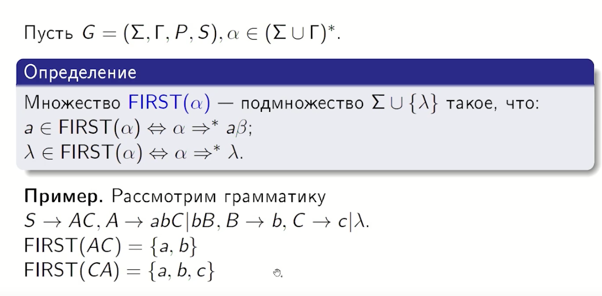
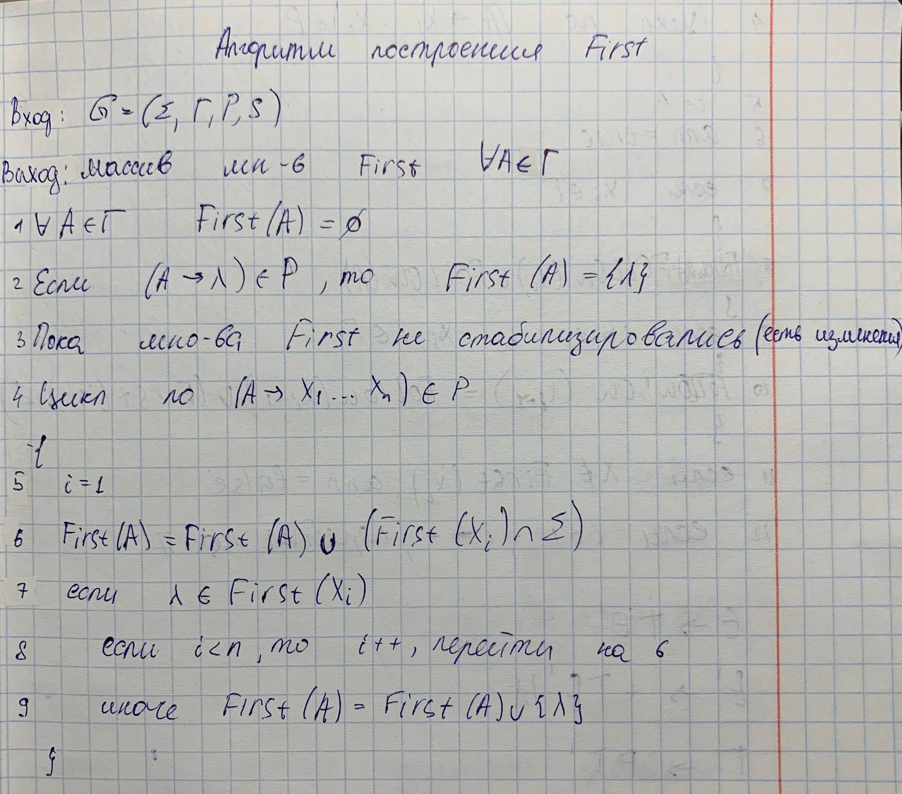
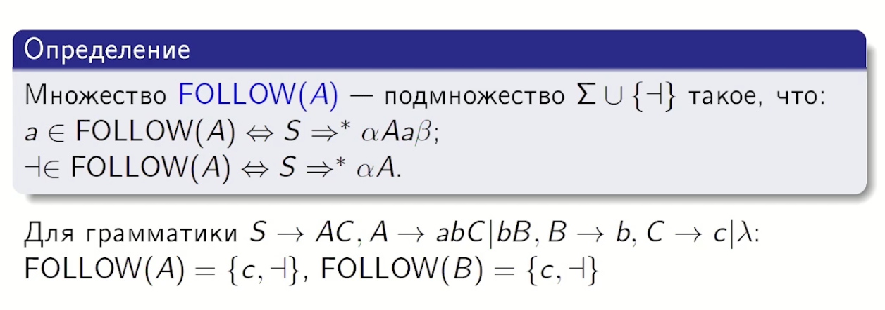
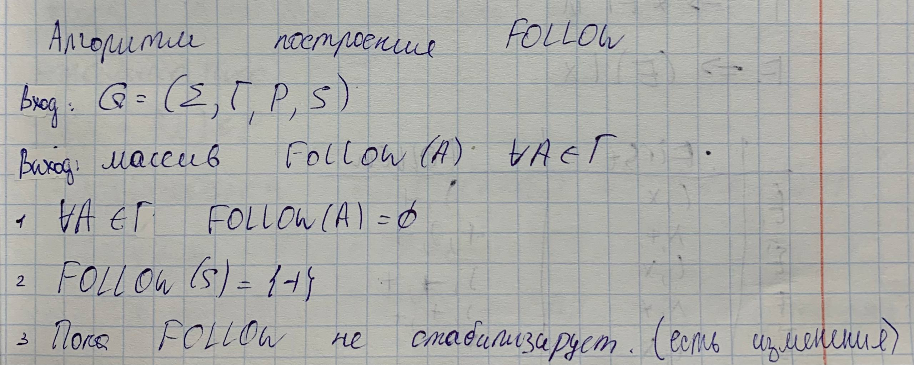
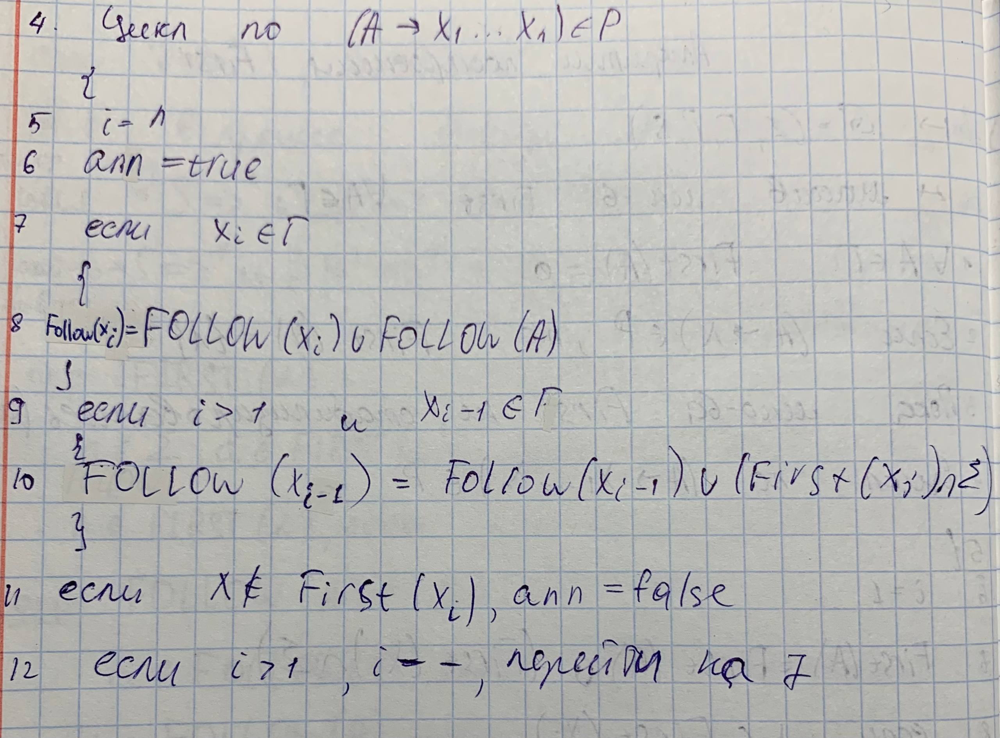
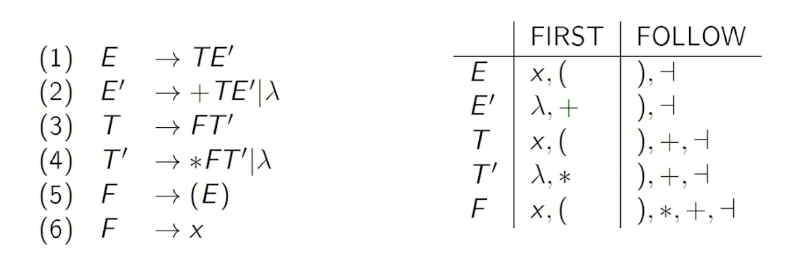
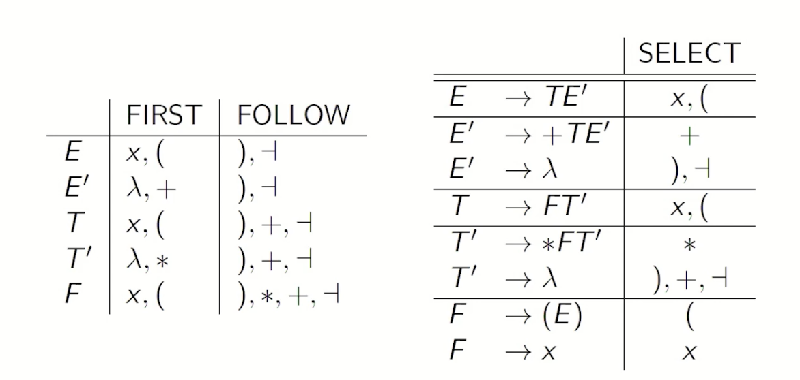

## 11. Множества FIRST, FOLLOW и SELECT. Алгоритмы их построения.

### Множество FIRST
Для **произвольной цепочки** (не обязательно один нетерминал) $\alpha$, множество **$FIRST(\alpha)$** — это подмножество терминалов, с которых могут начинаться терминальные цепочки, выводимые из $\alpha$.
Если из $\alpha$ можно вывести $\lambda$, то $\lambda \in FIRST(\alpha)$.

**Алгоритм построения:**

**Текстом:**

1.  Для каждого терминала $a$: $FIRST(a) = \{a\}$.
2.  Для каждого нетерминала $A$: если есть правило $A \to \lambda$, добавить $\lambda$ в $FIRST(A)$.
3.  Итеративно для каждого правила $A \to X_1X_2...X_n$:
    *   Добавлять в $FIRST(A)$ все неаннулирующие символы из $FIRST(X_1)$.
    *   Если $X_1$ может быть аннулирован ($\lambda \in FIRST(X_1)$), переходить к $FIRST(X_2)$ и так далее.
    *   Если все символы в правой части — аннулирующие, добавить $\lambda$ в $FIRST(A)$.

### Множество FOLLOW
Для нетерминала $A$, множество **$FOLLOW(A)$** — это подмножество терминалов, которые могут следовать непосредственно за $A$ в цепочках, выводимых из аксиомы.

**Алгоритм построения:**

**Текстом:**

1.  Начинаем с аксиомы $S$ : $FOLLOW(S) = \{\dashv\}$.
2.  Итеративно просматривать все правила вывода вида $A \to \alpha B \beta$:
    *   Все **терминалы** из $FIRST(\beta)$ (кроме $\lambda$) добавляются в $FOLLOW(B)$.
    *   Если $\beta$ — пустая цепочка или аннулируемая ($\lambda \in FIRST(\beta)$), то всё множество $FOLLOW(A)$ добавляется в $FOLLOW(B)$.

### Множество SELECT
Множество выбора **$SELECT(A \to \gamma)$** определяется для каждого конкретного правила вывода.
Оно указывает, при каких входных символах следует применять данное правило.

**Расчет SELECT:**
*   Если $\lambda \notin FIRST(\gamma)$, то **$SELECT(A \to \gamma) = FIRST(\gamma)$**.
*  Иначе **$SELECT(A \to \gamma) = (FIRST(\gamma) \setminus \{\lambda\}) \cup FOLLOW(A)$**.

Алгоритма на паре не давала.

