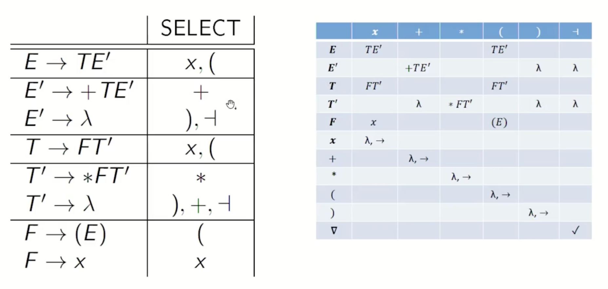
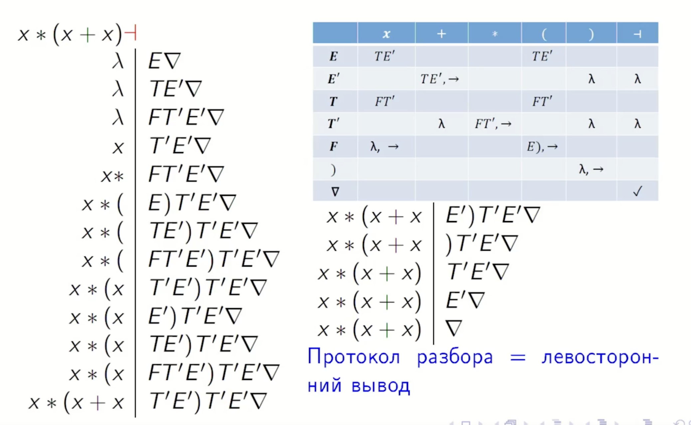

## 12. Построение управляющей таблицы МП-автомата. LL(1)-грамматики.

Для построения детерминированного синтаксического анализатора (МП-автомата), работающего по методу «сверху вниз», используются **LL(1)-грамматики**. Основная идея такого анализа заключается в возможности однозначно выбрать правило вывода, просматривая всего один текущий символ входной цепочки.

### Понятие LL(1)-грамматики
КС-грамматика называется **LL(1)-грамматикой**, если для любых двух различных правил вывода из одного и того же нетерминала ($A \to \alpha$ и $A \to \beta$) их **множества выбора (SELECT)** не пересекаются.
*   **Множество выбора $SELECT(A \to \alpha)$** — это набор терминалов, при появлении которых во входном потоке следует применить данное правило.
*   **Важные ограничения:** Приведенная LL(1)-грамматика **не может быть леворекурсивной**. Также она не должна содержать альтернатив с общим префиксом (что устраняется левой факторизацией).

### Построение управляющей таблицы МП-автомата
**опр.** МП-автомат(МПА) $\mathcal{M}$ — это 7-ка = $(\Sigma, \Gamma, Q, \delta, q_0, F, \gamma_0)$

* $\Sigma$ — **основной (терминальный) алфавит**
* $\Gamma$ — **вспомогательный (нетерминальный) алфавит**
* $Q$ — множество состояний
* $\delta$ — множество команд(выше есть разбор)
* $q_0$ — начальное состояние
* $F$ — множество конечных состояний (терминальных)
* $\gamma_0$ — начальное содержимое стека

Управляющая таблица фактически представляет собой систему команд детерминированного МП-автомата с единственным состоянием. Команды определяются парой: **(входной символ, символ на вершине стека)**.

### Множество SELECT
Множество выбора **$SELECT(B \to \gamma)$** определяется для каждого конкретного правила вывода.
Оно указывает, при каких входных символах следует применять данное правило.

**Расчет SELECT:**
*   Если $\lambda \notin FIRST(\gamma)$, то **$SELECT(B \to \gamma) = FIRST(\gamma)$**.
*  Иначе **$SELECT(B \to \gamma) = (FIRST(\gamma) \setminus \{\lambda\}) \cup FOLLOW(B)$**.

Построение таблицы (множества команд $\delta$) выполняется по следующим правилам:
1.  **Для каждого правила вывода $B \to \gamma$:** вычисляется множество $SELECT(B \to \gamma)$. Для каждого терминала $a \in SELECT(B \to \gamma)$ в таблицу заносится команда заменяющая нетерминал $B$ на цепочку $\gamma$ в стеке без сдвига по входной ленте: **$(a, B) \to (\gamma, \_)$**.
2.  **Для каждого терминала $a$ алфавита:** заносится команда сравнения. Если терминал на вершине стека совпадает с входным символом, он удаляется из стека, а указатель входа сдвигается: **$(a, a) \to (\lambda, \to)$**.
3.  **Обработка конца строки:** добавляется команда допуска. Если на входе символ конца строки ($\dashv$), а в стеке маркер дна ($\nabla$), цепочка считается принятой: **$(\dashv, \nabla) \to \checkmark$**

### Пример
Как построить FIRST и FOLLOW можно найти в предыдущем билете:

