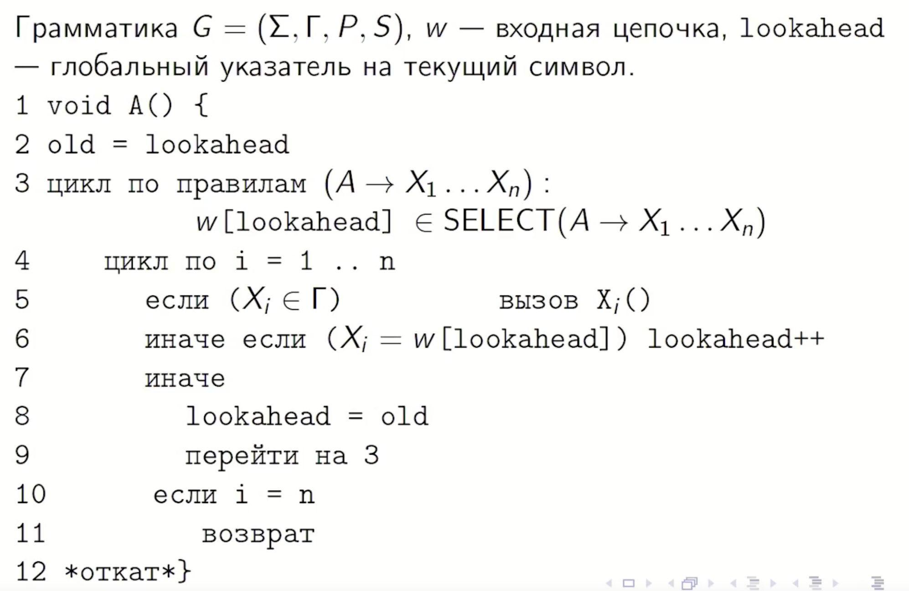
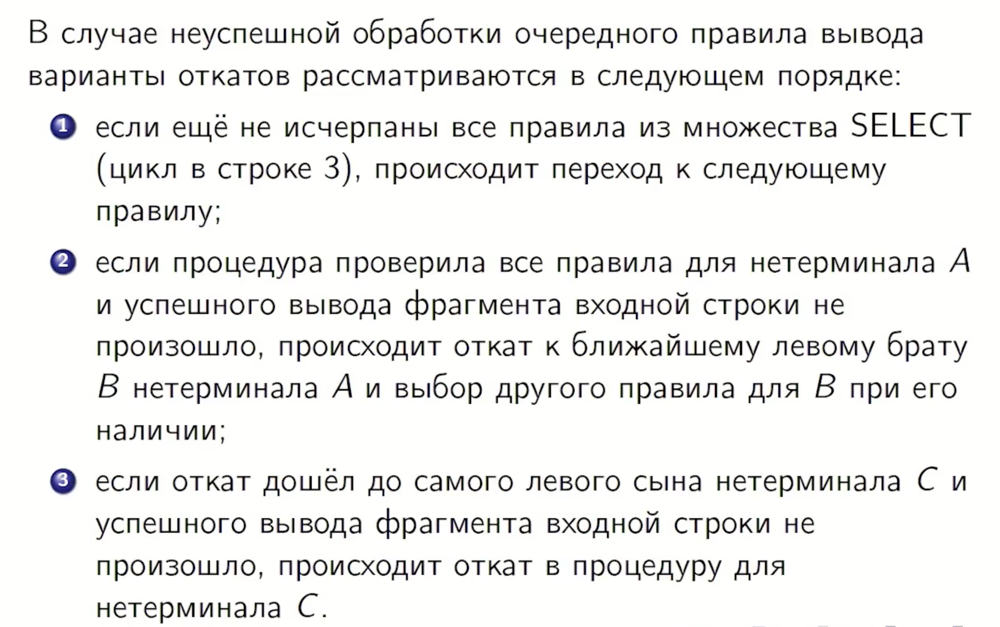
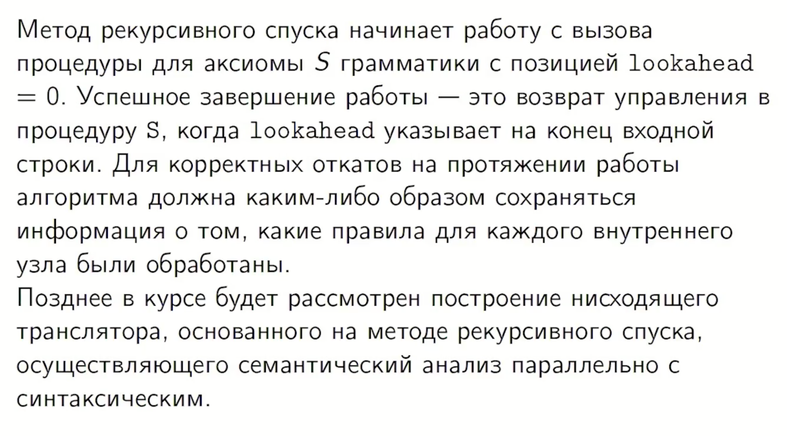

## 13. Нисходящий анализ методом рекурсивного спуска.

**Нисходящий анализ методом рекурсивного спуска** — это общий метод синтаксического разбора, при котором для каждого нетерминала грамматики $A$ создается отдельная процедура, отвечающая за распознавание фрагмента входной цепочки, выводимого из этого нетерминала. 
Процесс начинается с вызова процедуры для аксиомы грамматики $S$. 
Внутри каждой такой функции происходит выбор подходящего правила вывода (вида $A \to \alpha$) и его последовательная обработка: если в правой части встречается терминал, он сравнивается с текущим символом входа, а если нетерминал — рекурсивно вызывается соответствующая ему процедура.

Основные принципы и особенности реализации этого метода включают:

*   **Механизм выбора правила:** Для выбора правила вывода используется текущий символ входной цепочки и **множества выбора** ($select$), аналогично работе МП-автомата. Если грамматика является **LL(1)-грамматикой**, то выбор правила всегда детерминирован, и алгоритм работает **без откатов** (backtracking). В общем случае, если выбор неоднозначен, при неудаче одного варианта происходит «откат» для выбора другой альтернативы.
*   **Обработка символов:** При обработке правила $A \to X_1...X_n$ символы правой части анализируются по порядку. Если $X_i$ — терминал, он сравнивается с текущим символом (`lookahead`); при совпадении указатель входа сдвигается, при несовпадении — фиксируется ошибка или происходит откат. Если $X_i$ — нетерминал, вызывается его функция, которая может принимать наследуемые атрибуты как аргументы и возвращать синтезированные атрибуты как результат.
*   **Ограничение по левой рекурсии:** Метод рекурсивного спуска **неприменим к леворекурсивным грамматикам**, так как наличие правил вида $A \to A\alpha$ приводит к бесконечной рекурсии (процедура будет вызывать сама себя бесконечно, не продвигаясь по входной цепочке). Перед реализацией метода такие грамматики должны быть преобразованы в эквивалентные нелеворекурсивные.
*   **Программная структура:** Транслятор, работающий по этому методу, обычно использует глобальную переменную `lookahead` для хранения текущего символа входного потока. Каждая функция нетерминала анализирует этот символ через специальные условия (например, `case` или `if-then-else`) для определения дальнейшего пути разбора.

* 