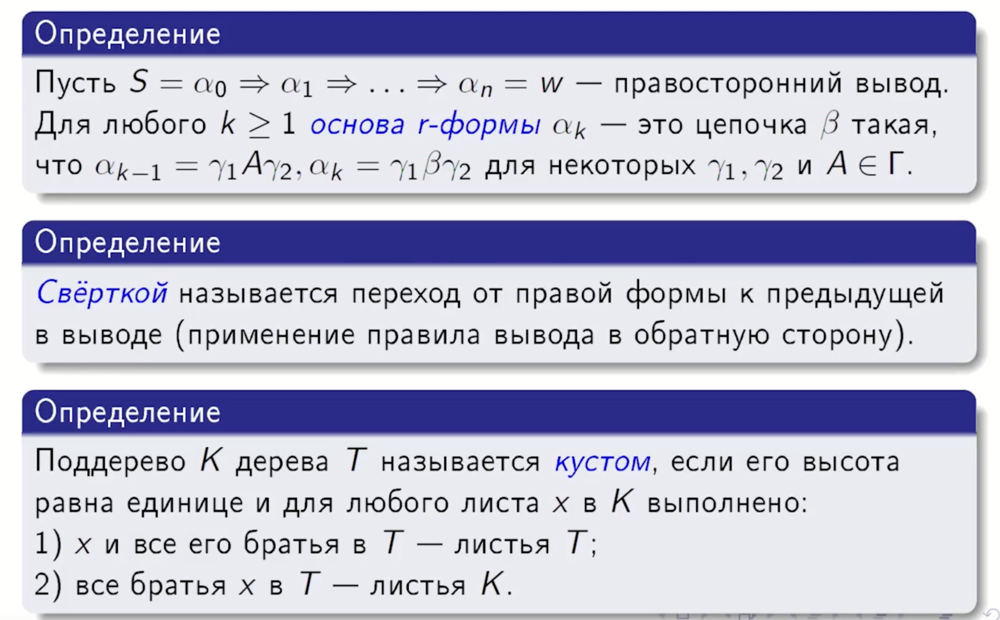
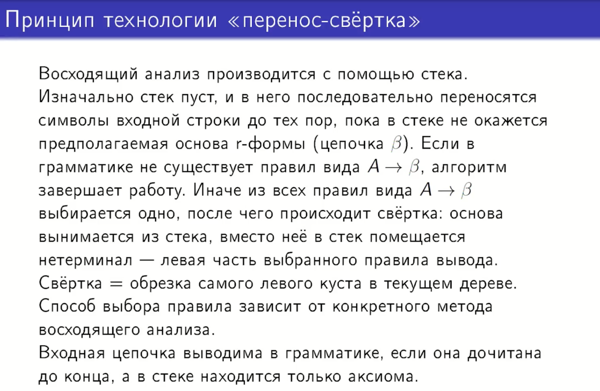
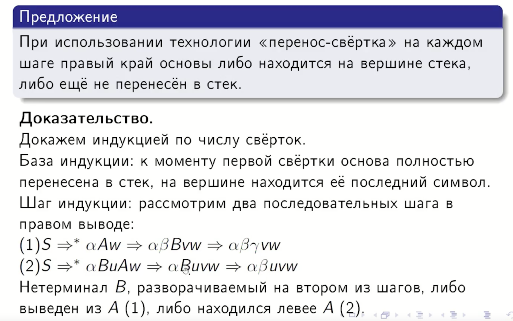
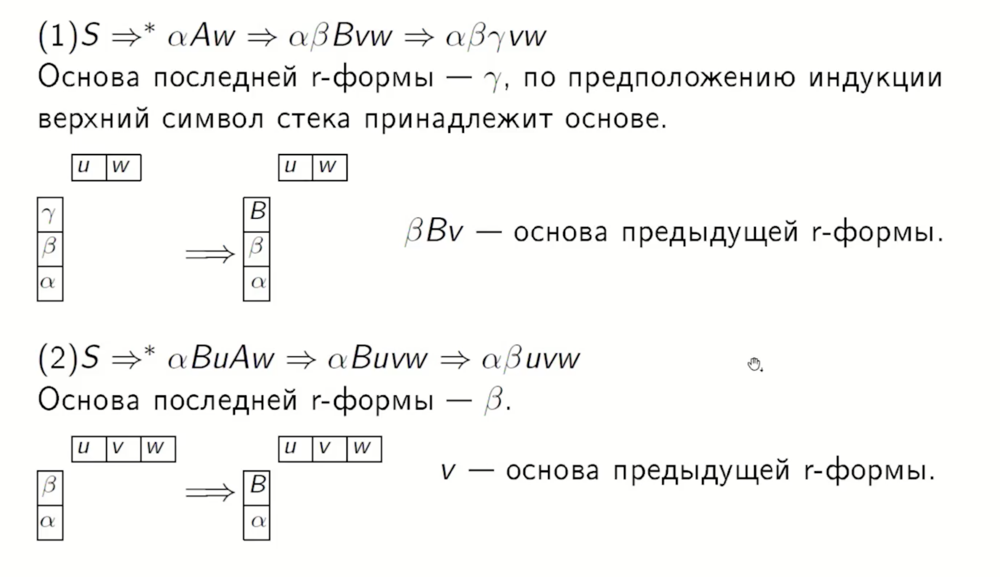

## 14. Идея восходящего анализа. Основа. Свертка. Метод перенос-свертка. Положение текущей основы в стеке. Конфликты перенос-свёртка и свёртка-свёртка.

Восходящий синтаксический анализ — это процесс построения дерева разбора, который начинается с листьев (входных символов) и идет к корню (аксиоме грамматики).
В ходе этого процесса входная цепочка «сворачивается» в начальный символ путем поиска основ и их замены на соответствующие нетерминалы, что фактически является восстановлением правостороннего вывода цепочки в обратном порядке.

### Основа и свертка

`r-форма` — правая форма (правило вывода).

### Метод перенос-свертка

### Положение текущей основы в стеке

### Конфликты в восходящем анализе
Конфликты возникают в ситуациях, когда на основе текущего состояния стека и входного символа анализатор не может принять однозначное решение.

*   **Конфликт перенос-свертка:** ситуация, когда один пункт в состоянии автомата указывает на необходимость переноса символа в стек, а другой — на необходимость выполнения свертки по уже найденной основе. Пример из грамматики условных операторов: при наличии `else` анализатор должен решить, перенести ли его в стек (отнеся к ближайшему `if`) или выполнить свертку предыдущего `if` без `else`,.
*   **Конфликт свертка-свертка:** возникает, когда в одном состоянии сразу два (или более) пункта указывают на возможность свертки по разным правилам вывода.
