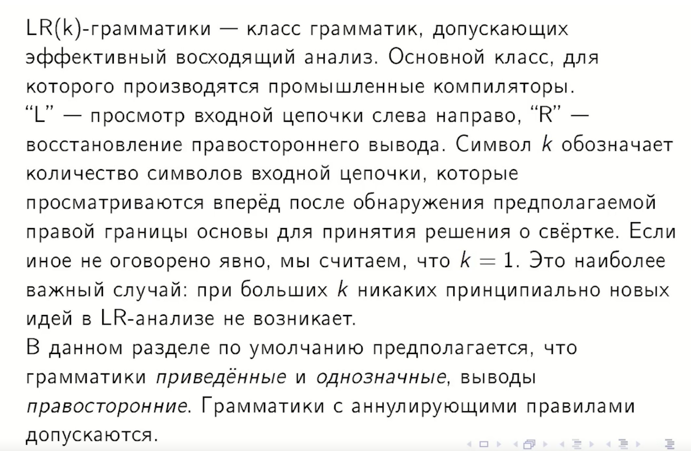
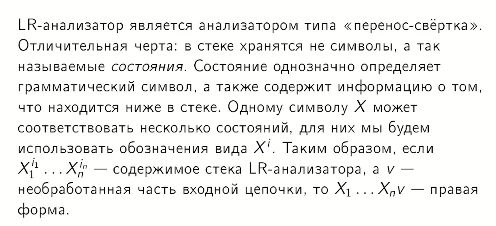
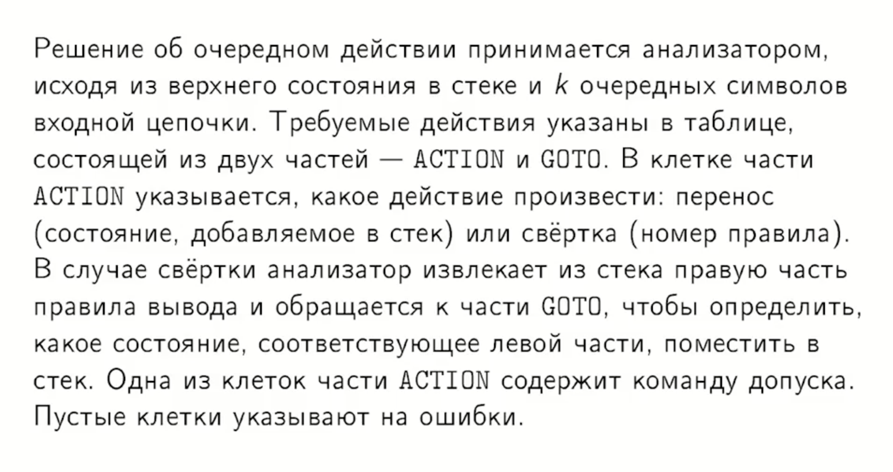
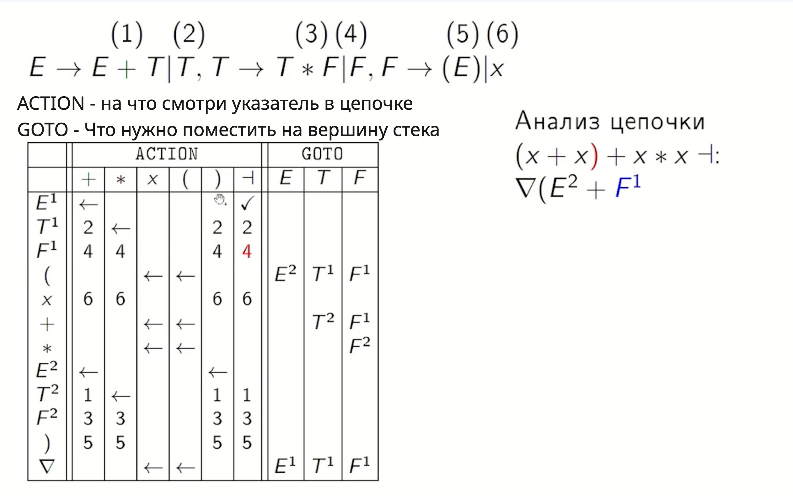

## 16. Схема LR-анализа. Состояния. Функции ACTION и GOTO.

На этом примере сейчас на входе ) и на вершине стека $F^1$.

1) Сворачиваемся по (4) правилу к T. Так как в строке $F^1$ и столбце ) стоит 4.
2) Сейчас на вершине стека знак + (так как $F^1$ сняли и держим в руках T), на входе всё то ).
3) Значит по GOTO ищем строку + и столбец T. В ячейке GOTO стоит $T^2$, значит помещаем на вершину стека $T^2$

После данной итерации 
Мы всё смотрим на ), стек=[$\nabla E^2 + T^2$]

Знак $\leftarrow$ говорит, что сейчас нужно перенести символ из ленты в стек и сдвинуться вправо на 1 символ.
