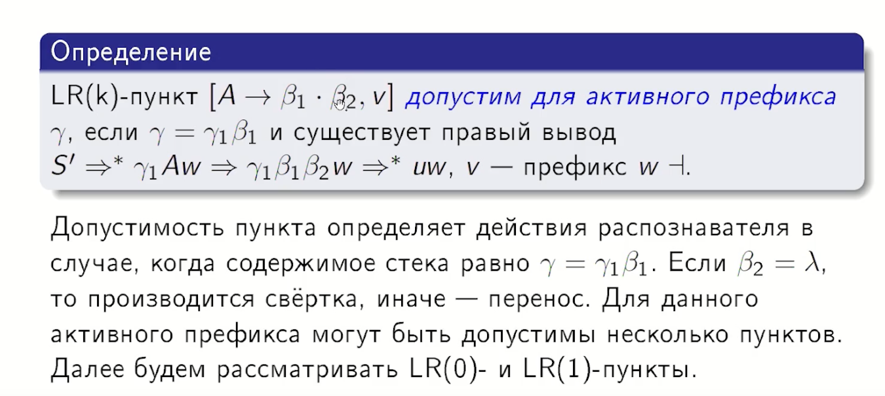
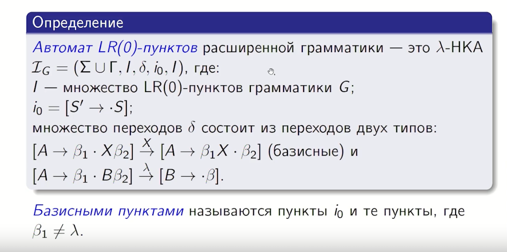
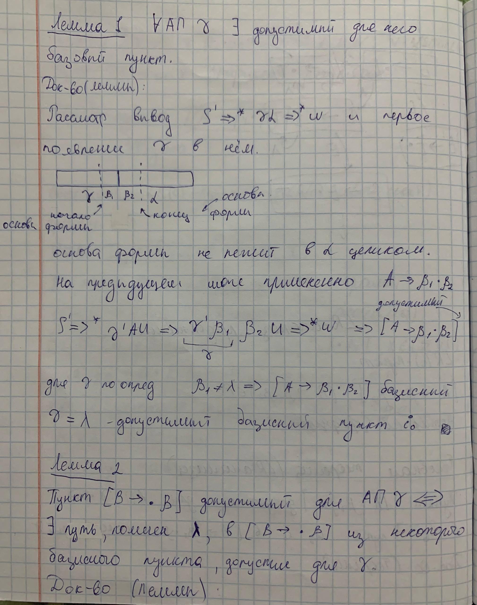
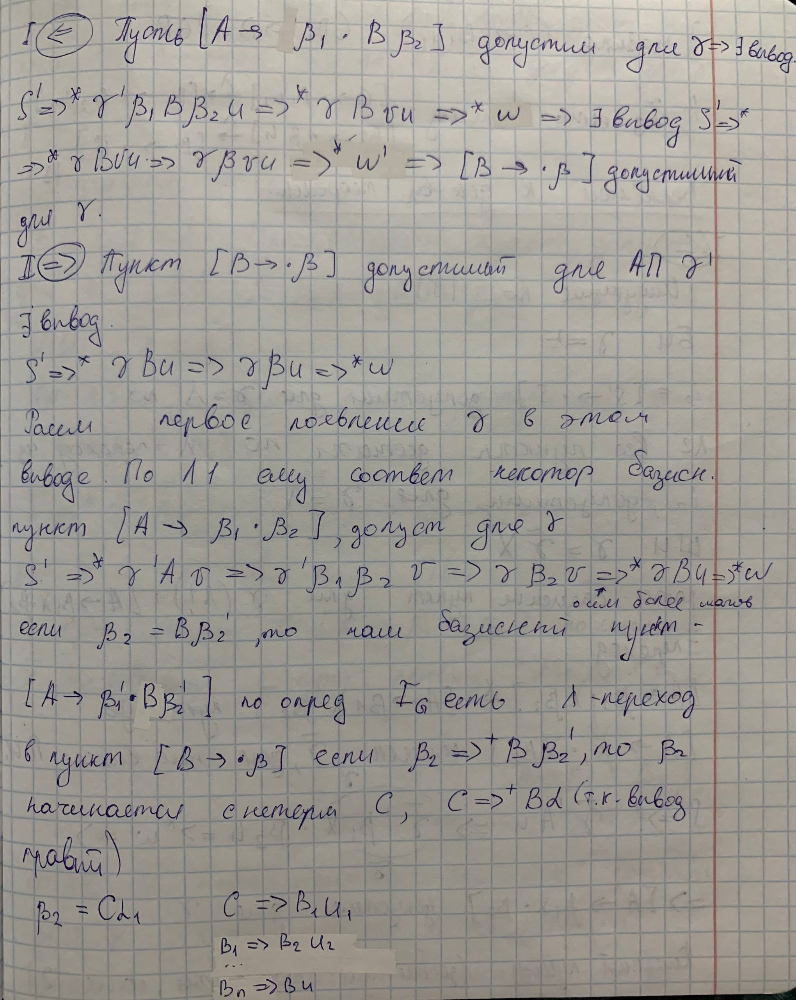
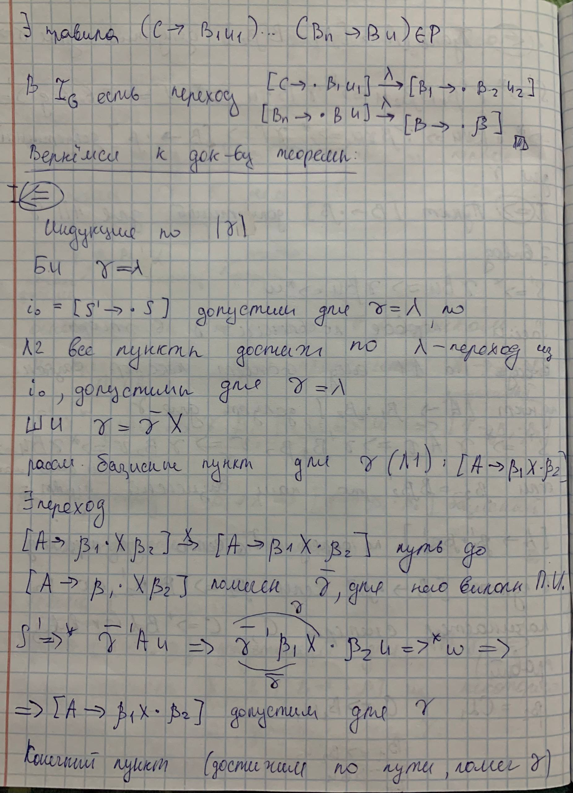
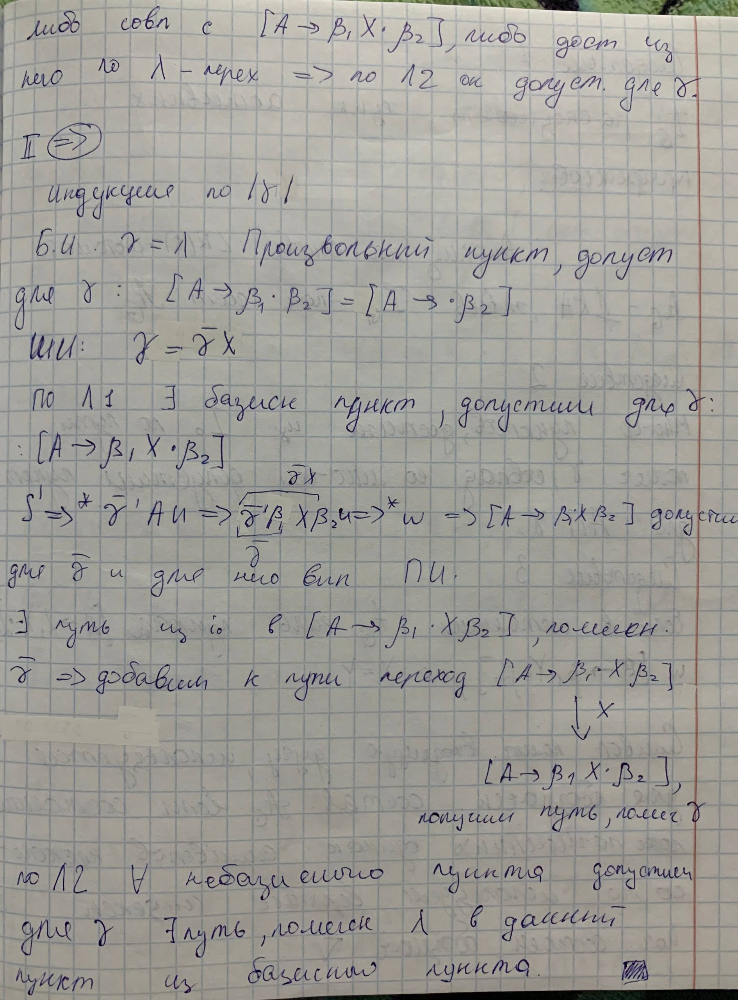
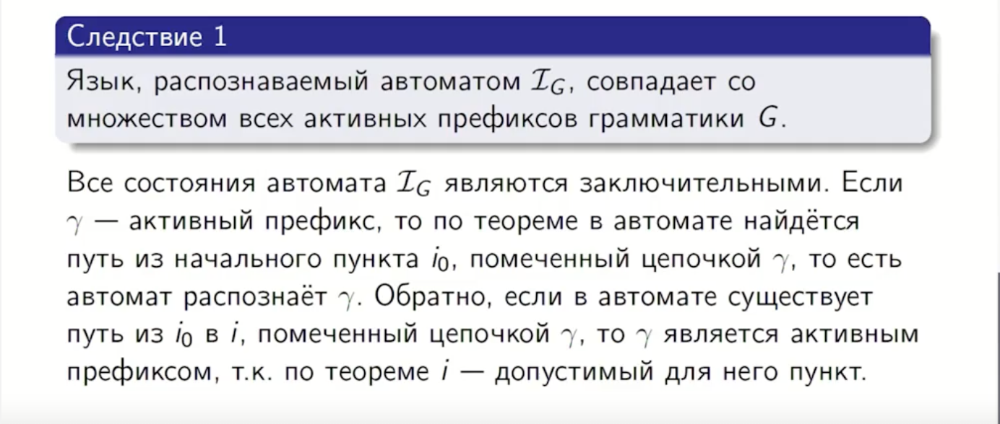

## 17. Активные префиксы. LR(0)-пункты. Теорема об LR(0)-автомате. Следствия из теоремы об LR(0)-автомате.

**опр.** Активный префикс — это содержимое стека в любой момент времени работы распознавателя, "перенос-свертка" (префикс r-формы не выходящий за правый конец основы)

### Вернёмся к док-ву теоремы

