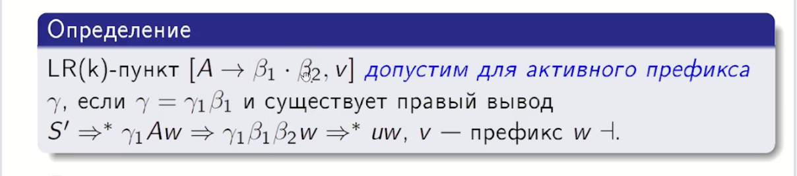
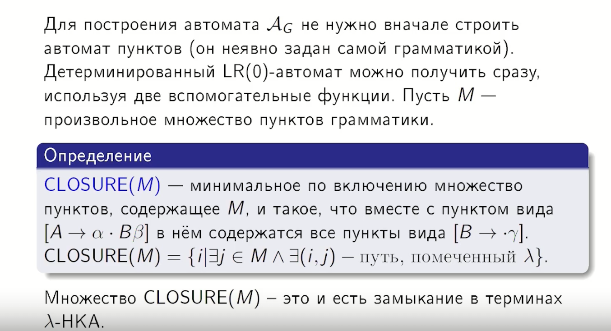
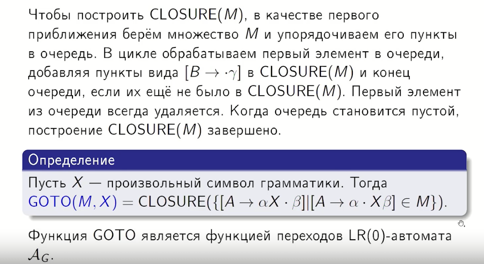
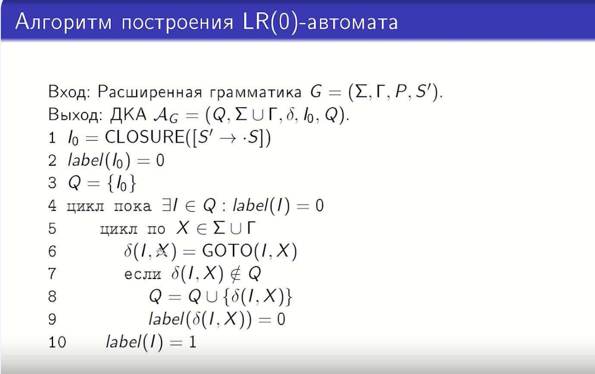
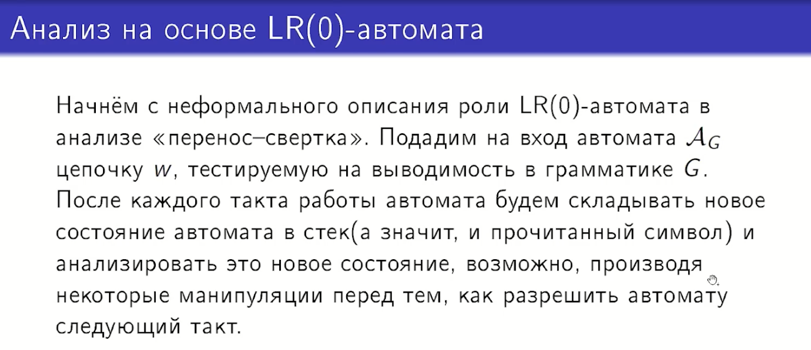
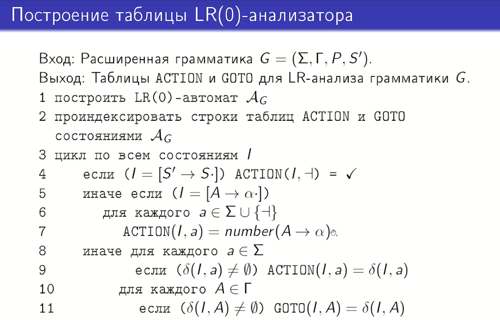
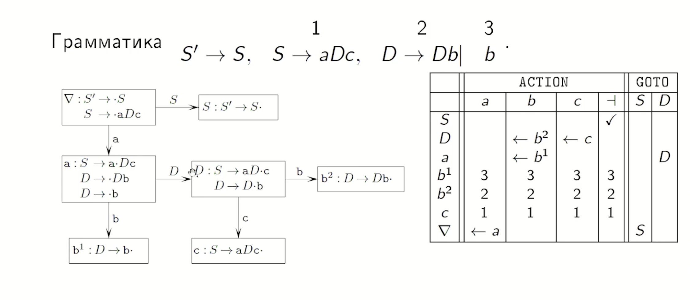
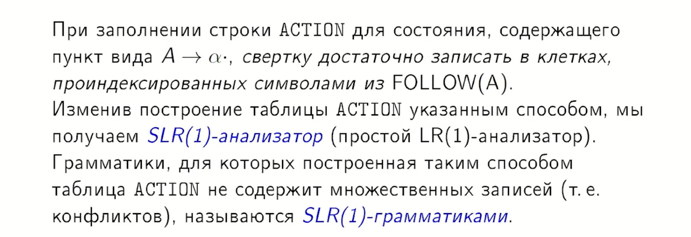

## 18. Анализ на основе LR(0)-автомата. SLR(1)-анализ.

Анализ на основе LR(0)-автомата и его расширение — SLR(1)-анализ — представляют собой методы **восходящего синтаксического анализа** типа «перенос–свёртка».
Эти методы используют детерминированный конечный автомат для отслеживания **активных префиксов** грамматики в стеке.

### 1. LR(0)-пункты и автомат
Основой LR-анализа является понятие **LR(0)-пункта**.

**опр** Пункт — это правило вывода с точкой в правой части, например $[A \to \beta_1 \cdot \beta_2]$.

А если быть точнее:
k=0

*   **Точка** обозначает границу между тем, что уже находится в стеке ($\beta_1$), и тем, что ожидается во входном потоке ($\beta_2$).
*   Если точка стоит в конце ($[A \to \alpha \cdot]$), это означает, что в стеке находится **основа** и можно выполнить **свёртку**.

В LR(0) автомате мы можем принимать решение в текущий момент времени и не заглядывая ни на один символ ленты вперед.

**LR(0)-автомат ($A_G$)** — это детерминированный конечный автомат, состояниями которого являются множества допустимых пунктов.

## Хз нужно ли следующие следствия рассказывать:

### Следствие

Множество пунктов, достежимых из $\mathcal{I}_0$ по пути помеченного $\gamma$, совпадают с множеством допустимых пунктов для активного префикса $\gamma$.

### Следствие

Если в состоянии $A_G$ есть пункты $[A \to \alpha_1X\alpha_2]$ и $[B \to \beta_1Y\beta_2]$, то X=Y.

### SLR(1)-анализ (Simple LR)
Большинство реальных грамматик (например, грамматики арифметических выражений) не являются LR(0)-грамматиками, так как их состояния часто содержат **конфликты**,:
*   **Перенос–свёртка:** в одном состоянии есть и $[A \to \alpha \cdot]$, и $[B \to \beta \cdot a \gamma]$.
*   **Свёртка–свёртка:** в состоянии два пункта вида $[A \to \alpha \cdot]$ и $[B \to \beta \cdot]$.

* 
* 
**SLR(1)-анализ** расширяет возможности LR(0) за счёт использования множеств **FOLLOW** (символов, которые могут следовать за нетерминалом в корректных формах).
*   **Правило свёртки в SLR(1):** свёртка по правилу $A \to \alpha$ выполняется только в том случае, если очередной символ входной цепочки **принадлежит множеству $FOLLOW(A)$**.
*   Если этот символ не входит в $FOLLOW(A)$, свёртка считается некорректной. Это позволяет разрешить многие конфликты, где LR(0)-анализатор не мог сделать выбор.

