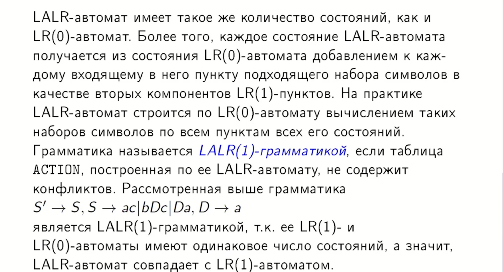
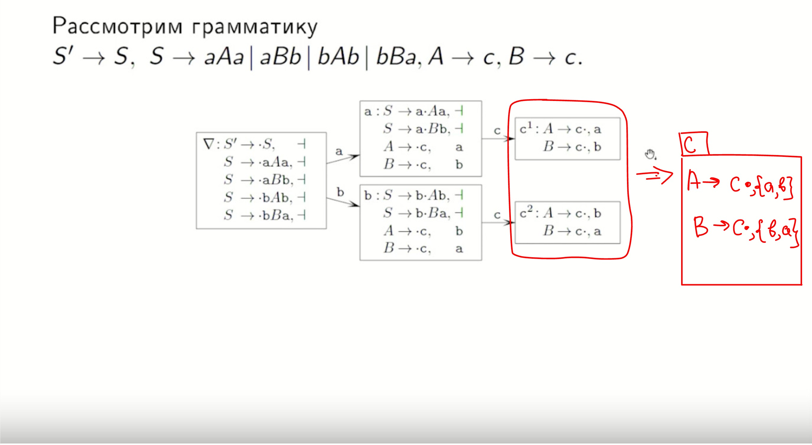

## 19. LR(1)-автомат. Канонический LR-анализ. LALR(1)-анализ.

### Важное уточнение
Данный билет ОЧЕНЬ тесно связан с 19 (прошлым) билетом. Лучше вначале ещё раз взглянуть его и понять суть LR(0) анализа.

-автомат.%20Канонический%20LR-анализ.%20LALR(1)-анализ./2.png)
-автомат.%20Канонический%20LR-анализ.%20LALR(1)-анализ./1.png)
-автомат.%20Канонический%20LR-анализ.%20LALR(1)-анализ./3.png)
-автомат.%20Канонический%20LR-анализ.%20LALR(1)-анализ./4.png)

-автомат.%20Канонический%20LR-анализ.%20LALR(1)-анализ./5.png)

### 2. Канонический LR-анализ
**Канонический LR-анализатор** использует таблицы `action` и `goto`, построенные непосредственно по LR(1)-автомату (Алгоритм 4.4).
*   **Преимущество:** Это самый мощный метод. Он позволяет разрешать конфликты «перенос-свертка», с которыми не справляется более простой SLR(1)-анализ (например, когда символ из множества $follow$ не гарантирует корректность свертки в данной конкретной позиции).
*   **Недостаток:** **Громоздкость**. Количество состояний канонического LR(1)-автомата для реальных языков программирования может достигать нескольких тысяч, что делает таблицы слишком большими для практического применения.

### 3. LALR(1)-анализ (LookAhead LR)
**LALR(1)-анализ** — это «гибридный» метод, который является основной промышленной технологией.

**Идея метода:**
1.  Берется канонический LR(1)-автомат.
2.  Все состояния, имеющие **одинаковые ядра** (множества LR(0)-пунктов), сливаются в одно.
3.  Символы предпросмотра при слиянии объединяются.

**Свойства LALR(1):**
*   **Компактность:** LALR-автомат имеет столько же состояний, сколько и LR(0)-автомат (сотни вместо тысяч), но обладает мощностью, близкой к LR(1).
*   **Конфликты:** При слиянии состояний **не могут возникнуть новые конфликты «перенос-свертка»**, если их не было в исходном LR(1)-автомате. Однако в редких случаях могут появиться новые конфликты «свертка-свертка».

Классы грамматик соотносятся следующим образом: **$LR(0) \subset SLR(1) \subset LALR(1) \subset LR(1)$**. 