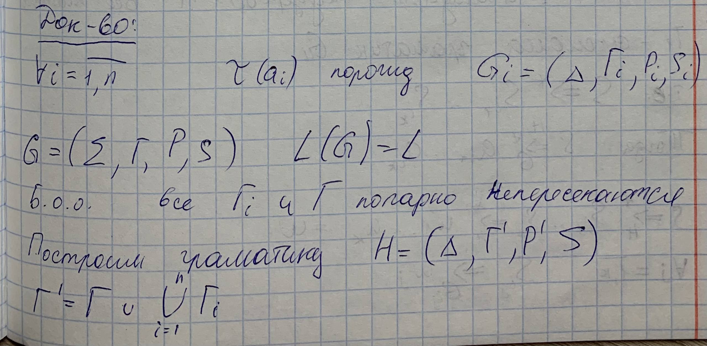
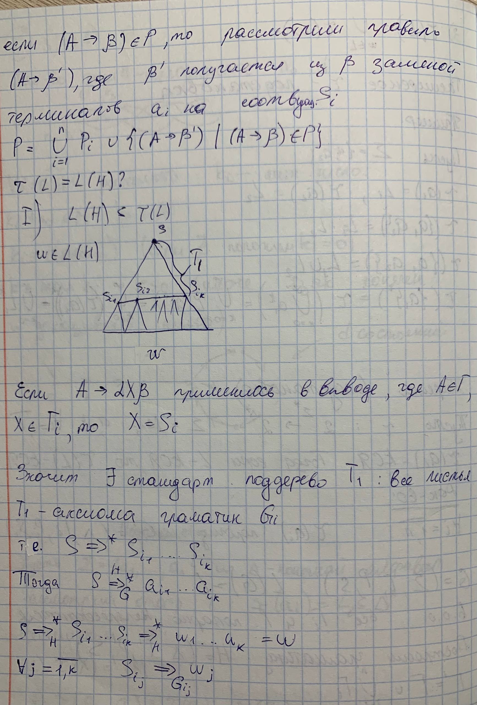
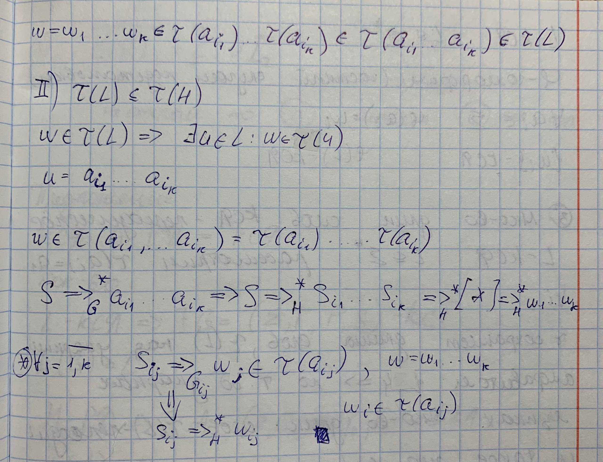

## 2. Теорема о подстановке и ее следствия.

**Теорема о подстановкe**

Пусть $\tau : 2^{ \Sigma^* } \rightarrow 2^{ \Delta^* }$ $\Sigma = \{a_1,...,a_n\}$ $\forall i = 1,...,n$ и $\tau(a_i)$ - КСЯ. Тогда если $L$ - КСЯ, то $\tau(L)$ - КСЯ.

*Тоже самое по русски (Eсли **τ** — это отображение (подстановка), которое каждой букве **a** из алфавита **Σ** сопоставляет некоторый контекстно-свободный язык (КС-язык) над алфавитом **Δ**, то для любого КС-языка **L** над **Σ** его образ **τ**(**L**) также будет **контекстно-свободным языком**.)*

### Док-во(лень техать)

### Следствия:

* **Замкнутость относительно основных операций:** Класс КС-языков **замкнут относительно операций объединения, произведения и итерации**. Это объясняется тем, что данные операции являются частными случаями подстановки (например, произведение $L_1L_2$ можно рассматривать как результат подстановки в язык $\{a_1a_2\}$).
* **Замкнутость относительно гомоморфизма:** Класс КС-языков **замкнут относительно перехода к гомоморфным образам**. Любой гомоморфизм можно считать подстановкой, при которой образом каждой буквы является язык, состоящий ровно из одной цепочки.
* **Периодичность длин слов:** Если $L$ является КС-языком, то множество длин всех его слов $\{|w| \mid w \in L\}$ обязательно является **периодическим**. Это следствие выводится через гомоморфизм, переводящий любую букву в символ $a$, и применение теоремы о КС-языках над однобуквенным алфавитом.

Важно помнить, что, несмотря на эти свойства, класс КС-языков **не является замкнутым относительно операций пересечения и дополнения**. Например, пересечение двух КС-языков $L_1 = \{a^n b^n a^m\}$ и $L_2 = \{a^m b^n a^n\}$ дает язык $\{a^n b^n a^n\}$, который не является контекстно-свободным.
