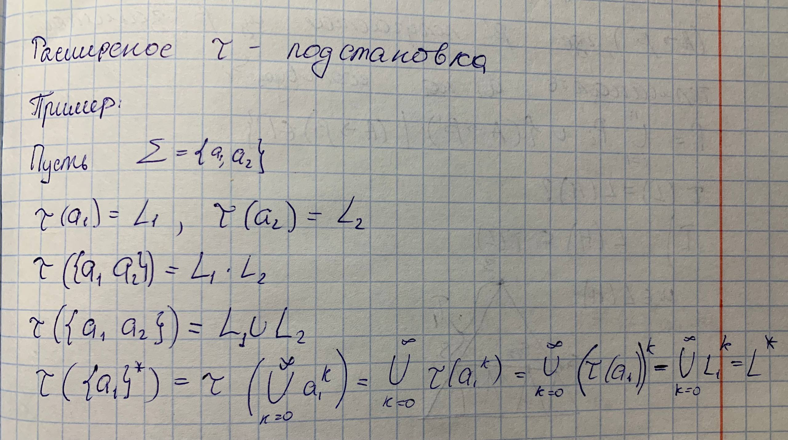
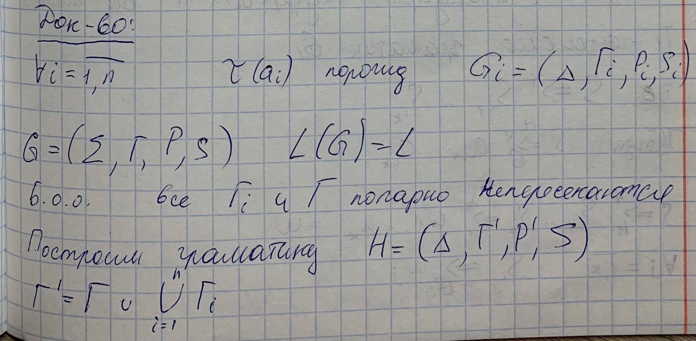
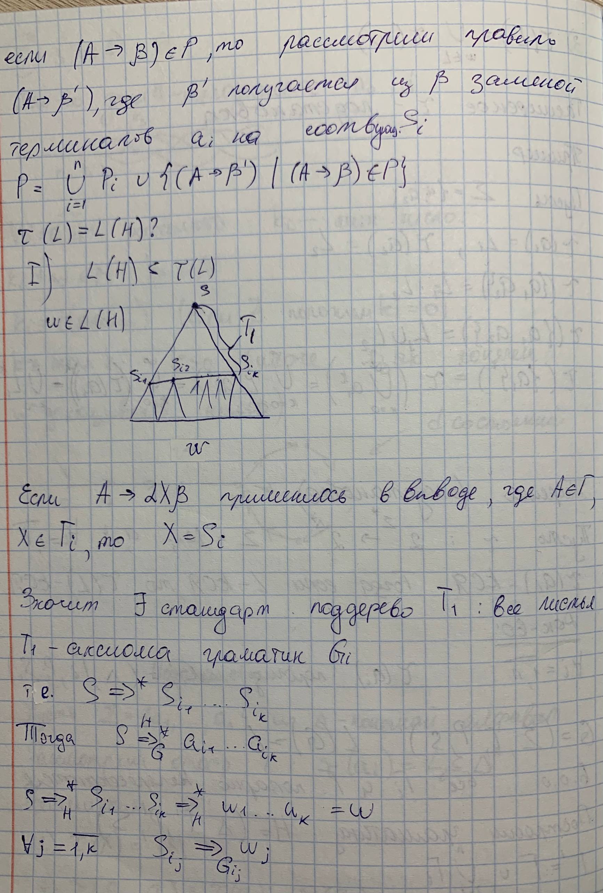
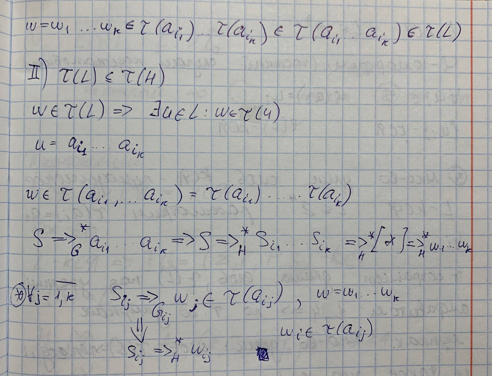
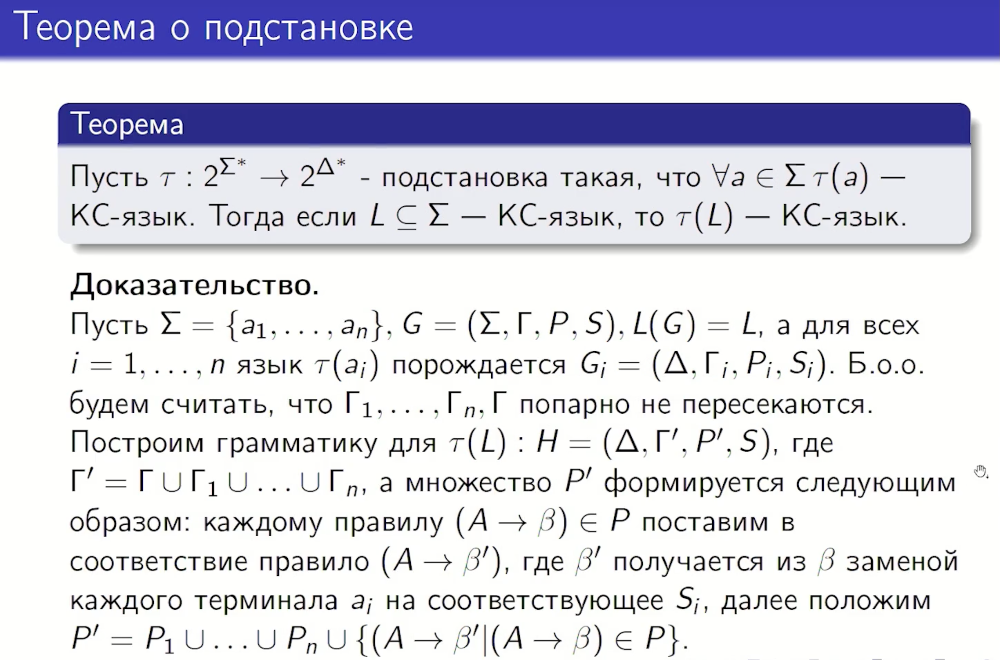
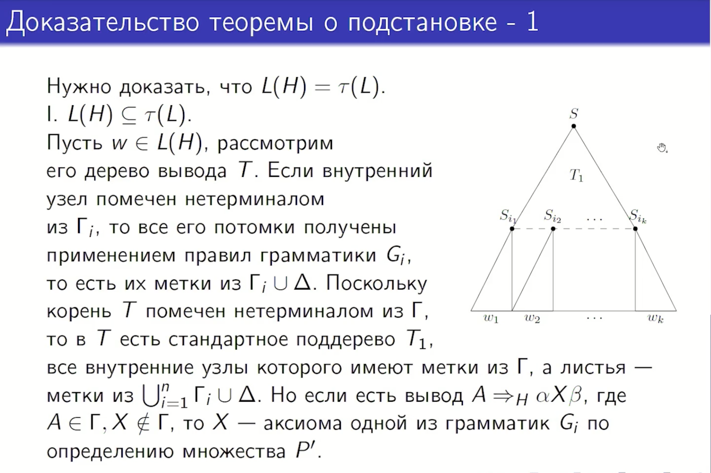
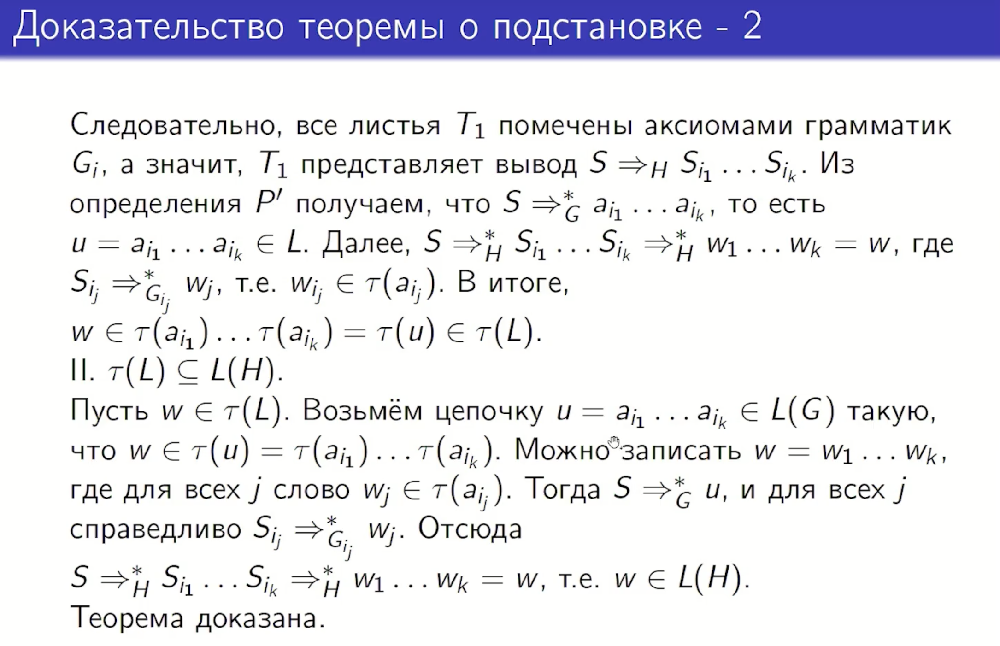

## 2. Теорема о подстановке и ее следствия.

Пусть $\Sigma = \{a_1, ..., a_n\}$ и $\Delta - $ конечный алфавит

Рассмотрим отображение $\tau:\tau(a_i) = L_i \subseteq \Delta^*$

Расширим $\tau$:
1) $\tau(\lambda) = \{\lambda\}$
2) $\tau(a_1...a_k)=\tau(a_1)...\tau(a_k)$
3) $\tau(L) = \bigcup_{w \in L} \tau(w) $

Расширенное $\tau$ мы будем назвать подстановкой.

**Теорема о подстановкe**

Пусть $\tau : 2^{ \Sigma^* } \rightarrow 2^{ \Delta^* }$ $\Sigma = \{a_1,...,a_n\}$ $\forall i = 1,...,n$ и $\tau(a_i)$ - КСЯ. Тогда если $L$ - КСЯ, то $\tau(L)$ - КСЯ.

*Тоже самое по русски (Eсли **τ** — это отображение (подстановка), которое каждой букве **a** из алфавита **Σ** сопоставляет некоторый контекстно-свободный язык (КС-язык) над алфавитом **Δ**, то для любого КС-языка **L** над **Σ** его образ **τ**(**L**) также будет **контекстно-свободным языком**.)*

### Док-во(лень техать)

### Док-во(c курса)

### Следствия:

1. **Замкнутость относительно основных операций:** Класс КС-языков **замкнут относительно операций объединения, произведения и итерации**. Это объясняется тем, что данные операции являются частными случаями подстановки (например, произведение $L_1L_2$ можно рассматривать как результат подстановки в язык $\{a_1a_2\}$).
2. **Замкнутость относительно гомоморфизма:** Класс КС-языков **замкнут относительно перехода к гомоморфным образам**. Любой гомоморфизм можно считать подстановкой, при которой образом каждой буквы является язык, состоящий ровно из одной цепочки.
3. **Периодичность длин слов:** Если $L$ является КС-языком, то множество длин всех его слов $\{|w| \mid w \in L\}$ обязательно является **периодическим**. Это следствие выводится через гомоморфизм, переводящий любую букву в символ $a$, и применение теоремы о КС-языках над однобуквенным алфавитом.

Про 3 более детально:
### 1. Что такое периодичность длин?
Множество натуральных чисел $M$ называется **периодическим**, если существуют такие числа $n_0$ (индекс) и $d$ (период), что для любого числа $n \ge n_0$, если оно входит в множество, то и $n+d$ тоже в него входит. В контексте языков это означает, что начиная с некоторой длины, в языке **обязательно** должны встречаться слова, длины которых образуют бесконечную **арифметическую прогрессию**.

### 2. Как это выводится?
Логика доказательства строится на трех «китах» из источников:
*   **Теорема о накачке (Theorem 3.1):** Для любого КС-языка в достаточно длинном слове можно выделить части $u$ и $v$, которые можно «размножать» (накачивать). Каждая такая «накачка» увеличивает длину слова на фиксированную величину $|uv|$.
*   **Гомоморфизм (Следствие 3.2):** Если мы заменим каждую букву любого алфавита на одну и ту же букву `a`, структура длин слов не изменится, а сам язык останется контекстно-свободным.
*   **Теорема о языке над однобуквенным алфавитом (Теорема 3.2):** Если КС-язык состоит из слов только над одной буквой $\{a\}$, то он автоматически становится **регулярным**, а множество его длин — **периодическим**.

Объединяя это, мы получаем **Следствие 3.3**: если $L$ — КС-язык, то множество длин его слов $\{|w| \mid w \in L\}$ обязано быть периодическим.

### 3. Как пользоваться?
Этот факт позволяет «отсеивать» языки, которые выглядят как контекстно-свободные, но ими не являются. Если длины слов в языке не образуют периодического множества, то язык **не может быть контекстно-свободным**.

**Примеры из источников, которые НЕ являются КС-языками из-за нарушения периодичности:**
*   **Язык $\{a^{i^2} \mid i \in \mathbb{N}\}$:** длины слов — это квадраты ($1, 4, 9, 16 \dots$). Расстояние между ними постоянно растет ($3, 5, 7 \dots$), здесь нет постоянного периода $d,$ поэтому язык не регулярен и не контекстно-свободен.
*   **Язык $\{a^p \mid p \text{ — простое число}\}$:** простые числа не образуют бесконечную арифметическую прогрессию с постоянным шагом, следовательно, такой язык также не является контекстно-свободным.

Важно помнить, что, несмотря на эти свойства, класс КС-языков **не является замкнутым относительно операций пересечения и дополнения**. Например, пересечение двух КС-языков $L_1 = \{a^n b^n a^m\}$ и $L_2 = \{a^m b^n a^n\}$ дает язык $\{a^n b^n a^n\}$, который не является контекстно-свободным.
