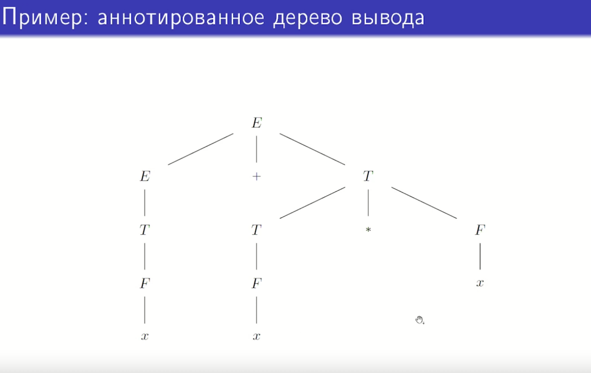
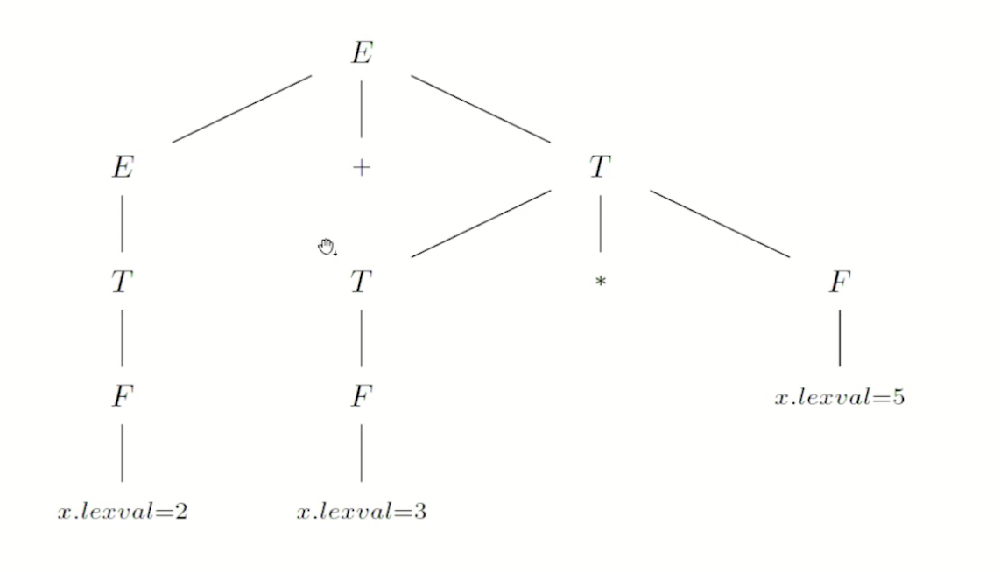
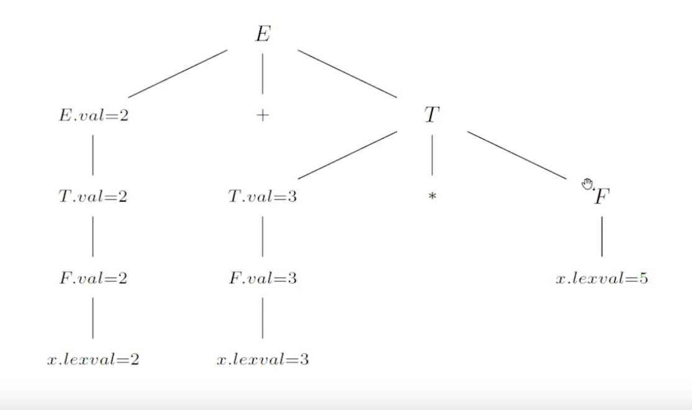
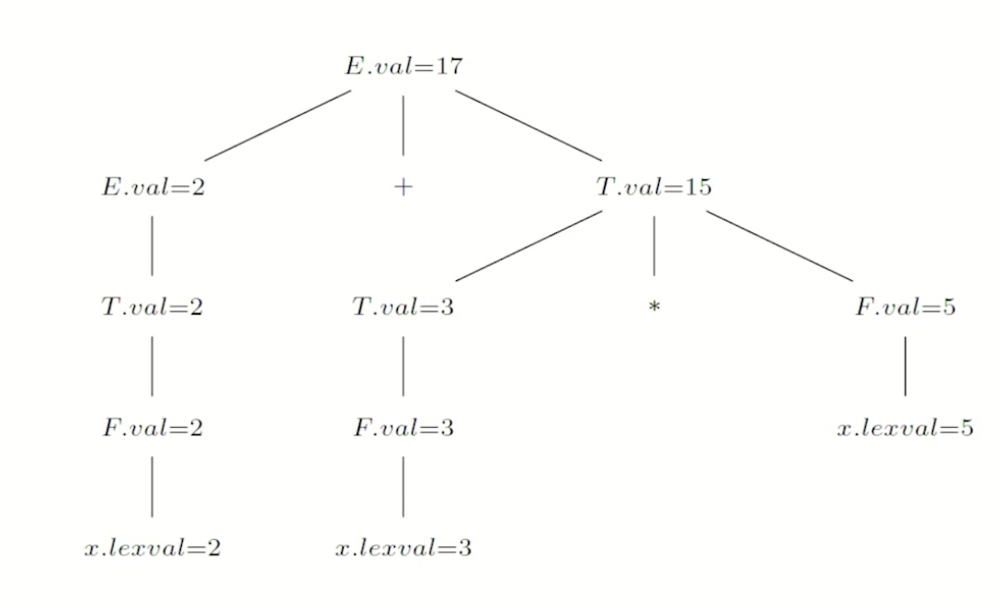
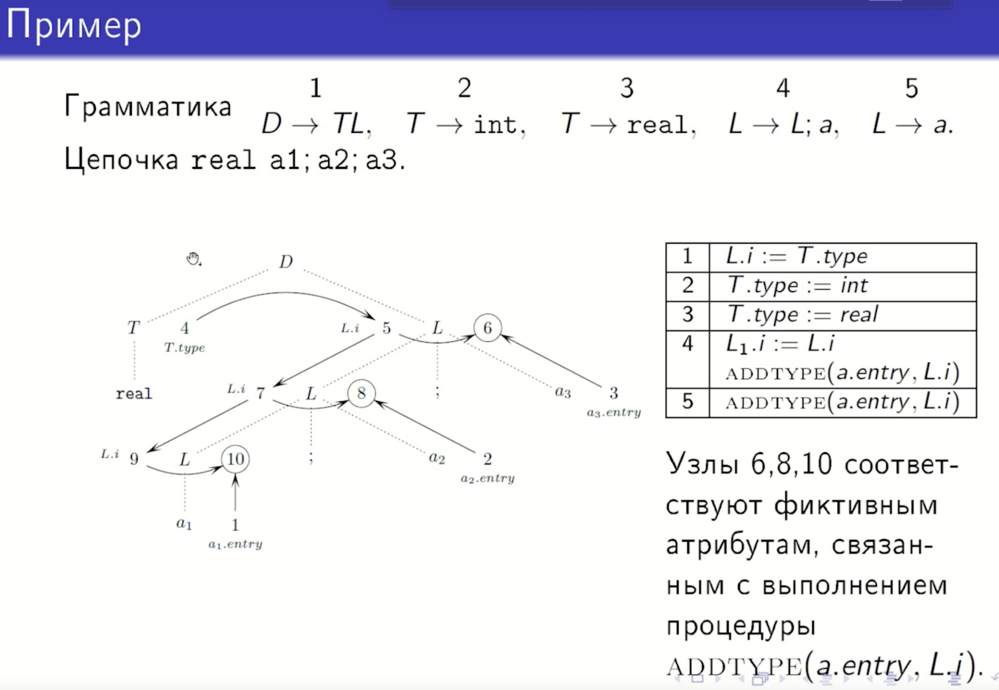

## 21. Наследуемые и синтезируемые атрибуты грамматических символов. Атрибутная грамматика. Граф зависимости. Топологическая сортировка.

https://vkvideo.ru/video-218215487_456239050?list=ln-FEr7bgDMD3qTMBnl0V&t=40m32s - лекций 19


# Атрибутная грамматика
Расширим понятие КС-грамматики до понятия *атрибутной грамматики*, наделив грамматические символы и правила вывода определенной смысловой нагрузкой. В результате каждому грамматическому выводу можно будет сопоставить конкретный вычислительный процесс над конкретными данными, тем самым связав синтаксическую и семантическую категории. Одну и ту же грамматику можно преобразовать в атрибутную грамматику многими способами в зависимости от того, какую именно семантическую информацию необходимо отследить.

Возьмем произвольную КС-грамматику $ G $ и поставим в соответствие каждому грамматическому символу конечное (возможно пустое) множество параметров. Эти параметры будем называть **атрибутами**. Каждый из атрибутов имеет свою область изменения ($ \text{домен} $). Каждому правилу вывода грамматики $ G $ сопоставим множество **семантических правил**, или **действий** – функциональных зависимостей вида  
$$b := f(c_1, \ldots, c_k),$$
где $ b, c_1, \ldots, c_k $ – атрибуты грамматических символов, входящих в правило вывода. Полученный объект называется **атрибутной грамматикой**.

### Примечание
**Простыми словами:**  

Атрибутная грамматика — это обычная КС-грамматика, к которой «прикрутили» дополнительные данные и правила их вычисления.  

**Как это устроено:**  

1. **К каждому символу** (например, `E`, `T`, `x`) добавляются **параметры** — это и есть **атрибуты**.  
   Например, у символа `E` может быть атрибут `значение` (число).  

2. **У каждого атрибута** есть свой **тип данных** (домен) — число, строка, адрес и т.д.  

3. **К каждому правилу вывода** добавляются **семантические правила** — формулы, которые говорят, как вычислить атрибуты.  
   Например:  
   $$
   E.val := E_1.val + T.val
   $$
   Это значит: «значение выражения `E` равно сумме значений подвыражений `E₁` и `T`».  

**Итог:**  
Атрибутная грамматика позволяет не только проверить синтаксис (как обычная грамматика), но и **вычислить значения, типы, адреса** и другие свойства элементов языка прямо в процессе разбора.

# Вывод в атрибутной грамматике

Вывод цепочки в атрибутной грамматике происходит так же, как и в КС-грамматике, только при применении каждого правила вывода выполняются и все связанные с ним семантические правила. В результате вывода в атрибутной грамматике каждому узлу дерева вывода сопоставляется список значений атрибутов грамматического символа, находящегося в этом узле. Полученное дерево называют **аннотированным** деревом вывода.

Атрибут a символа A обозначается через A.a. Атрибуты  
терминальных символов не вычисляются; обычно в роли  
атрибута терминала выступает его лексическое значение,  
хранимое в таблице символов компилятора. Нетерминал может  
иметь несколько атрибутов различных видов. В качестве  
значений атрибутов могут быть типы данных, числа, наборы  
битов, строки, поля строк таблиц, адреса памяти и т.д.


# Пример

Возьмем грамматику для арифметических выражений:  
$$E \to E + T | T, \, T \to T * F | F, \, F \to (E) | x.$$  
Введем атрибут $ val $ для символов $ E, \, T, \, F $ и используем его для вычисления значения арифметического выражения.

|    | Правило вывода | Семантические правила |
|---|---|---|
| 1   | $ E \to E_1 + T $ | $ E.val := E_1.val + T.val $ |
| 2   | $ E \to T $    | $ E.val := T.val $    |
| 3   | $ T \to T_1 * F $ | $ T.val := T_1.val * F.val $ |
| 4   | $ T \to F $    | $ T.val := F.val $    |
| 5   | $ F \to (E) $    | $ F.val := E.val $    |
| 6   | $ F \to x $    | $ F.val := x.lexval $    |

Индексы введены, чтобы различать одинаковые символы в левой и правой частях правила вывода. В таблице символов для терминала $ x $ указано его лексическое значение — $ x.lexval $, числовое значение переменной.


### пример аннотированного дерева вывода

ДВИГАЕМСЯ СЛЕВА-НАПРАВО + СНИЗУ-ВВЕРХ




#### копируем значения по цепному правилу


### теперь вычисляем



# Синтезируемые и наследуемые атрибуты
Атрибуты в зависимости от способа их вычисления делятся на  
2 типа: синтезируемые и наследуемые.  

**Синтезируемый атрибут $ s $** символа $ A $ вычисляется при  
применении правила вида $ A \to \alpha $, то есть синтезируемые  
атрибуты зависят от атрибутов сыновей узла. **Наследуемый  
атрибут $ i $** символа $ A $ вычисляется при применении правила  
вида $ B \to \alpha A\beta $, то есть наследуемые атрибуты зависят от  
атрибутов отца и/или братьев.  

Грубо говоря, синтезируемые атрибуты вычисляются при  
обходе дерева снизу вверх, наследуемые — при обходе сверху  
вниз (иногда между соседями) или более сложном, комбинированном.  

Использование обоих способов вычисления применительно к  
одному и тому же атрибуту ведёт к проблемам, зачастую  
неразрешимым.

### Почему смешивать правила — плохо:

Проблема: Если для одного и того же атрибута попытаться задать и синтезируемое, и наследуемое правило, может возникнуть циклическая зависимость (например, значение родителя зависит от значения ребёнка, а значение ребёнка — от значения родителя). Это делает вычисление невозможным или крайне сложным. Поэтому атрибут обычно проектируется как строго один тип.

### Фиктивные атрибуты
Можно оперировать кортежем атрибутов как одним атрибутом и считать, что у каждого символа только два атрибута — синтезируемый и наследуемый.

Расширенная трактовка семантических правил: *семантическое правило может быть произвольным фрагментом кода*, который следует выполнять при применении данного правила вывода.  
(Такой фрагмент кода обычно связан с атрибутами символов, входящих в правило вывода, например: «напечатать значение атрибута», «вычислить функцию атрибута и присвоить значение глобальной переменной», «внести данные в таблицу символов».) При этом можно считать, что такое семантическое правило вычисляет *фиктивный* синтезируемый атрибут нетерминала в левой части правила вывода.

### примечание
Фиктивные атрибуты - это технический приём, чтобы вписать любой произвольный код в формальную модель атрибутной грамматики.

На практике семантические правила — это не только формулы вида $b := f(...)$.
Это может быть любой код:
```
print(E.val) — напечатать значение

symbol_table.insert(x.name, x.type) — добавить запись в таблицу символов

generate_code(T.addr) — сгенерировать инструкции процессора
```

Такие действия не вычисляют значение атрибута в чистом виде, а совершают побочный эффект.

#### Почему фиктивные атрибуты удобны на практике?
Гибкость: В грамматику можно встраивать любые необходимые действия (генерация кода, проверки, вывод).

Единая модель: Все правила вывода выглядят однотипно: есть левая часть, правая часть и действие, вычисляющее атрибут (даже если он фиктивный).

Порядок выполнения: Действия выполняются автоматически в порядке, определённом зависимостями атрибутов (включая этот фиктивный).


# Граф зависимости

Если значение атрибута $ A.a $ в некотором узле дерева вывода определяется семантическим правилом $ A.a := f(B.b, ...) $, то значение атрибута $ B.b $ должно быть вычислено ранее: атрибут $ A.a $ **зависит** от атрибута $ B.b $. Зависимость между атрибутами грамматических символов в вершинах дерева вывода цепочки может быть представлена помеченным орграфом, называемым **графом зависимости цепочки**.

Каждому атрибуту грамматического символа в каждом узле дерева вывода цепочки $ w $ сопоставляется узел графа зависимости. Из узла, помеченного экземпляром атрибута $ B.b $, проводится дуга к узлу, помеченному экземпляром $ A.a $, если соответствующие узлы с метками $ A $ и $ B $ в дереве вывода цепочки $ w $ связаны правилом вывода (вида $ A \to \alpha B\beta $, $ B \to \alpha A\beta $, $ C \to \alpha A\beta B\gamma $ или $ C \to \alpha B\beta A\gamma $), которому соответствует семантическое правило вида $ A.a : = f(B.b, ...) $.

### пример


### примечание

***Как строятся зависимости***

- Правило 1: L.i := T.type
  - Контекст: Применяется в корне D → T L
  - Зависимость: Атрибут L.i (наследуемый атрибут L) зависит от T.type
  - В графе: Дуга от узла T.type к узлу L.i

- Правила 2 и 3: T.type := int или real
  - Контекст: T → real (в нашем случае)
  - Зависимость: T.type зависит от лексического значения терминала real
  - В графе: У терминалов нет вычисляемых атрибутов, поэтому T.type — это начальный узел, вычисляемый напрямую

- Правило 4: L.i := L.i и ADDTYPE(a.entry, L.i)
  - Контекст: Применяется для L → L; a (дважды в нашей цепочке)
  - Первая часть L.i := L.i:
  - Атрибут L.i в левой части (новый L) зависит от L.i в правой части (старый L)
  - В графе: Дуга от L.i (старый) к L.i (новый)
  - Вторая часть ADDTYPE(a.entry, L.i):
  Фиктивный атрибут ADDTYPE зависит от:
    - a.entry (лексическое значение идентификатора)
    - L.i (текущее значение наследуемого атрибута)
  - В графе: Две дуги: от a.entry и от L.i к фиктивному узлу ADDTYPE

- Правило 5: ADDTYPE(a.entry, L.i)
  - Контекст: Применяется для L → a (самый нижний L)
  - Зависимости: Аналогично — фиктивный атрибут зависит от a.entry и L.i
  - В графе: Две дуги к фиктивному узлу

# Ациклическая атрибутная грамматика и топологическая сортировка

Для того, чтобы все арибуты могли быть вычислены, необходимо и достаточно, чтобы граф зависимости не содержал циклов.  
Если циклов нет, то граф зависимости допускает ***топологическую сортировку***: нумерацию узлов, при которой любой путь ведёт из вершины с меньшим номером в вершину с большим номером. Данная нумерация и будет порядком вычисления атрибутов.  

Атрибутная грамматика **ациклична**, если для любой выводимой в ней терминальной цепочки её граф зависимости не имеет циклов. Свойство алгоритмически разрешимо.