## 22. Синтаксическое дерево, даг. Атрибутная грамматика для построения дага. Проверка существования узла.

Вспомним схему устройства компилятора: 
Frontend (занимается анализом, разбором, поиском ошибок)
Backend (занимается генерацией целевого кода).
Но между ними есть передаточное звено в виду промежуточного представления. После того, как блок анализа отработал, он получил некоторое представление исходного текста, пригодного для дальнейшей генерации кода на целевом языке, это и есть промежуточное представление, а **синтаксическое дерево** — один из его вариантов.
Для построения синтаксического дерева исходная грамматика должна быть операторной. Синтаксическое дерево получается из дерева вывода применением двух преобразований, пока это возможно:
1) Листья, соответствующие терминалам-операторам (и ключевым словам), удаляются, а данные терминалы связываются с родительским узлом.
2) Ветви дерева, соответствующие цепным правилам, сворачиваются в одну вершину.
(Важно учитывать, что не все листья в исходном дереве являются операторами и ключевыми словами. Только операторы идут в родительский узел, операнды остаются как есть, разве что поднимаются наверх цепочки, а сама цепочка при этом удаляется)
В результате все узлы преобразованного дерева помечены терминалами (листья — операндами, а внутренние узлы — операторами и другими аналогичным по смыслу языковыми конструкциями)
Если вдруг забыли, что такое дерево вывода:
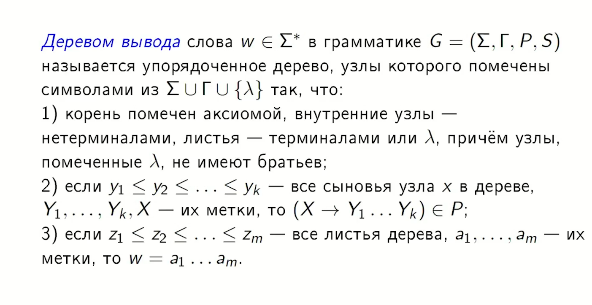
Рассмотрим пример преобразования дерева вывода в синтаксическое дерево:
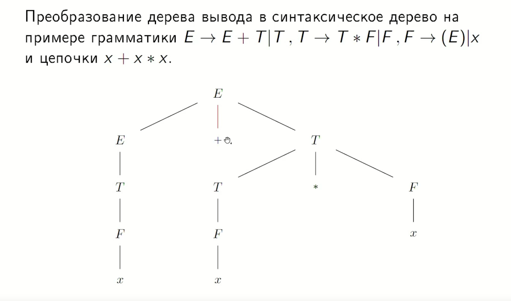
Поднимаем оператора в родительский узел: + Поднимаем в E.
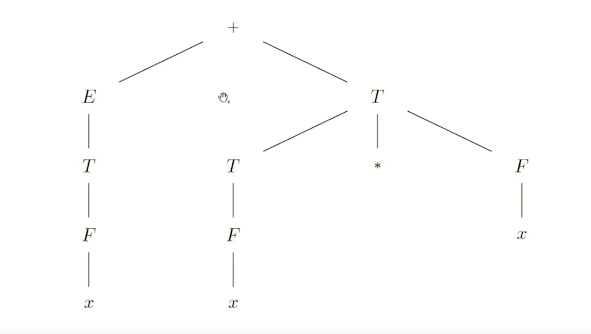
То же самое происходит с умножением в родительский узел T.
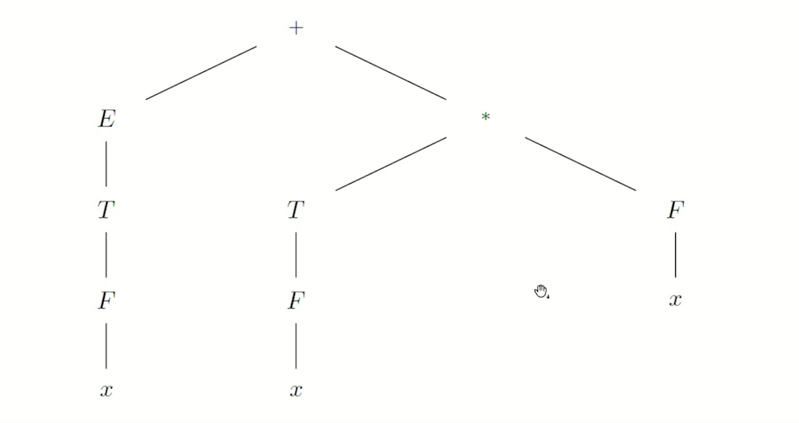
Теперь свернем цепочку E-T-F-x в один узел, помеченный соответствующим терминалом x
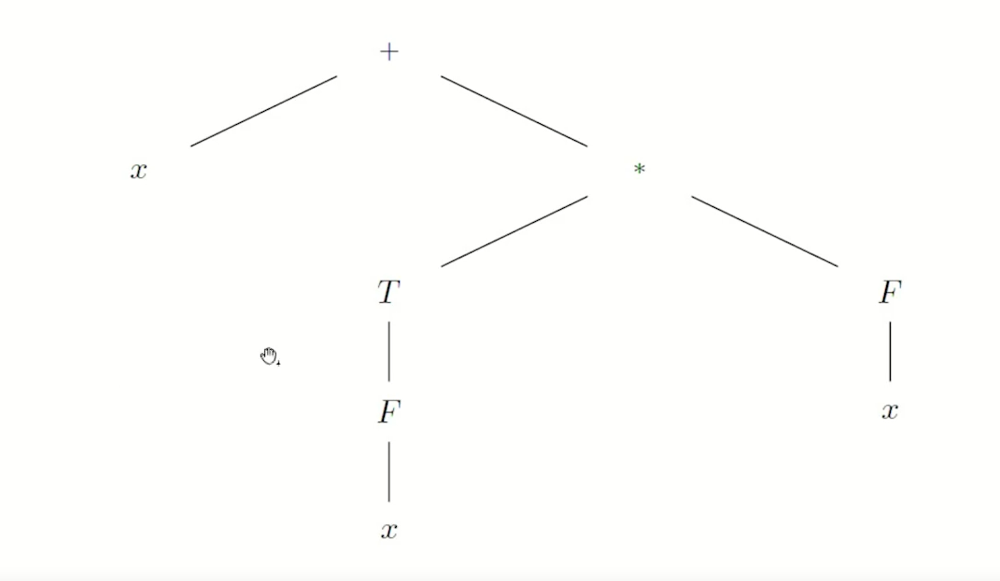
Аналогично T-F-x в x
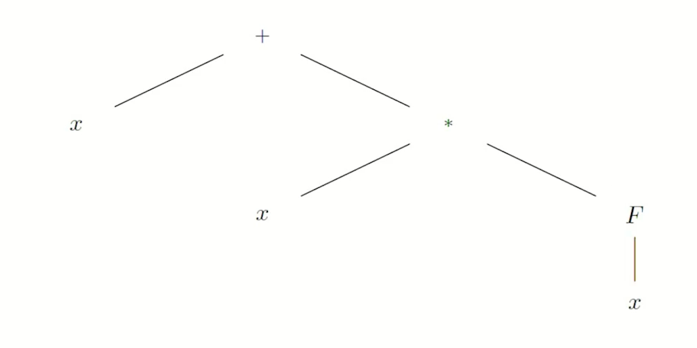
Так же с F-x
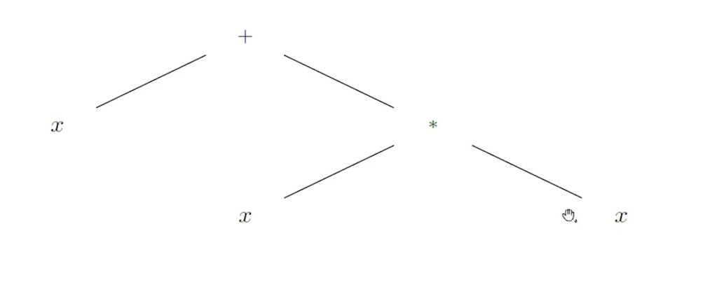
Мы получили синтаксическое дерево!

Теперь рассмотрим, как выглядит атрибутная грамматика для синтаксического дерева:
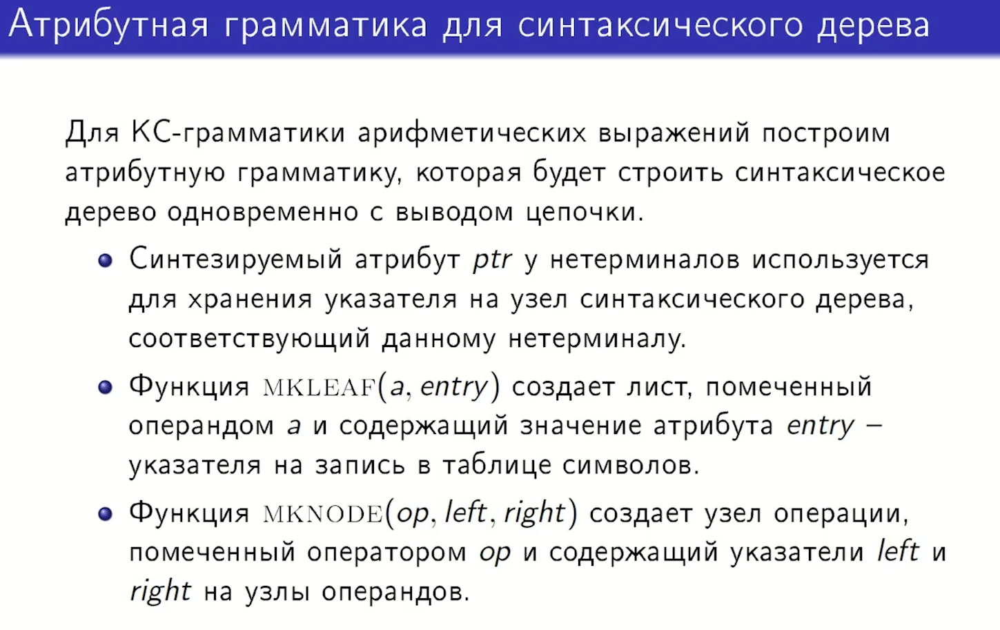
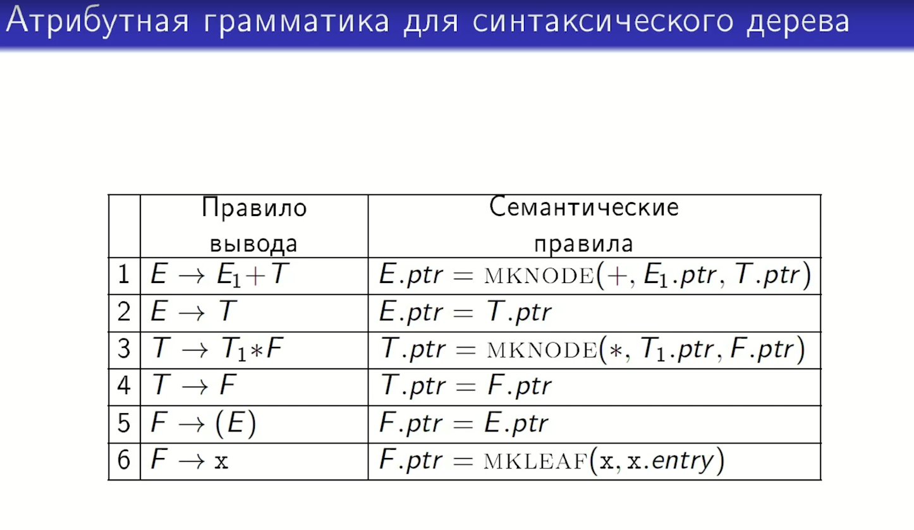
Что такое даг?
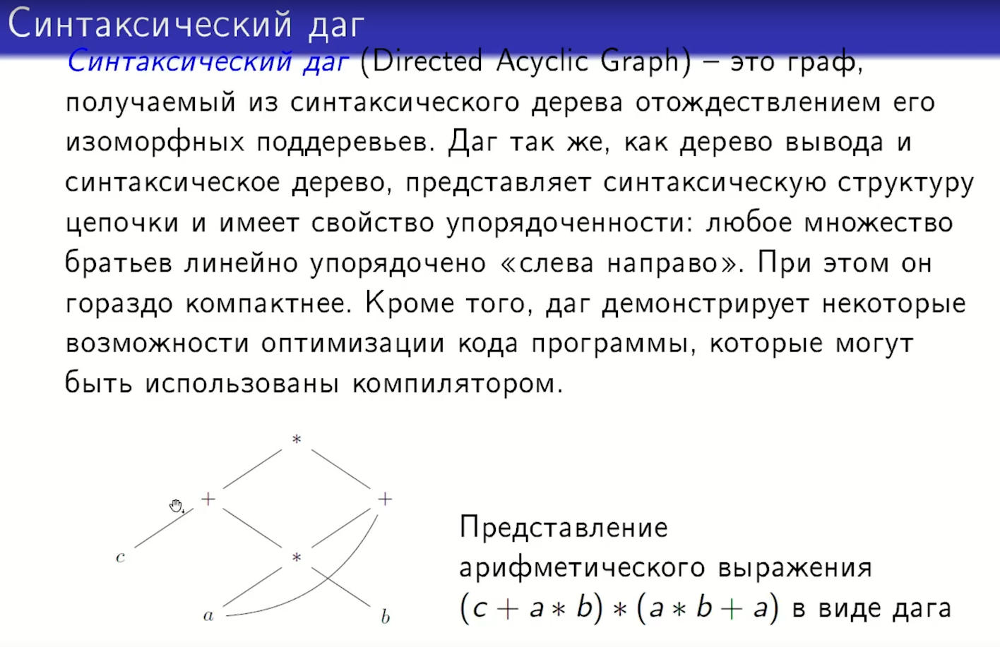
Какова будет атрибутная грамматика для построения дага? В функциях создании листа MKLEAF() и создании узла MKNODE() должны проверять, нет ли уже в строящемся даге изоморфного поддерева (например повторяющихся a*b). Если такое поддерево уже есть, то просто вернем указатель на него и не будем создавать новый узел. Если нет, то делается всё, как и раньше — создается новый узел/лист.
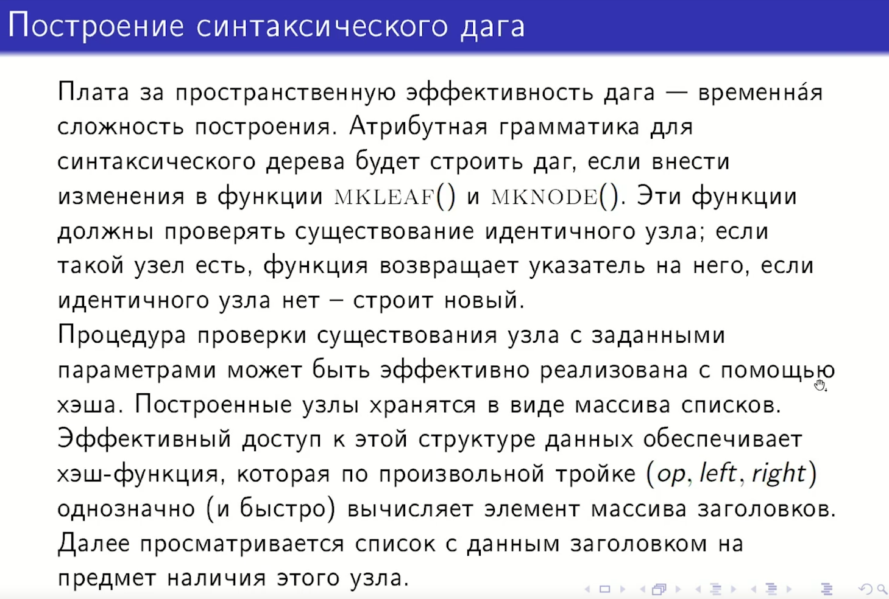
Основная загвоздка заключается в том, чтобы достаточно быстро проверять существование узла с заданными параметрами (т.е. с такой же меткой у корня и такими же левыми и правыми сыновьями или просто с такой же меткой, если речь о листе). Это можно реализовать например с помощью хэша, если хранить все построенные узлы в виде массива списков (все узлы разделяются на какие-то равные группы, и мы осуществляем с помощью хэша доступ к какой-то из этих групп и внутри этой группы её просматриваем на предмет наличия подходящего нам узла). Соответственно, хэш-функция по произвольной тройке (op, left, right) для MKNODE быстро вычисляет нужный заголовок, нужную ссылку на нужную группу узлов и далее этот список просматривается на предмет наличия интересующего нас узла, если такой узел найден, возвращаем на него ссылку, если узел не найден, то создаем новый узел. Таким образом мы можем минуя этап построения синтаксического дерева построить синтаксический даг.