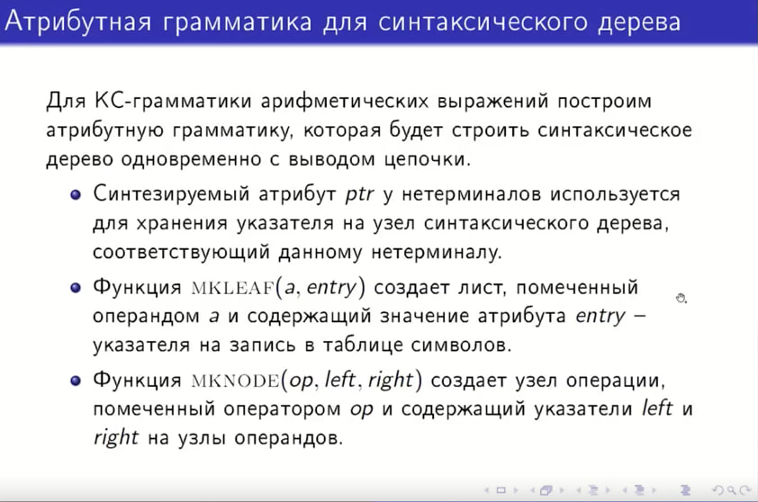
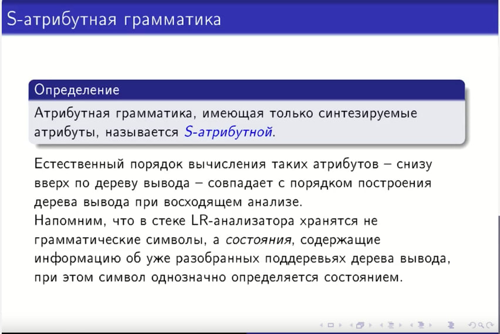
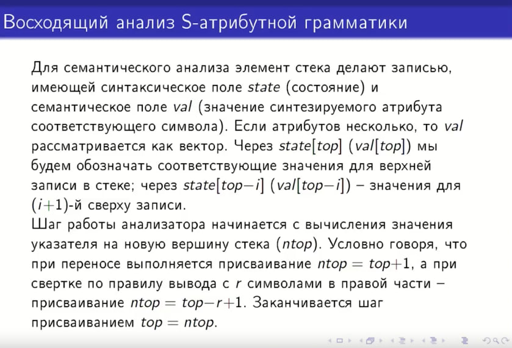
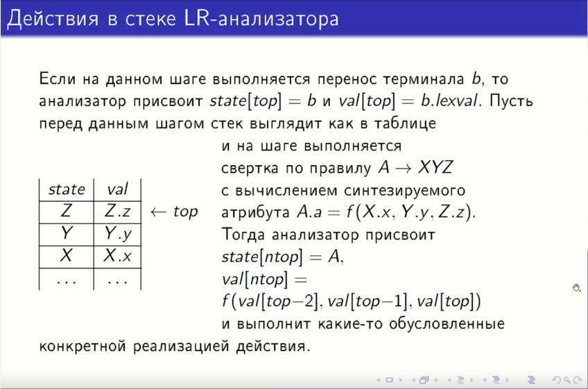
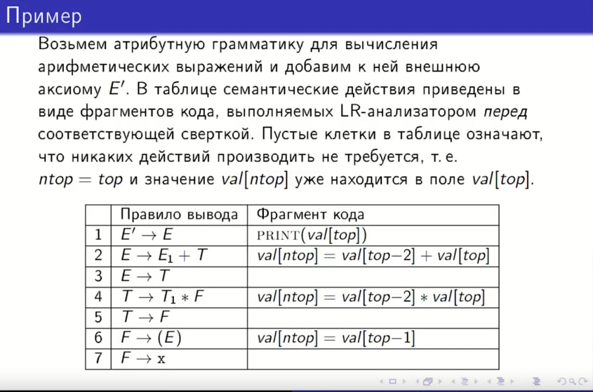

## 23. S-атрибутные грамматики. Реализация при восходящем анализе.

## 1. Основные определения

**S-атрибутная грамматика** — это тип атрибутной грамматики, в которой используются только **синтезируемые атрибуты**.

* **Синтезируемый атрибут** — это атрибут, значение которого в узле дерева вычисляется через значения атрибутов его
  дочерних узлов.
* **Особенность:** Порядок вычисления таких атрибутов — **снизу вверх** (от листьев к корню). Это идеально совпадает с
  порядком работы восходящих (bottom-up) парсеров, таких как LR-анализаторы.

---

### Детальное управление указателем стека

Для реализации семантики анализатор использует два указателя: `top` (текущая вершина) и `ntop` (новая вершина).

* **Доступ к данным:** * `val[top]` — атрибут верхнего элемента.
    * `val[top-i]` — атрибут (i+1)-го элемента сверху.

* **Логика ntop:**
    * При **переносе (Shift)**: `ntop = top + 1`. Стек просто растет вверх.
    * При **свертке (Reduce)** по правилу с длиной правой части `r`: `ntop = top - r + 1`. 
      Это позволяет записать результат вычисления прямо в ту позицию, где начиналась правая часть правила, эффективно заменяя её одним нетерминалом.

* **Завершение:** В конце каждого шага выполняется присваивание `top = ntop`.

## 2. Механизм реализации в LR-анализаторе

В стандартном LR-анализаторе в стеке хранятся состояния (`state`). Для реализации S-атрибутной грамматики каждая запись
в стеке расширяется полем **`val`** для хранения значения атрибута.

### Структура стека

Стек представляет собой массив записей, где каждая запись — это пара `(state, val)`.

* `state` — состояние синтаксического анализатора.
* `val` — значение синтезируемого атрибута для соответствующего символа.

### Управление указателями стека

При выполнении шага анализатора вычисляется новое положение вершины стека — `ntop`:

1. **Перенос (Shift):** `ntop = top + 1`. Атрибут терминала (например, значение числа из лексера) записывается в
   `val[ntop]`.
2. **Свертка (Reduce):** Если применяется правило $A \to XYZ$ (где $r=3$ символа в правой части):
    * `ntop = top - r + 1`.
    * Значение атрибута нетерминала $A$ вычисляется как функция от значений атрибутов $X, Y, Z$, которые уже лежат в
      стеке на позициях `top-2`, `top-1` и `top`.

---

## 3. Функции построения синтаксического дерева

Если атрибутом является не число, а указатель на узел дерева (`ptr`), используются следующие функции:

* **`MKLEAF(id, entry)`**: Создает лист дерева для операнда (идентификатора или константы). `entry` — указатель на
  запись в таблице символов.
* **`MKNODE(op, left, right)`**: Создает внутренний узел для операции `op` с указателями на левое и правое поддеревья.

---

## 4. Подробный разбор примера

Рассмотрим грамматику арифметических выражений, дополненную семантическими действиями для вычисления значений.

| № | Правило вывода  | Фрагмент кода (Семантическое действие) | Комментарий                                                            |
|:--|:----------------|:---------------------------------------|:-----------------------------------------------------------------------|
| 1 | $E' \to E$      | `PRINT(val[top])`                      | Вывод финального результата в корне.                                   |
| 2 | $E \to E_1 + T$ | `val[ntop] = val[top-2] + val[top]`    | Свертка суммы: $E_1$ на `top-2`, знак `+` на `top-1`, $T$ на `top`.    |
| 3 | $E \to T$       | *(пусто)*                              | Значение $T$ просто переходит к $E$ (`ntop` совпадает с `top`).        |
| 4 | $T \to T_1 * F$ | `val[ntop] = val[top-2] * val[top]`    | Свертка произведения.                                                  |
| 5 | $T \to F$       | *(пусто)*                              | Передача значения вверх.                                               |
| 6 | $F \to (E)$     | `val[ntop] = val[top-1]`               | Значение выражения $E$ берется с позиции `top-1`, т.к. на `top` — `)`. |
| 7 | $F \to x$       | *(пусто)*                              | Значение `x` уже лежит в `val[top]` после фазы переноса.               |

### Пример процесса для выражения `3 * 5`:

1. **Shift `3`**: В стеке `val[top] = 3`.
2. **Reduce $F \to x$, $T \to F$**: Значение `3` поднимается по стеку.
3. **Shift `*`**: Стек растет.
4. **Shift `5`**: В стеке `val[top] = 5`.
5. **Reduce $T \to T * F$**:
    * Анализатор видит в стеке: `[3]` (на `top-2`), `[*]` (на `top-1`), `[5]` (на `top`).
    * Выполняет: `3 * 5`.
    * Результат `15` записывается в `val[ntop]`, заменяя собой всю правую часть правила в стеке.

---
**Итог:** Реализация S-атрибутных грамматик в восходящих анализаторах эффективна, так как не требует отдельного обхода
дерева — вычисления происходят параллельно с синтаксическим анализом.