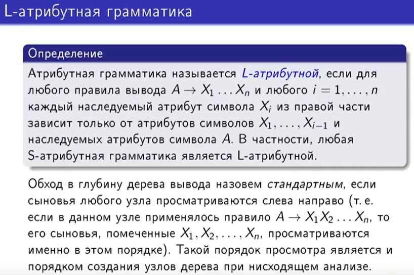
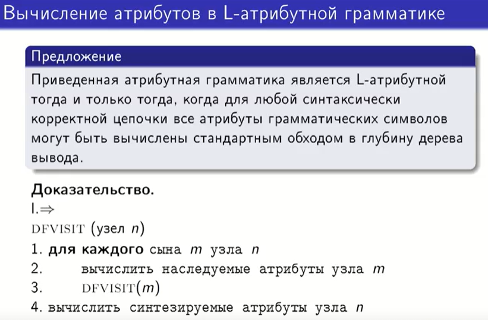
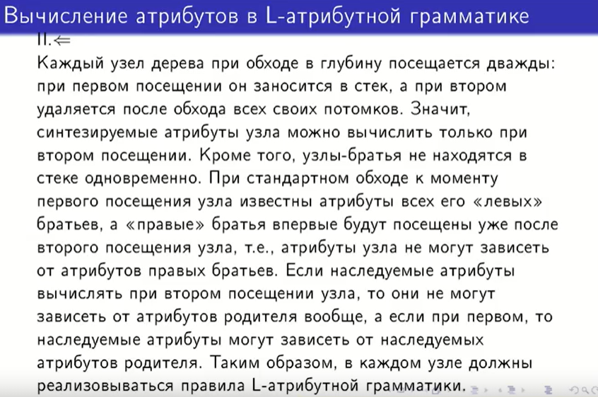
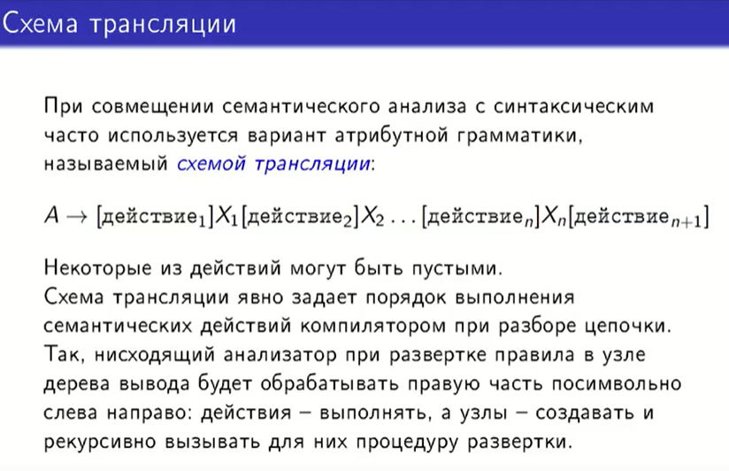
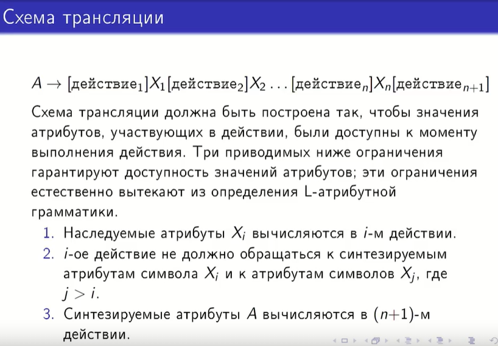
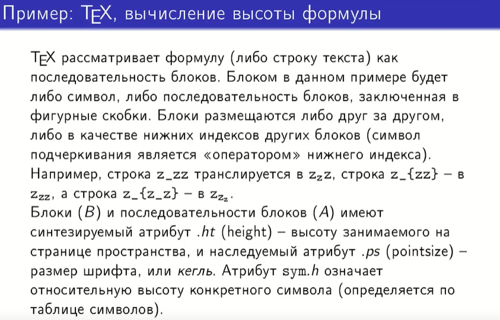
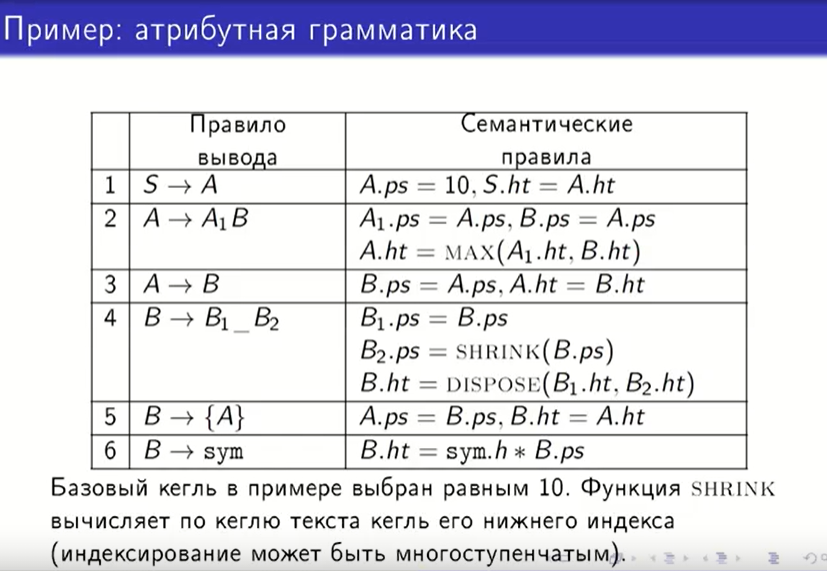
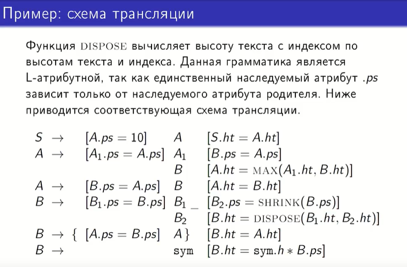

## 24. L-атрибутные грамматики. Вычисление атрибутов при обходе в глубину. Схемы трансляции.

Ничего не сказано про синтезируемые атрибуты, так как на них нельзя ввести никаких ограничений (они могут быть, могут не быть)

Можем наследоваться от любых (и синтезируемых, и наследуемых) атрибутов левых братьев и только от наследуемых атрибутов отца

Док-во:

1. => (если грамматика L-атрибутная)
   
Рекурсивная процедура посещения узла:

* Заходим в узел n
* Просматриваем всех его сыновей m слева направо
* Вычисляем наследуемые атрибуты каждого сына m
* Заходим в соответствующие сыновьям m поддеревья
* Вычисляем синтезируемые атрибуты узла n (когда все сыновья и соответствующие им поддеревья посещены и произведены все возвраты из этих процедур)

Это работает, потому что:

В L-атрибутной грамматике все наследуемые атрибуты зависят только от левых братьев или от отца. Если мы посещаем узел и его сыновей, это значит, что к этому времени наследуемые атрибуты отца уже известны. Когда мы доходим до какого-то узла среди его сыновей, это значит, что всех более левых сыновей мы уже посетили и вернулись оттуда (то есть вычислены их наследумые и синтезируемые атрибуты), поэтому теперь в случае зависимости от атрибутов левых братьев, мы сможем вычислить атрибуты данного узла. Синтезируемые атрибуты вычисляются после того, как все поддерево, лежащее под данным узлом полностью пройдено, значит у нас есть вся необходимая информация для вычисления синтезируемых атрибутов. 

2. <= (если данная процедура позволяет вычислить все атрибуты)

Замечания:

Узлы-братья в стеке одновременно не находятся: если мы прошли какого-то брата, значит мы уже прошли все поддерево, вернулись обратно в этот узел, посчитали все его атрибуты и удалили его из стека.

Если наследуемые атрибуты вычисляются при первом посещении узла, то они могут зависеть только от наследуемых атрибутов родителя, поскольку синтезируемые атрибуты родителя будут вычислены только после посещения всех его сыновей и возвращения в него (родительский). 

Схема трансляции - это способ записи атрибутной грамматики

Между символами встраиваются семантические действия, которые происходят в определенный момент

Разворачивать правило в узле = заменять левую часть правила на правую

К моменту выполнения действия должны быть доступны (вычислены) все атрибуты, от которых зависит вычисляемый в данном действии атрибут

Замечания по ограничениям:

1. Атрибуты символа вычисляются в действии, которое находится перед тем, как мы пойдем разворачивать поддерево, соответствующее данному узлу
3. Синтезируемые атрибуты для левой части правила вывода вычисляются в самом последнем действии, которое расположено после последнего символа правой части

Последовательность блоков, заключенная в фигурные скобки, является вложенным блоком

Задача: посчитать физическую высоту формулы

А и В - нетерминалы

Атрибут относительной высоты - для терминалов (это запись в таблице символов, лексическое значение)

Отдельный символ тоже может быть блоком

Базовый кегль задается откуда-то извне (можно считать константой), далее кегль наследуется, единственное изменение появлется там, где есть нижняя индексация

Кегль передаем сверху вниз по дереву, а высоту вычисляем после этого снизу вверх

В последовательности блоков высота будет максимальной из всех составляющих 

