## 25. Устранение левой рекурсии из схемы трансляции.

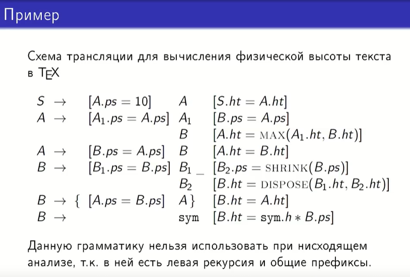

В данном примере 2-ое и 4-ое правила леворекурсивные (правая часть правила вывода начинается с того же нетерминала, который находится в левой части)

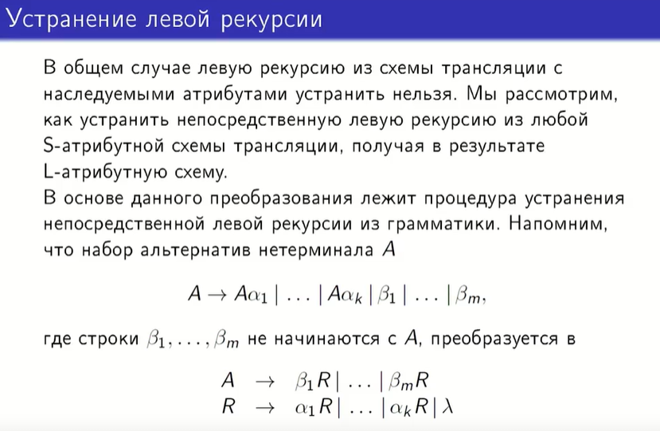

В S-атрибутной схеме трансляции есть только синтезируемые атрибуты

В некоторых случаях с наследуемыми атрибутами тоже можно провести такое преобразование

Заменяем левую рекурсию на правую с помощью введения дополнительного нетерминала R, который аннулируется после того, как выведено все, что нужно вывести из А

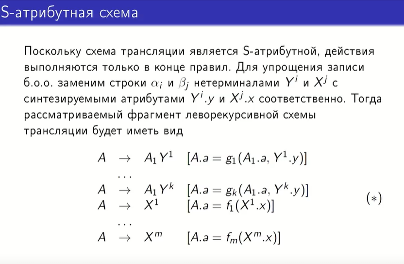

Действия выполняются только в конце правил: когда мы разобрали все поддерево, выводимое из данного нетерминала, и вернулись обратно в этот узел при обходе в глубину, то мы можем вычислить синтезируемый атрибут на основе атрибутов сыновей данного узла

Атрибут А.а вычисляется через какую-то функциональную зависимость от атрибутов символов, которые находятся в правой части правил вывода. У всех X и Y по одному синтезируемому атрибуту. По замечанию: если атрибутов несколько, но они все синтезируемые, то можно оперировать ими как кортежем, то есть как одним атрибутом.

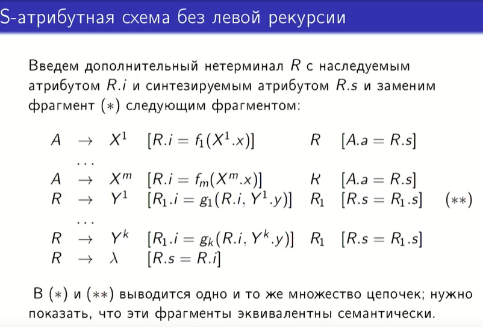

Сейчас если не обращать внимание на семантические действия, записанные в квадратных скобках, то пока это все то же самое, что происходит при устранении левой рекурсии из контекстно-свободной грамматики.

Все функциональные зависимости, которые были у атрибута А.а от всех остальных атрибутов, теперь вычисляются как наследуемый атрибут символа R перед тем, как он будет раскрыт. К этому моменту мы уже рассмотрели все поддеревья, соответствующие X и Y, поэтому данные атрибуты уже могут быть вычислены. Переходим к развертыванию узлов R. Важно: когда R аннулируется, его наследуемый атрибут копируется в синтезируемый атрибут, и последний передается обратно вверх по дереву без изменений.

Теперь надо проверить, что значение атрибута А.а совпадает в обеих схемах (*) и (**):

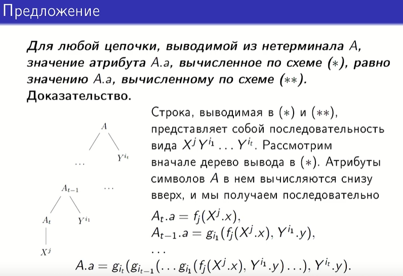

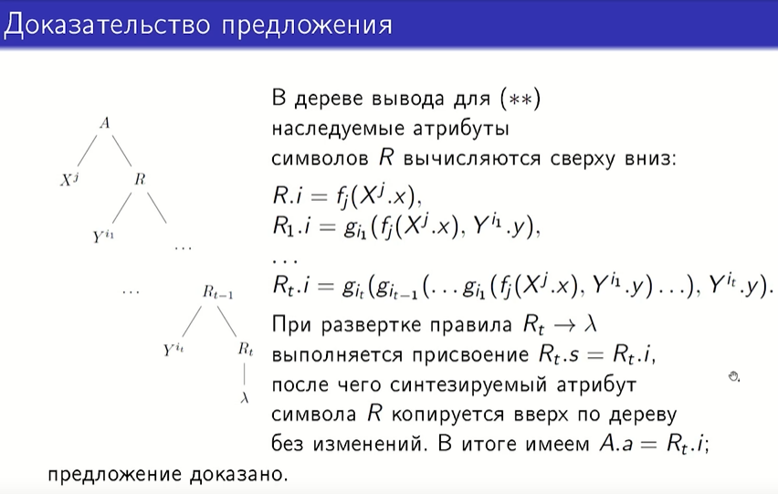

Наследуемый атрибут R.i зависит от левого брата, все последующие от отца + левого брата

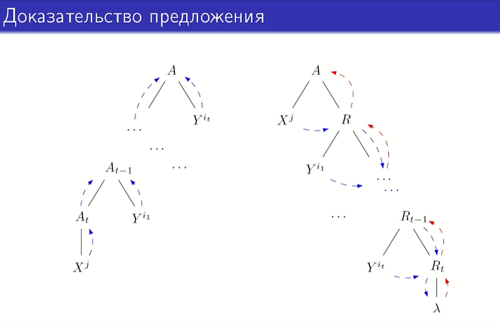

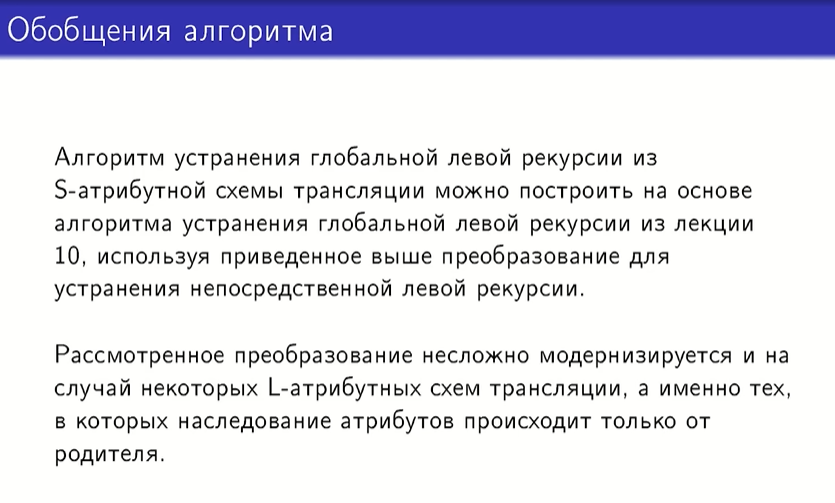

На основе алгоритма устранения глобальной левой рекурсии из контекстно-свободной грамматики

Если наследование есть от левых братьев: при замене левой рекурсии на правую мы меняем местами братьев, а вычислять наследование от правых братьев мы не умеем при синтаксическом анализе, так как мы всегда обходим все слева направо, и это противоречит определению L-атрибутной грамматики (наличие наследования от правых братьев).

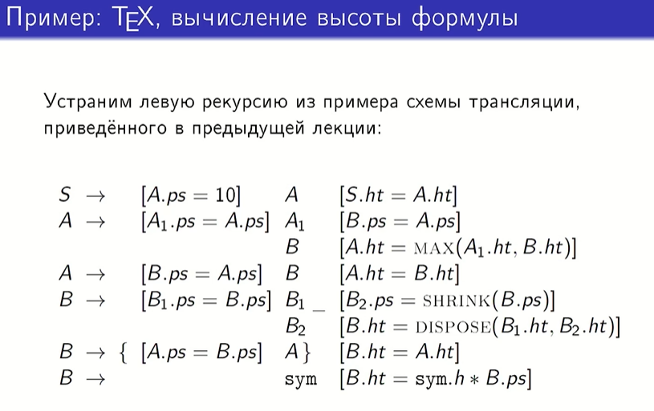

Вернулись к примеру из начала лекции: тут 2-ое и 4-ое правила леворекурсивные (правая часть правила вывода начинается с того же нетерминала, который находится в левой части)

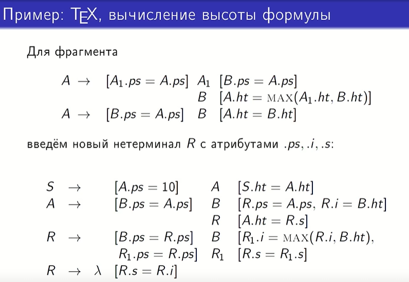

Новому нетерминалу потребуется 3 атрибута, так как в исходной грамматике было 2 (для исходного синтезируемого атрибута .ht добавлены новые 2 атрибута .i и .s, которые будут вычисляться сначала сверху вниз, а потом снизу вверх, исходный наследуемый атрибут кегля .ps просто сохраняется)

Для нового нетерминала добавили наследование атрибута кегля от родителя, как и у остальных.

Вычисление высоты: на первое исходное правило не обращаем внимание, в следующих правилах высота теперь наследуется от левого брата, в последнем правиле синтезриуемый атрибут копирует значение из наследуемого, значение синтезируемого атрибута R.s просто копируется вверх по дереву от сына к родителю.

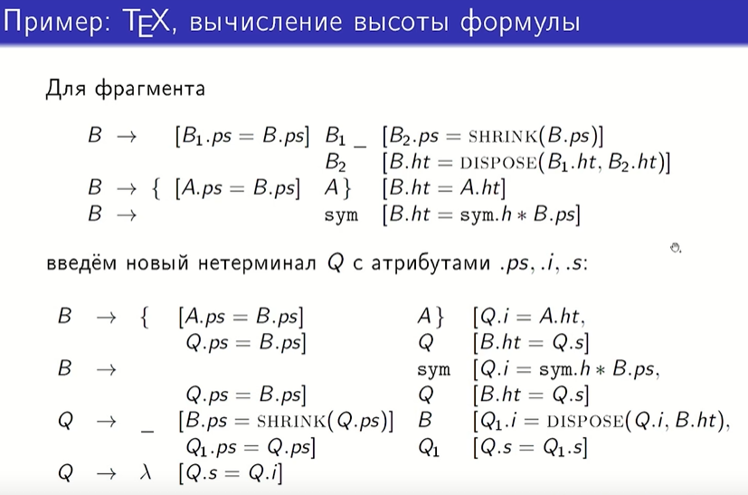

Все аналогично 

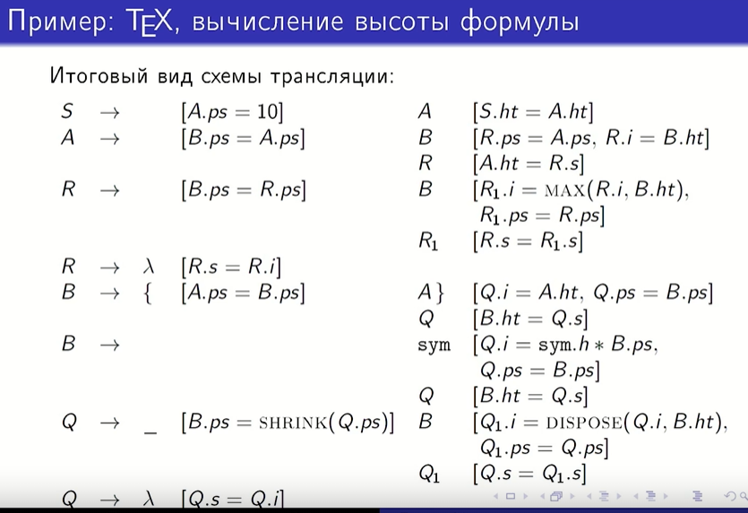

Просто записали все вместе
