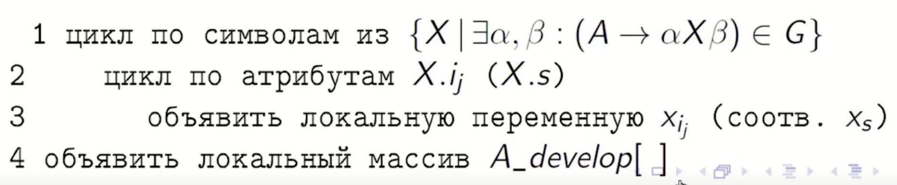
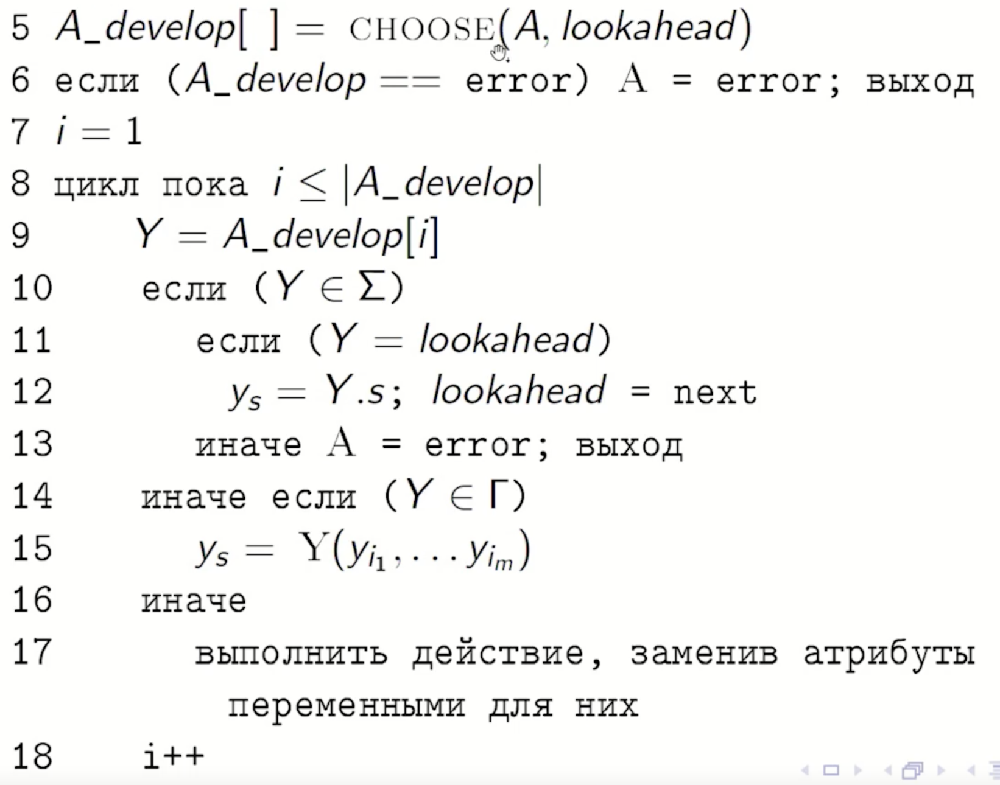
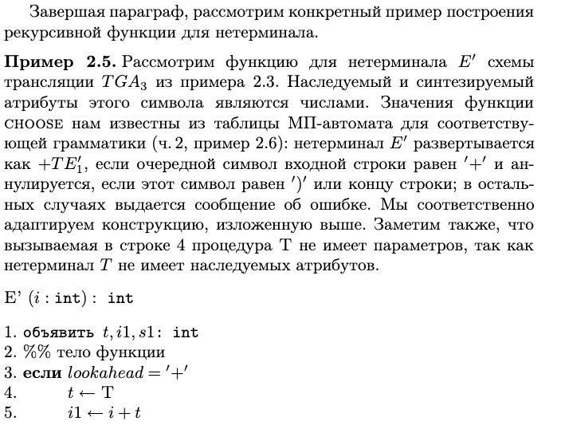
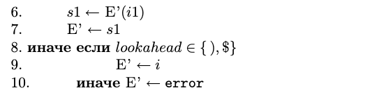

## 26. Реализация транслятора, совмещённого с нисходящим анализатором.

# Нисходящий транслятор

Если построенная схема трансляции пригодна для нисходящего анализа, то можно построить нисходящий **транслятор** – программу, осуществляющую нисходящий синтаксический анализ параллельно с вычислением атрибутов, в соответствии с правилами данной схемы трансляции.

Нисходящий транслятор представляет собой набор функций, взаимно однозначно соответствующих нетерминалам порождающей грамматики. Эти функции рекурсивно вызывают друг друга и имеют общую глобальную переменную `lookahead`, значение которой указывает на текущий символ входной строки в процессе ее разбора.

Обработка входной строки транслятором производится путем установки указателя `lookahead` на первый символ строки и вызова функции S, соответствующей аксиоме грамматики.

### примечание
***Что такое нисходящий транслятор?***
Это программа, которая одновременно:

- Разбирает синтаксис (нисходящий LL(1)-анализ)

- Выполняет семантические действия (вычисляет атрибуты, генерирует код, заполняет таблицы)

Ключевые свойства:

- Функциональная структура: одна функция на каждый нетерминал

- Работает за один проход (синтаксис + семантика вместе)

- Использует общую переменную lookahead для доступа к текущему токену

#### Важные ограничения
Только LL(1)-грамматики — иначе CHOOSE(A, lookahead) не сможет однозначно выбрать правило

Схема трансляции должна быть пригодна — обычно это L-атрибутные грамматики

Левой рекурсии быть не должно — иначе рекурсивные вызовы зациклятся

# Алгоритм функции для нетерминала

Вход: схема трансляции, основанная на LL(1)-грамматике  
$$ G = (\Sigma, \Gamma, P, S), $$  
нетерминал $ A $.  

Выход: код функции для $ A $.  

Функция TYPE(x) возвращает тип x, функция CHOOSE(A, a) возвращает «атрибутный» вариант правила вывода, содержащегося в клетке $[A, a]$ таблицы нисходящего анализатора грамматики $ G $ (предполагается, что таблица построена предварительно). Построенная для нетерминала функция имеет вид  

$$A(i_1 : TYPE(A.i_1), \dots, i_k : TYPE(A.i_k)) : TYPE(A.s)$$

### пример из шура (стр. 210)

