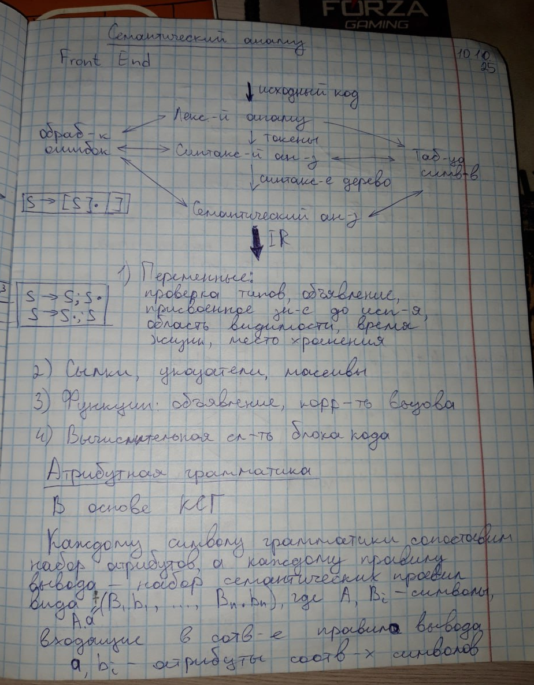
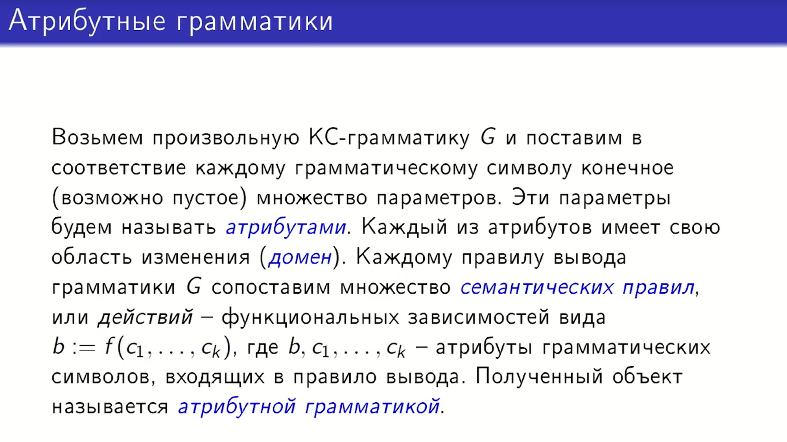
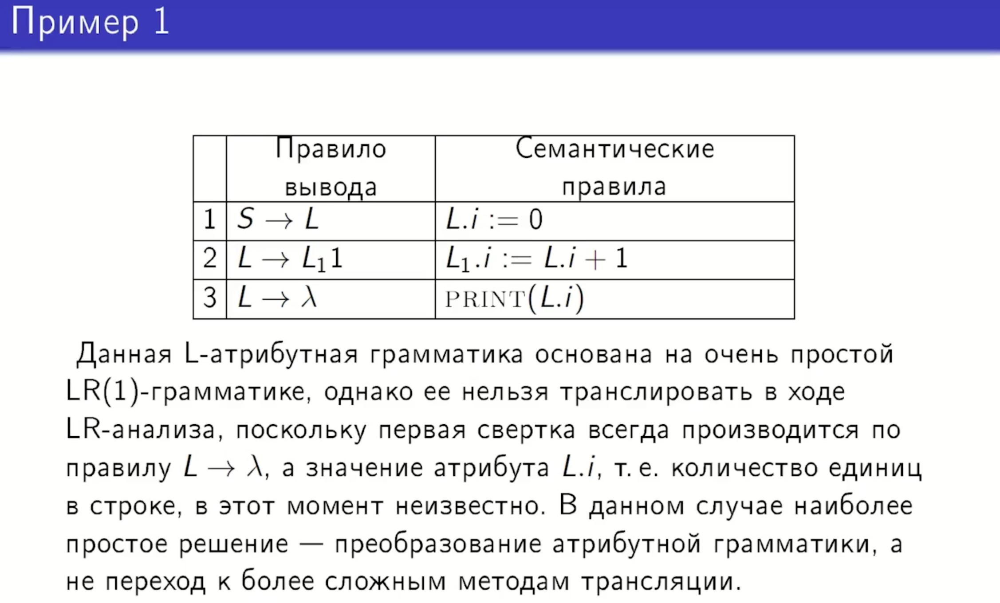
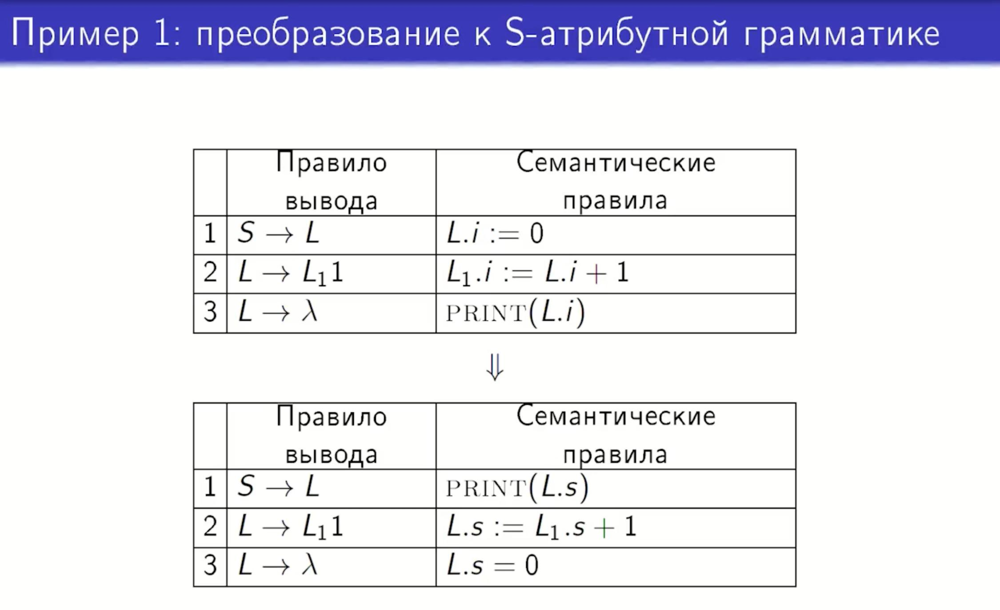
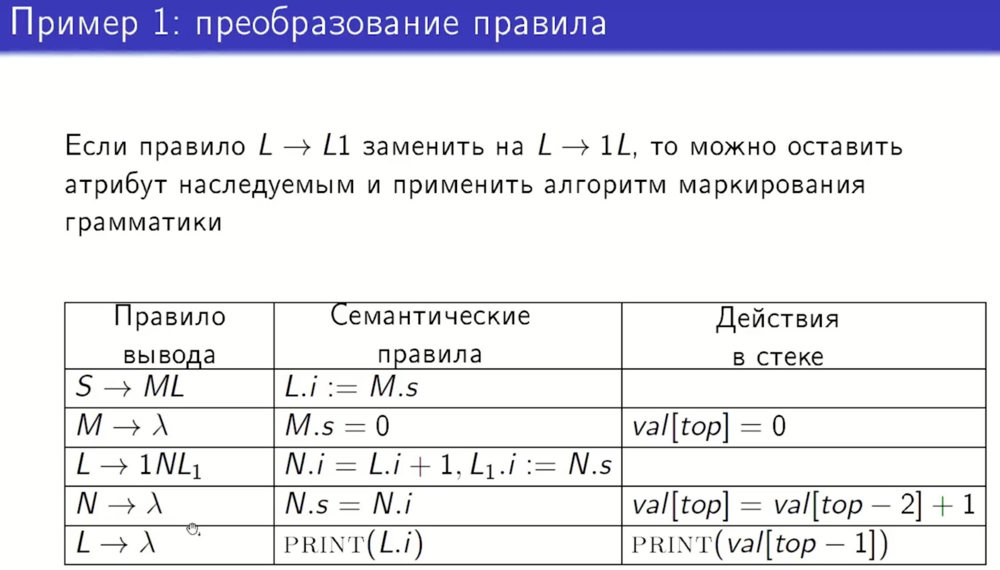
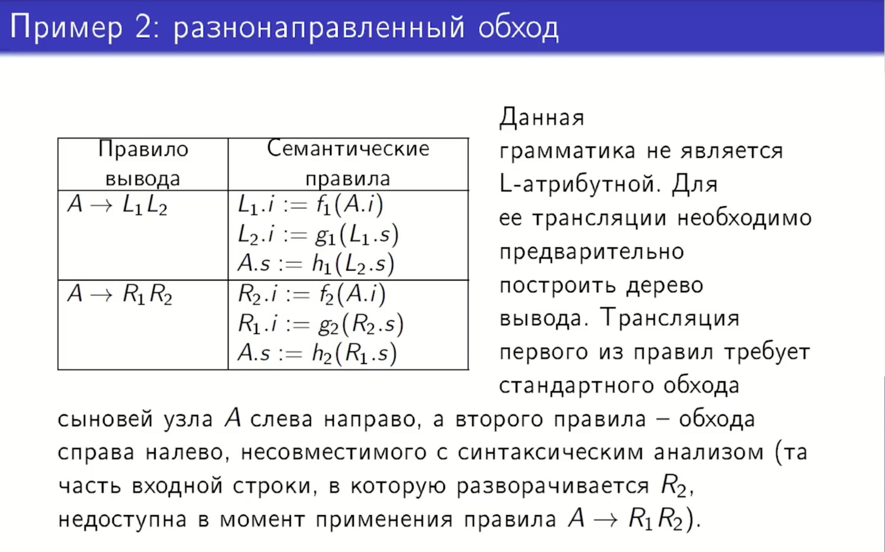
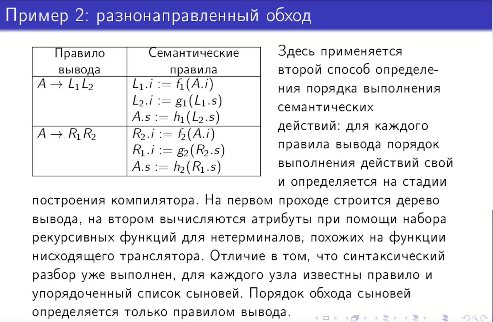
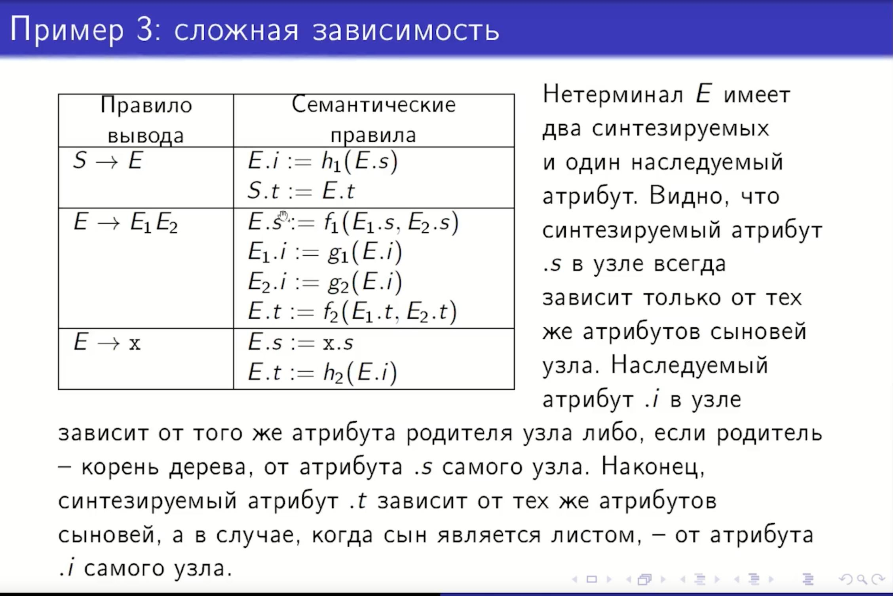
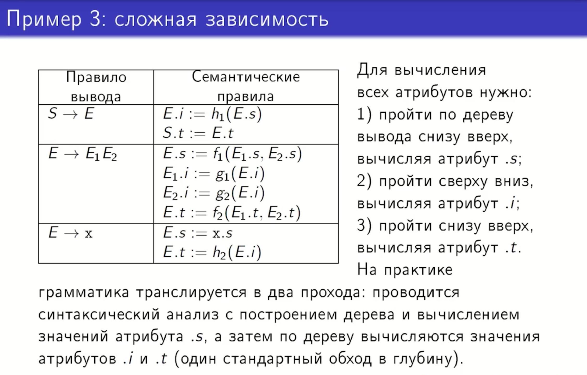
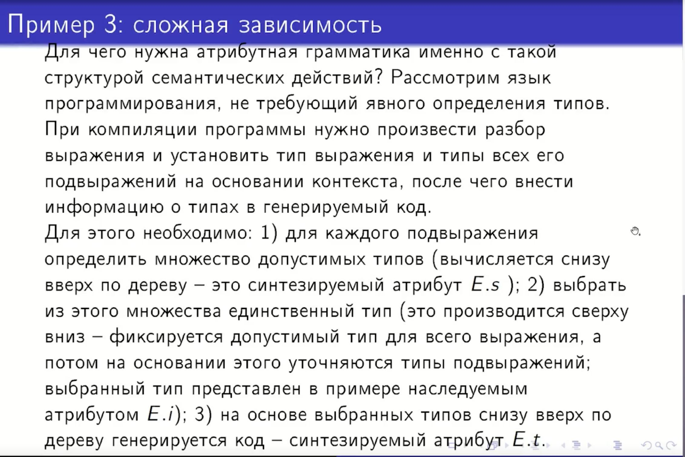

## 28. Примеры атрибутных грамматик, не вычислимых в ходе синтаксического анализа.

### Атрибутная грамматика:

В теории компиляции не все атрибутные грамматики могут быть вычислены «на лету» одновременно с синтаксическим разбором (
то есть за один проход). Это происходит, когда зависимости между атрибутами противоречат порядку обхода дерева вывода
синтаксическим анализатором.

### 1. Грамматики с «несвоевременными» действиями

Это ситуации, когда семантическое действие должно быть выполнено в момент, когда необходимая для него информация еще не
доступна анализатору.

* **Пример:** Грамматика для подсчета количества единиц в строке, где значение наследуемого атрибута передается в самое
  начало вывода.
    * Правила:
        1. $S \to L$ (семантика: $L.i := 0$)
        2. $L \to L_1 1$ (семантика: $L_1.i := L.i + 1$)
        3. $L \to \epsilon$ (семантика: **print($L.i$)**)
    * **Почему не вычислимо:** При LR-анализе первая свертка всегда происходит по аннулирующему
      правилу $L \to \epsilon$. В этот момент общее количество единиц в строке ($L.i$) еще не известно, так как символы
      строки еще не обработаны.

### 2. Не L-атрибутные грамматики (Разнонаправленные обходы)

Если грамматика не является L-атрибутной, это означает, что атрибуты могут зависеть от информации, находящейся «справа»
от текущего узла, что невозможно вычислить при стандартном проходе слева направо.

* **Пример:** Правила вывода требуют разного порядка обхода сыновей для разных веток.
    * В одном правиле ($A \to L_1 L_2$) атрибуты вычисляются слева направо.
    * В другом правиле того же нетерминала ($A \to R_1 R_2$) наследуемый атрибут левого символа ($R_1.i$) зависит от
      синтезируемого атрибута правого символа ($R_2.s$).
    * **Почему не вычислимо:** Для трансляции второго правила требуется обход справа налево, что несовместимо с
      синтаксическим анализом, так как правая часть входной строки ($R_2$) недоступна в момент обработки левой ($R_1$).
      Такие грамматики требуют предварительного построения полного дерева вывода.

### 3. Грамматики со сложными зависимостями (Многопроходные)

Некоторые грамматики требуют нескольких полных обходов дерева вывода (вверх-вниз-вверх) для вычисления всех значений.

* **Пример:** Определение типов в языках без явного описания переменных.
    * Процесс требует:
        1. Прохода **снизу вверх** для определения множества *допустимых* типов подвыражений.
        2. Прохода **сверху вниз** для *выбора* конкретного типа на основе контекста всего выражения.
        3. Повторного прохода **снизу вверх** для генерации кода на основе уже выбранных типов.
    * **Почему не вычислимо:** Синтаксический анализатор совершает только один проход. Такие зависимости атрибутов (
      синтезируемый $\to$ наследуемый $\to$ синтезируемый) технически невозможно разрешить за один такт построения
      дерева.

**Вывод:** Для обработки таких грамматик компиляторы используют «многопроходную» трансляцию: сначала строится полное
дерево вывода (синтаксический анализ), а затем по нему запускаются рекурсивные функции для вычисления атрибутов в нужном
порядке.