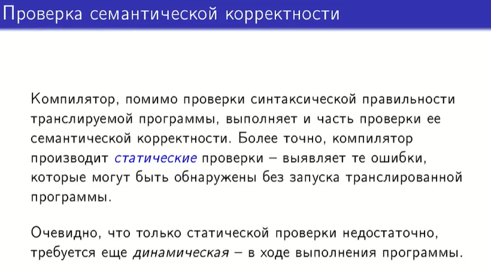
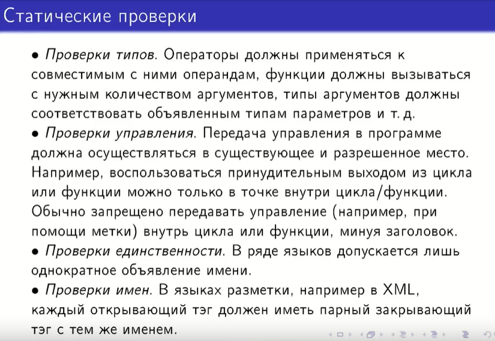
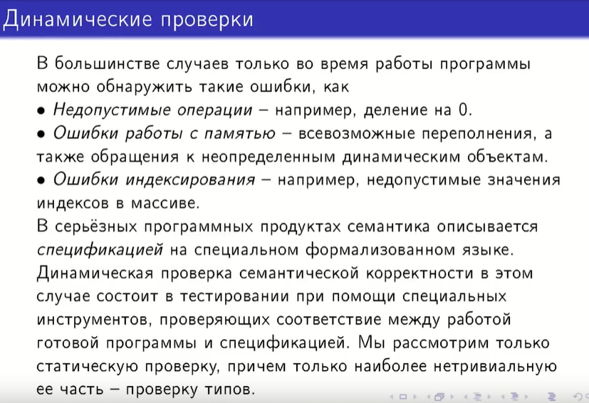

## 29. Виды семантических проверок. Ошибки, не распознаваемые при компиляции.

Статические проверки - выявление тех ошибок, которые можно обнаружить на стадии компиляции без запуска кода

В проверку типов входит также проверка типов при обращении с массивами, ссылками, указателями

В ТЕХе есть команды, обозначающие начало и конец блока, которые тоже должны совпадать (пример)

Динамические проверки выявляют ошибки, не распознаваемые при компиляции, и производятся с помощью системы тестов
