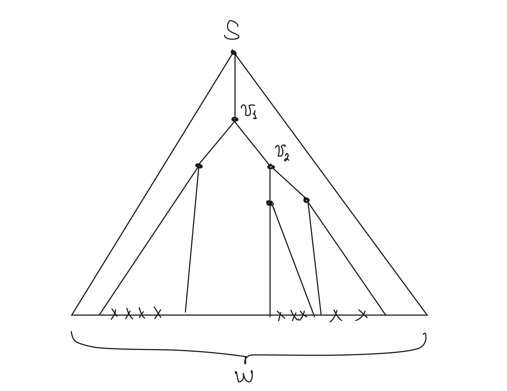
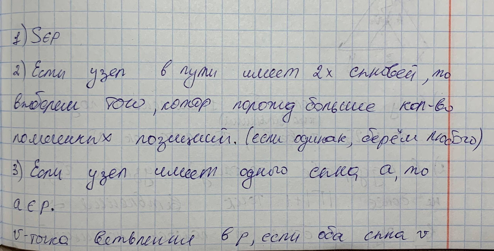
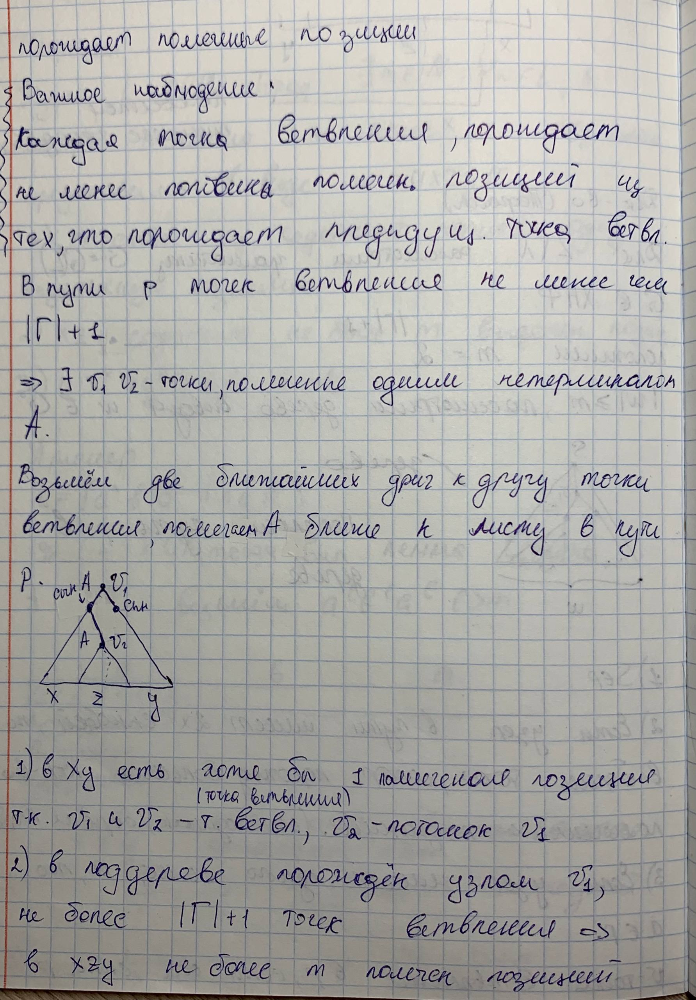
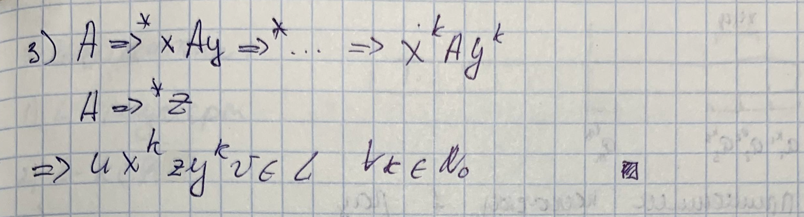
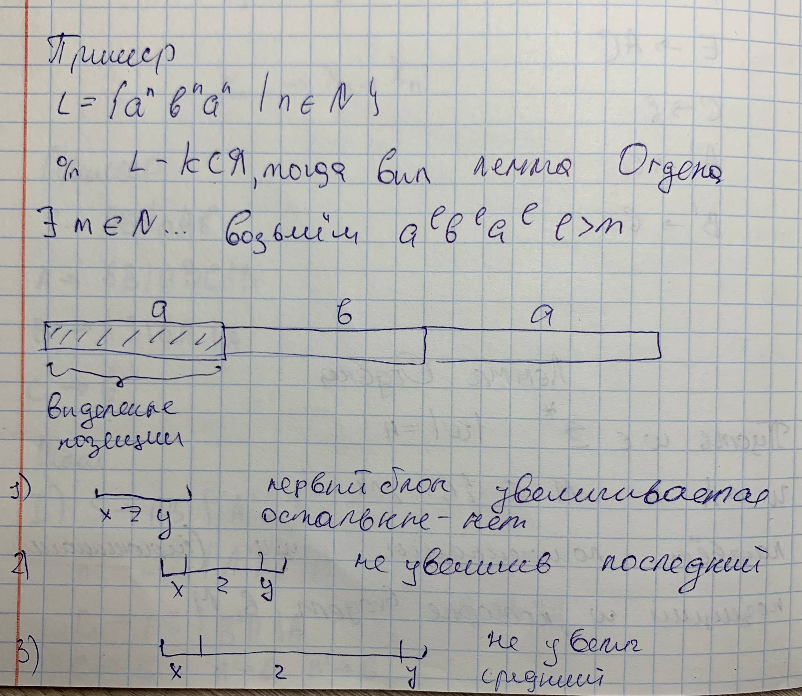
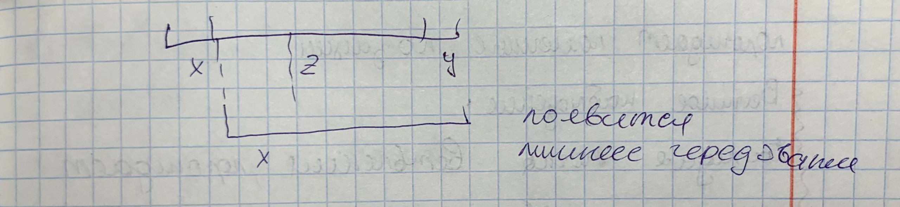
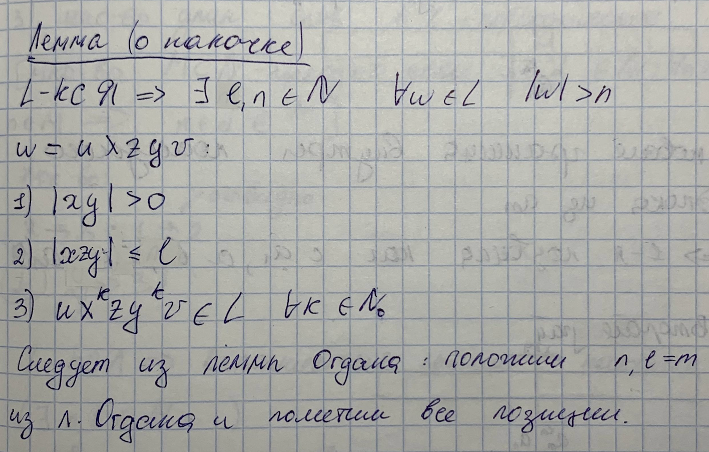
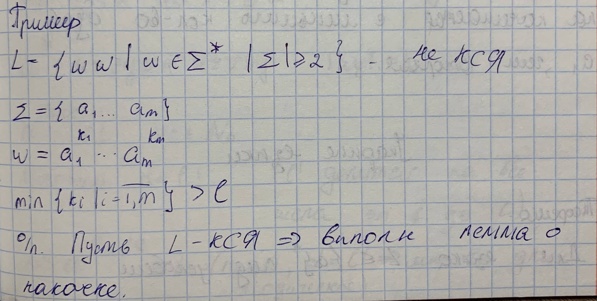
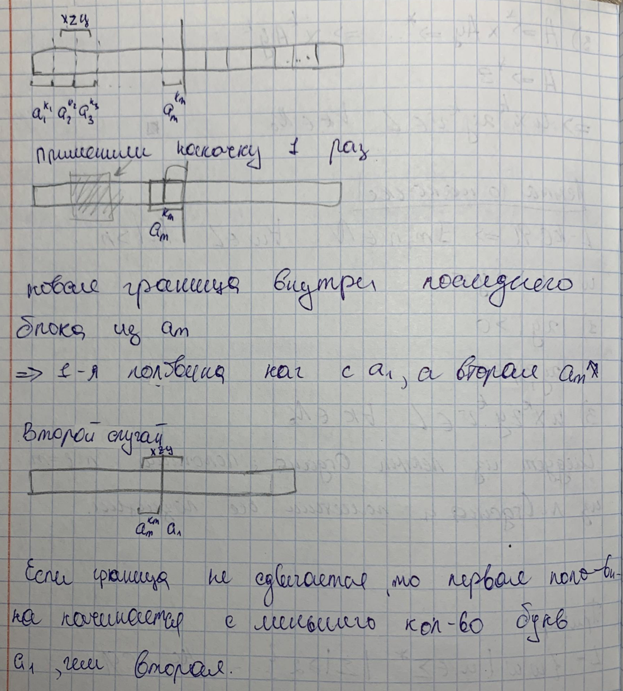

## 3. Лемма Огдена, лемма о накачке и ее следствия.

Пусть $w \in \Sigma^*$, $|w| = n$ $w \neq \lambda$ и $M \subseteq \{1,...,n\}$. Возьмем помеченные (или выделенные) позиции $w$, которые входят в $M$

### Теорема(Лемма Огдена)

Пусть $L-КСЯ$. Тогда $\exists m \in\mathbf{N}: \forall w \in L $, в котором помечено не менее $m$ позиций, представимо в виде  $w=uxzyv$.

1) Подслово $xy$ содержит хотябы одну выделенную позицию.
2) $xzy$ содержит не более $m$ выделенных позиций
3) $ux^kzy^kv \in L \text{, где } k \in \mathbf{N}_0$ (натуральные числа и ноль)

### Док-во:

Для $L$ без $\lambda$ рассмотрим грамматику $G=G(L)$, где G в нормальной форме Хомского.

Для понимания:
_Грамматика считается находящейся в ХНФ, если она $\lambda$ -свободна (не содержит правил, порождающих пустую строку, за исключением возможного специального правила для аксиомы), а все её неаннулирующие правила вывода имеют строго один из двух видов:_

1. A→BC — _нетерминал порождает ровно два нетерминала;_
2. A→a — _нетерминал порождает ровно один терминал._

Продолжаем док-во: положим $m=2^{|Г| + 1}$

$|w|\geq m$, рассмотрим дерево вывода $w$ в $G$

Построим путь p в дереве:

---

## Из нейронки, может лучше усвоится**

### Лемма о накачке для КС-языков

**Теорема о накачке (Теорема 3.1)** описывает фундаментальное свойство контекстно-свободных языков (КС-языков), которое позволяет доказывать, что тот или иной язык не является контекстно-свободным.

Согласно этой теореме, для любого КС-языка $L$ существуют такие натуральные числа $n$ и $m$, что любая цепочка $w \in L$ длиной $|w| > n$ может быть представлена в виде **$w = xuzvy$**, где соблюдаются три условия:

1. **$uv \neq \epsilon$** (хотя бы одна из цепочек $u$ или $v$ не пуста).
2. **$|uzv| \leq m$**.
3. Для любого натурального $k$ цепочка **$xu^kzv^ky$** также принадлежит языку $L$.

### Следствия леммы о накачке

* **КС-языки в однобуквенном алфавите (Теорема 3.2):** Для языка $L$ над алфавитом $\{a\}$ условия того, что он является контекстно-свободным и того, что он является регулярным, **эквивалентны**. В этом случае множество длин слов $\{n \in \mathbb{N} \mid a^n \in L\}$ обязательно является **периодическим**.
* **Периодичность длин слов (Следствие 3.3):** Если $L$ — КС-язык, то множество длин всех его слов $\{|w| \mid w \in L\}$ является периодическим. Это доказывается через гомоморфизм, переводящий любую букву алфавита в один и тот же символ.
* **Ограниченность «памяти» КС-грамматик:** На основе леммы можно сделать неформальный вывод: контекстно-свободные грамматики «умеют» сравнивать количество объектов **двух видов**, но не трех.

### Применение: доказательство неконтекстно-свободности

Лемма о накачке — основной инструмент для доказательства того, что язык не является контекстно-свободным (путем приведения к противоречию). В источниках приведены классические примеры таких языков:

1. **$L = \{a^n b^n a^n \mid n \in \mathbb{N}\}$**: при попытке «накачки» цепочки хотя бы один из трех блоков ($a, b$ или $a$) не увеличится, что нарушит равенство количеств символов.
2. **$L = \{wcw \mid w \in \{a, b\}^*\}$**: лемма показывает, что невозможно синхронно изменять части слова $w$ до и после разделителя $c$, если они разделены произвольно длинной строкой.

---

**Аналогия:** Представьте дерево вывода как **фрактальную структуру**. Если ветвь дерева достаточно длинная, на ней обязательно вырастет «почка» (нетерминал), идентичная той, что была выше. Это позволяет вам бесконечно вставлять копии этой части ветки в саму себя, и дерево всё равно останется «правильным» согласно правилам роста (грамматике). Если же язык требует жёсткой связи между тремя разными частями (как в $\{a^n b^n a^n\}$), такая «самовложенность» неизбежно сломает баланс.
