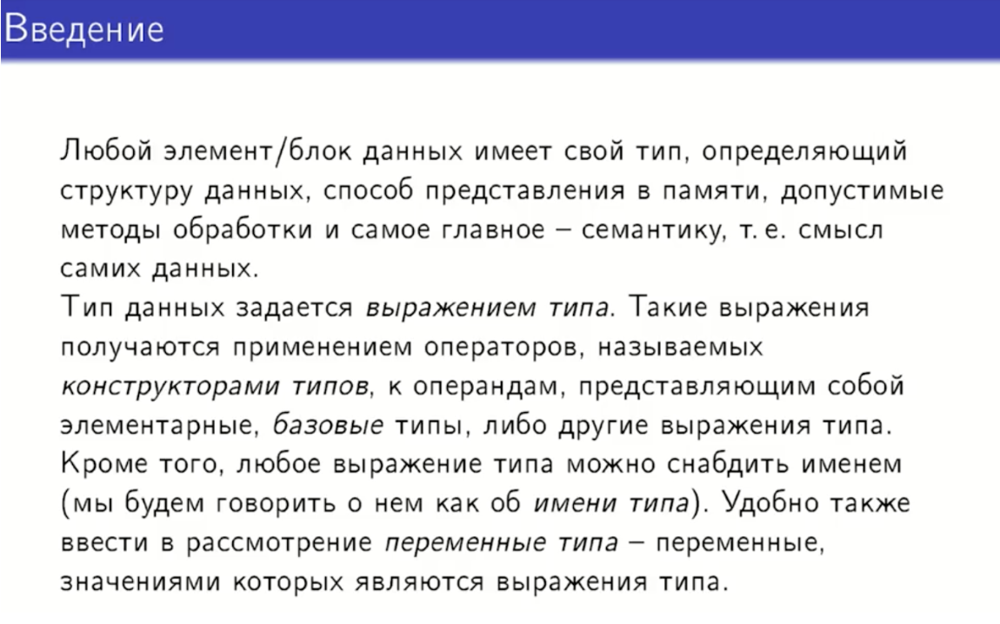
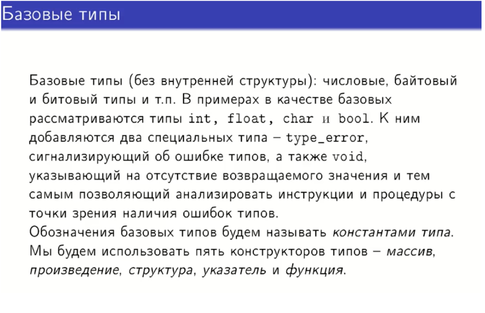
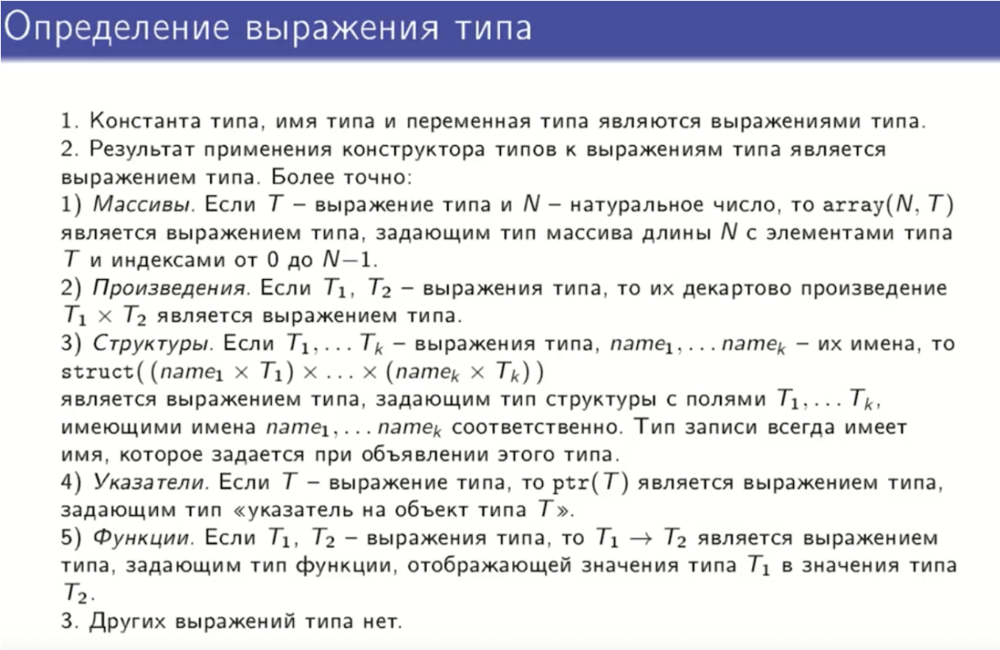
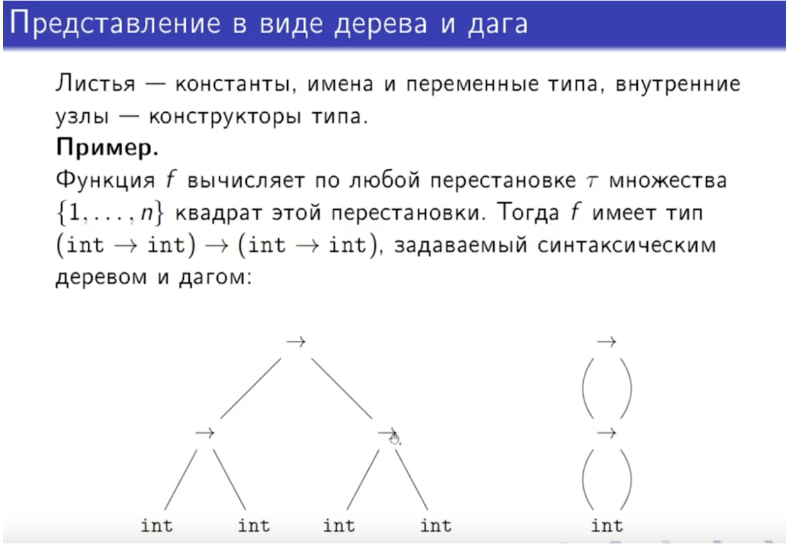
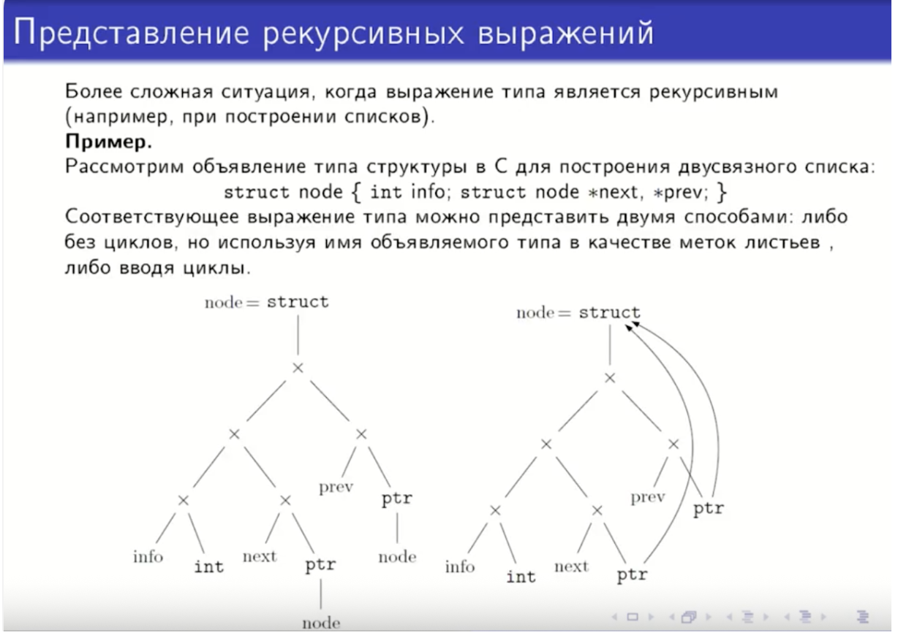
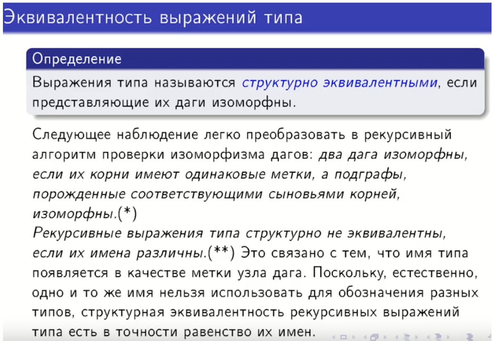
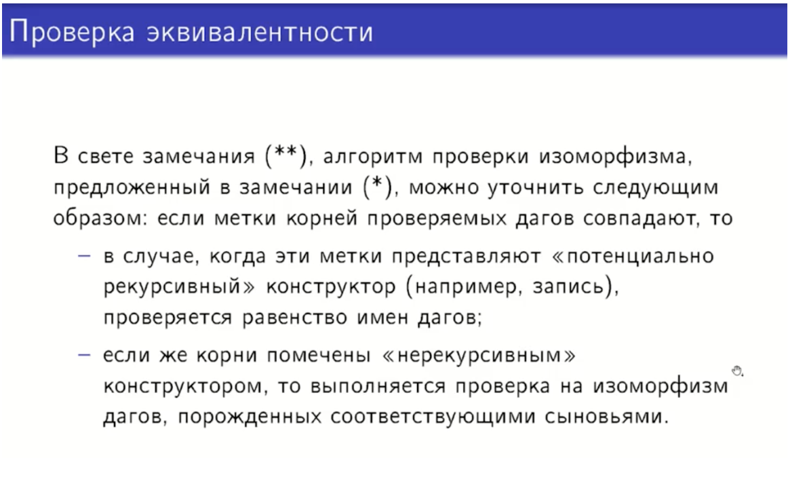

## 30. Базовые типы, конструкторы и выражения типа. Представление выражения типа дагом. Эквивалентность выражений типа.

### Базовые типы, конструкторы и выражения типа

Базовые типы — это элементарные типы данных (int, float, char, boolean), предоставляемые языком программирования. 
Примеры: int, float, char, boolean, void
Назначение: задать элементарные единицы хранения и операций (сложение чисел, сравнение символов).

Конструкторы типов — это правила создания сложных типов из базовых (массивы, указатели, структуры). 
Примеры:
Массив (Array): array[10] of int — тип "массив из 10 целых чисел".
Структура (Record/Struct): struct { int x; char c; } — тип, объединяющий несколько полей.
Функция (Function): (int, int) -> bool — тип "функция, принимающая два int и возвращающая bool".

Выражение типа — это формальное описание типа с использованием базовых типов и конструкторов.

### Представление выражения типа дагом
Выражения типа удобно представлять в виде направленного ациклического графа (ДАГа), где общие подтипы не дублируются, а представлены одним узлом. Это экономит память и упрощает сравнение типов.
Как строится:
Есть таблица (хэш-таблица) уже созданных узлов типов.
При создании нового выражения типа:
Разбираем его на компоненты.
Для каждого компонента рекурсивно создаём/находим узел.
Проверяем, есть ли уже узел с такими полями (например, ARRAY размером 10, указывающий на узел ARRAY[5]).
Если есть — используем существующий, если нет — создаём новый.
Ключевое: узел типа создаётся единожды.

### Эквивалентность выражений типа
Мы хотим понять, одинаковы ли два типа данных в программе. Например, одинаков ли тип "массив чисел" и "список чисел"? Компьютер проверяет это, глядя на их структуру (как они устроены внутри).
 Что такое "структурная эквивалентность"?
В типах данных:
array[10] of int (массив из 10 целых чисел)
array[10] of int (другой массив из 10 целых чисел)
Структурно эквивалентны — одинаковое устройство.

Как проверяют эквивалентность? Алгоритм:
Смотрим на корни (верхние узлы) двух типов.
Если метки разные (например, один "массив", другой "запись") → типы разные.
Если метки одинаковые:
Для простых конструкторов (массив, указатель): сравниваем их "детей" (что внутри) рекурсивно.
Для сложных/рекурсивных (запись, класс): сравниваем имена типов, а не структуру.
Рекурсивный тип — это тип, который ссылается сам на себя. 
Для рекурсивных типов сравниваются имена, а не структура. Почему?
struct Node и struct ListNode могут быть устроены одинаково (int + указатель), но разные по смыслу.
Иначе можно было бы случайно смешать логически разные типы.
Имя типа становится меткой узла в DAG, и это метка уникальна.

