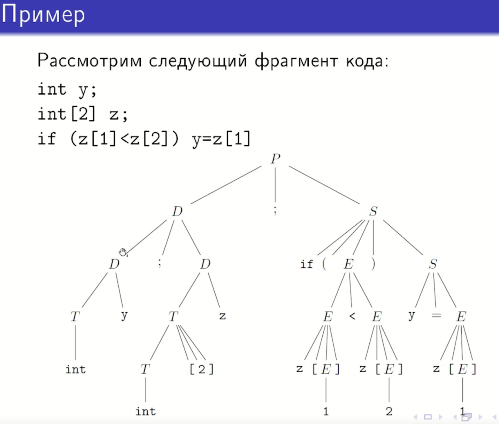
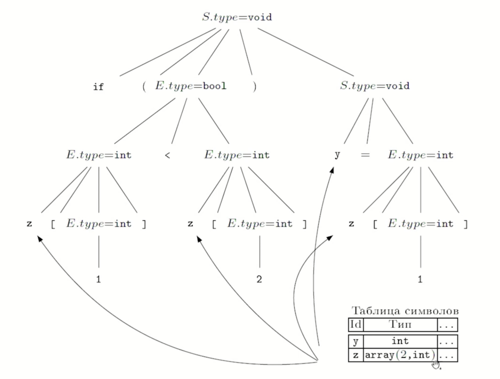

## 31. Система типов. Атрибутная грамматика для проверки типов.


# Система типов

Множество правил назначения типов частям программы называется  
**системой типов**. Статическая проверка типов в программе состоит в  
реализации этих правил. Фрагмент программы, получивший тип  
`type_error`, содержит ошибку типов; если же программа целиком  
имеет тип, отличный от `type_error`, то она успешно прошла  
проверку.  

Мы рассмотрим грамматику, порождающую небольшой фрагмент  
языка программирования, содержащий объявления, выражения и  
инструкции. Функции мы рассматриваем очень упрощенно, как  
объявление идентификатора с типом $ T_1 \mapsto T_2 $. Программа (аксиома  
$ P $) состоит из набора объявлений $ D $, за которыми следует набор  
инструкций $ S $.  

Объявление состоит в присвоении идентификатору типа,  
задаваемого выражением типа $ T $. Инструкции могут содержать  
выражения $ E $. Нетерминалы $ T, S, E, P $ имеют синтезируемый  
атрибут `type`, содержащий тип фрагмента программы,  
представляемого этим нетерминалом.

### краткое примечание
 ***Что такое система типов?***

Это набор правил, которые говорят:

- Какие типы данных бывают (числа, строки, массивы)

- Как их можно использовать (складывать, сравнивать, присваивать)

Пример правила:

* Число нельзя прибавить к строке — это ошибка типов.

***Как это связано с грамматикой?***

Мы описываем язык программирования с помощью грамматики (как раньше с арифметическими выражениями).

Наша грамматика описывает:
P - аксиома (программа)

Объявления (D): int x; float y;

Инструкции (S): x = 5; y = 3.14;

Выражения (E): x + y


# Атрибутная грамматика

| Правило вывода    | Семантические правила    | Смысл      |
|---|---|---|
| $ P \to D; S $    | $ P.type = S.type $ |
| $ D \to D; D $    |    |
| $ D \to T x $    | ADDTYPE(x.entry, T.type)    |
| $ T \to float $    | $ T.type = float $    |
| $ T \to int $    | $ T.type = int $    |
| $ T \to * T_1 $    | $ T.type = ptr(T_1.type) $    | Тип указателя|
| $ T \to T_1[n] $    | $ T.type = array(n.val, T_1.type) $    |
| $ T \to T_1 \mapsto T_2 $ | $ T.type = T_1.type \to T_2.type $    | явное приведение типа|
| $ S \to S_1; S_2 $    | $ S.type = \begin{cases} S_2.type, & \text{если } S_1.type = void \\ type\_error & \text{иначе} \end{cases} $ | последовательность инструкций |
| $ S \to x = E $    | $ S.type = \begin{cases} void, & \text{если } TYPE(x.entry) = E.type \\ type\_error & \text{иначе} \end{cases} $ |
| $ S \to if (E) S_1 $    | $ S.type = \begin{cases} S_1.type, & \text{если } E.type = bool \\ type\_error & \text{иначе} \end{cases} $ |
| $ S \to \text{while } (E) \, S_1 $ | $ S.\text{type} = \begin{cases} S_1.\text{type}, & \text{если } E.\text{type}=\text{bool} \\ \text{type\_error} & \text{иначе} \end{cases} $ |
| $ E \to n $    | $ E.\text{type} = \text{int} $    |
| $ E \to x $    | $ E.\text{type} = \text{TYPE}(x.\text{entry}) $    |
| $ E \to E_1 < E_2 $    | $ E.\text{type} = \begin{cases} \text{bool}, & \text{если } E_1.\text{type}=E_2.\text{type}=\text{int} \\ \text{или } E_1.\text{type}=E_2.\text{type}=\text{float} \\ \text{type\_error} & \text{иначе} \end{cases} $ |
| $ E \to E_1 \uparrow $    | $ E.\text{type} = \begin{cases} t, & \text{если } E_1.\text{type}=\text{ptr}(t) \\ \text{type\_error} & \text{иначе} \end{cases} $ | разыменование указателя |
| $ E \to E_1[E_2] $    | $ E.\text{type} = \begin{cases} t, & \text{если } E_2.\text{type}=\text{int}, \\ E_1.\text{type}=\text{array}(N, t) \\ \text{type\_error} & \text{иначе} \end{cases} $ | обращение к элементу массива |
| $ E \to E_1(E_2) $    | $ E.\text{type} = \begin{cases} t, & \text{если } E_2.\text{type}=s, \\ E_1.\text{type}=s \to t \\ \text{type\_error} & \text{иначе} \end{cases} $ | вызов функции |

# Пояснения к грамматике

- Если выражение — константа, то его тип — это тип данной константы. Тип присваивается сразу, т.к. в грамматике только целочисленные константы.

- Если выражение — переменная, то его тип берется из таблицы символов (куда он попал после разбора объявления данной переменной, см. правило 3).

- Выражение-неравенство имеет тип bool, если типы его частей позволяют эти части сравнивать, и тип ошибки иначе. Для простоты мы полагаем, что сравнивать можно только одинаковые базовые типы.

- Выражение-ссылка по указателю имеет тип, для значений которого определен указатель.

- Выражение-обращение к элементу массива имеет тип элемента этого массива; необходимым условием отсутствия ошибки является то, что «массив» $ E_1 $ действительно имеет тип массива, а «индекс» $ E_2 $ имеет целочисленный тип.

- Выражение-вызов функции имеет тип значения этой функции; для корректности такого вызова нужно, чтобы $ E_1 $ имело тип функции, а $ E_2 $ – тип, совпадающий с типом аргумента.

- Инструкция имеет тип void, если она корректна с точки зрения типов, и тип type_error в случае наличия ошибки. Соответственно в инструкции присвоения проверяется эквивалентность типа присваиваемого выражения типу переменной, а в условной инструкции и инструкции цикла проверяется, что условие имеет булев тип.
  
### примечание
***Почему именно атрибутная грамматика:***

Атрибутная грамматика эффективна для использования в данном случае так как это формальный способ описывать проверку типов в языке программирования через грамматику и атрибуты.

Причины кратко:
1) Атрибуты (type) "прицеплены" к нетерминалам

2) Семантические правила говорят, как вычислять эти атрибуты

3) Вычисления идут по дереву разбора:

* Снизу вверх: от терминалов (5, x) к корню

* Используют таблицу символов (глобальное состояние)

4) Проверка идёт за один проход синтаксического анализа

***Как это работает (глобально):***
У каждого нетерминала есть атрибут type — это "тип" той части программы, которую он представляет

При разборе программы атрибуты вычисляются по правилам

Если где-то получается type_error — программа содержит ошибку типов

***Как это выглядит в работе на примере:***
Программа:

```c
int x;
int y;
x = y + 5;
```

Разбор:

1) `int x` → записываем `x: int` в таблицу

2) `int y` → записываем `y: int` в таблицу

3) `y + 5`:

    * y → тип int (из таблицы)

    * 5 → тип int (константа)

    * "+" работает с int и int → результат int

4) `x = ...`:

   * x имеет тип int (из таблицы)

   * правый аргумент имеет тип int

   * типы совпадают → всё ок (void)


### пример



# Замечание

В случае когда в языке программирования объявления типов отсутствуют или не обязательны, рассмотренная стратегия вычисления типов частей программы по-прежнему применима. Однако вычисляться будут не типы выражений, а *множества допустимых типов* этих выражений; такие множества вычисляются в предположении, что программа корректна с точки зрения типов. Пустое множество допустимых типов сигнализирует об ошибке. После вычисления всех множеств допустимых типов необходимо произвести выбор единственного типа для каждого выражения, после чего внести записи о типах в таблицу символов (см. пример 3 из лекции 23 и комментарии после него).

