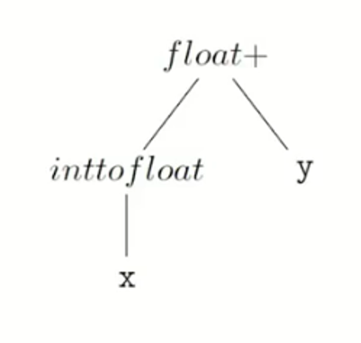
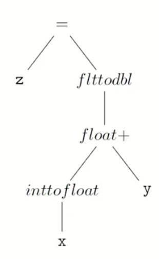
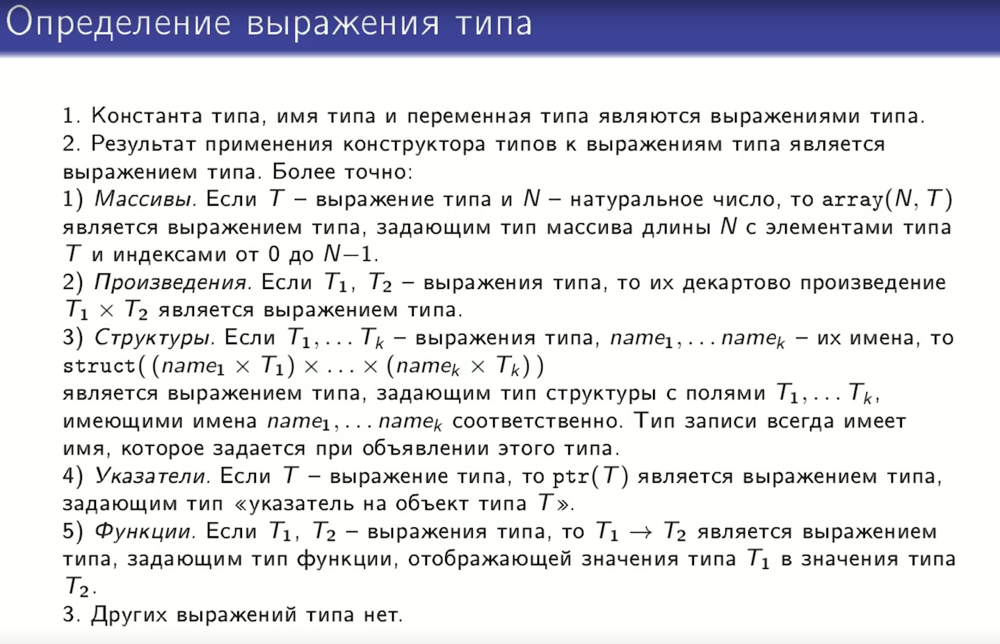
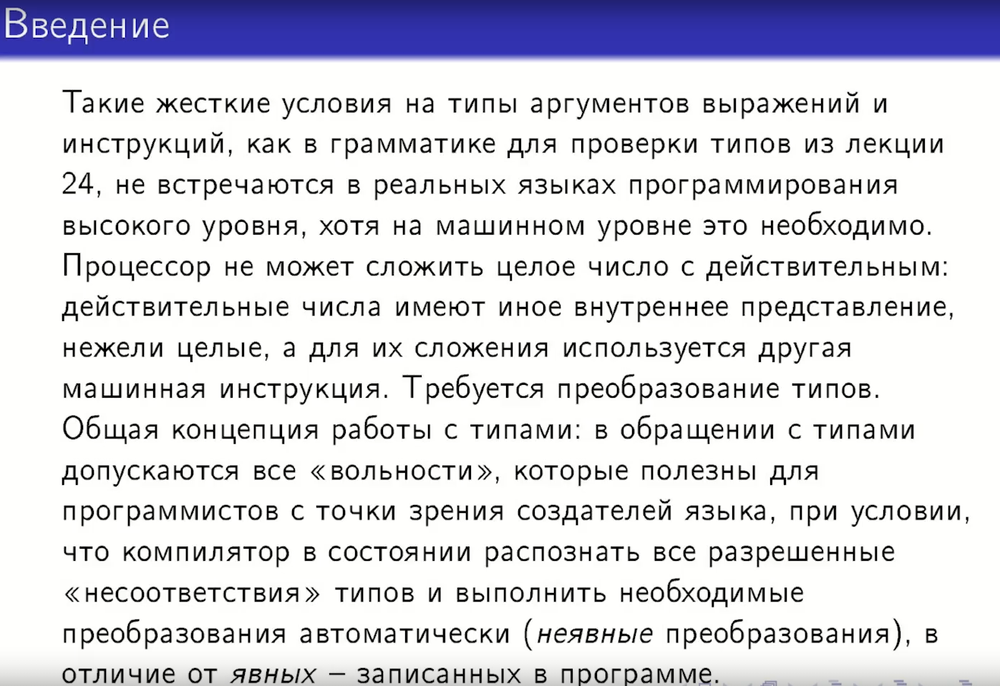
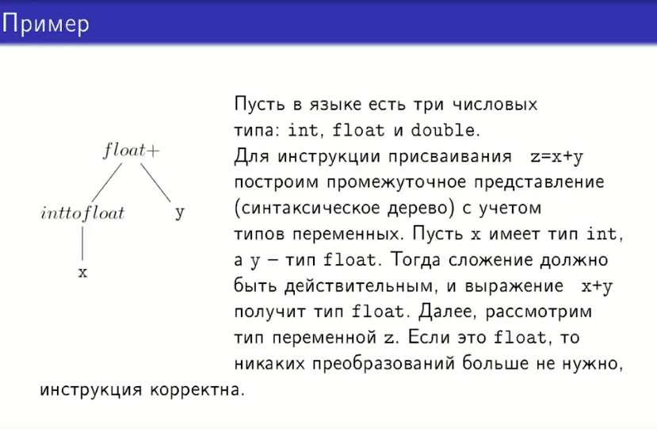
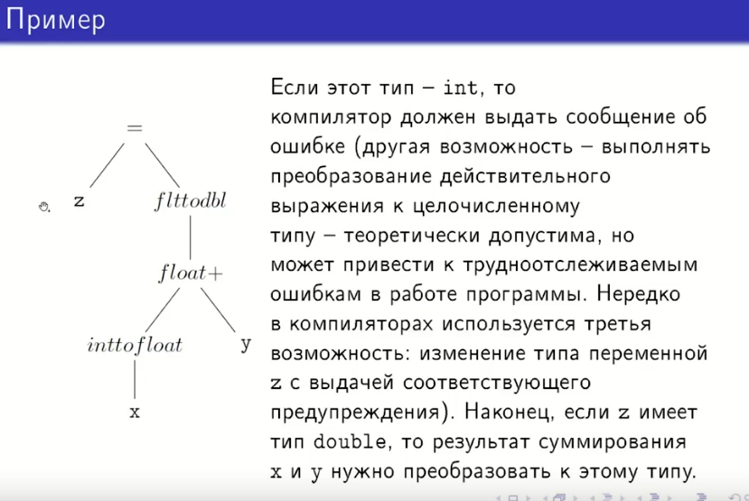
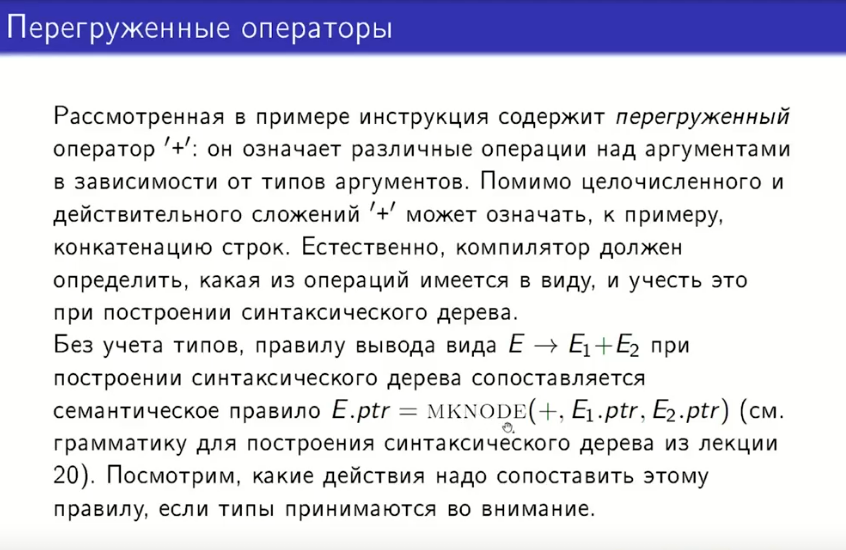
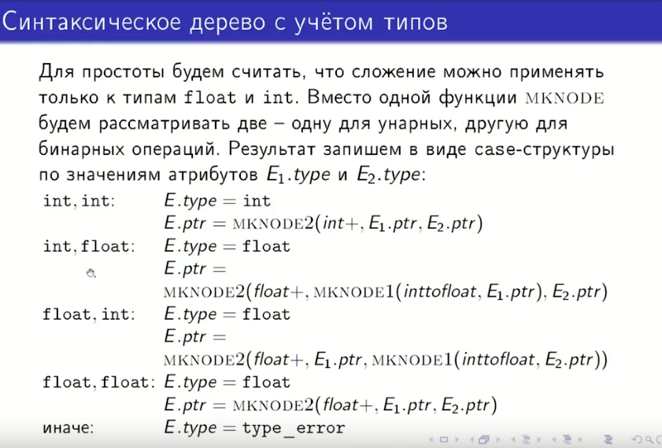

## 32. Преобразование выражений типа.

## 1. Определение выражения типа

**Выражениями типа** называются конструкции, описывающие типы данных в языке программирования. Определение строится индуктивно:

1.  **Базовые элементы:** Константа типа, имя типа и переменная типа являются выражениями типа.
2.  **Конструкторы типов:** Результат применения конструктора типов к выражениям типа является выражением типа. Более точно:
    * *Массивы.* Если $T$ — выражение типа и $N$ — натуральное число, то $\text{array}(N, T)$ является выражением типа, задающим тип массива длины $N$ с элементами типа $T$ и индексами от 0 до $N-1$.
    * *Произведения.* Если $T_1, T_2$ — выражения типа, то их декартово произведение $T_1 \times T_2$ является выражением типа.
    * *Структуры.* Если $T_1, \dots, T_k$ — выражения типа, $name_1, \dots, name_k$ — их имена, то $\text{struct}((name_1 \times T_1) \times \dots \times (name_k \times T_k))$ является выражением типа, задающим тип структуры с полями $T_1, \dots, T_k$, имеющими имена $name_1, \dots, name_k$ соответственно. Тип записи всегда имеет имя, которое задается при объявлении этого типа.
    * *Указатели.* Если $T$ — выражение типа, то $\text{ptr}(T)$ является выражением типа, задающим тип «указатель на объект типа $T$».
    * *Функции.* Если $T_1, T_2$ — выражения типа, то $T_1 \to T_2$ является выражением типа, задающим тип функции, отображающей значения типа $T_1$ в значения типа $T_2$.
3.  Других выражений типа нет.

---

## 2. Необходимость преобразования типов

Такие жесткие условия на типы аргументов выражений и инструкций, как в грамматике для проверки типов, не встречаются в реальных языках программирования высокого уровня, хотя на машинном уровне это необходимо.

**Проблема:** Процессор не может сложить целое число с действительным: действительные числа имеют иное внутреннее представление, нежели целые, а для их сложения используется другая машинная инструкция. Требуется преобразование типов.

**Общая концепция работы с типами:** В обращении с типами допускаются все «вольности», которые полезны для программистов с точки зрения создателей языка, при условии, что компилятор в состоянии распознать все разрешенные «несоответствия» типов и выполнить необходимые преобразования автоматически (**неявные преобразования**), в отличие от *явных* — записанных в программе.

---

## 3. Пример построения дерева с преобразованием

Пусть в языке есть три числовых типа: `int`, `float` и `double`.
Рассмотрим инструкцию присваивания `z = x + y`.

### Этап 1: Сложение (x + y)

Построим промежуточное представление (синтаксическое дерево) с учетом типов переменных.
* Пусть `x` имеет тип `int`, а `y` — тип `float`.
* Тогда сложение должно быть действительным (`float+`), и выражение `x + y` получит тип `float`.
* Для этого над узлом `x` добавляется узел неявного преобразования `inttofloat`.

### Этап 2: Присваивание (z = ...)

Рассмотрим тип переменной `z`:
1.  Если это `float`, то никаких преобразований больше не нужно, инструкция корректна.
2.  Если этот тип — `int`, то компилятор должен выдать сообщение об ошибке (другая возможность — выполнять преобразование действительного выражения к целочисленному типу — теоретически допустима, но может привести к трудноотслеживаемым ошибкам; нередко используется третья возможность: изменение типа переменной `z` с выдачей предупреждения).
3.  Если `z` имеет тип `double`, то результат суммирования `x` и `y` (который имеет тип `float`) нужно преобразовать к этому типу. В дерево добавляется узел `flttodbl`.

---

## 4. Перегруженные операторы

Рассмотренная в примере инструкция содержит **перегруженный оператор** `+`: он означает различные операции над аргументами в зависимости от типов аргументов.

Помимо целочисленного и действительного сложений `+` может означать, к примеру, конкатенацию строк. Компилятор должен определить, какая из операций имеется в виду, и учесть это при построении синтаксического дерева.

Без учета типов, правилу вывода вида $E \to E_1 + E_2$ при построении дерева сопоставляется семантическое действие:
$$E.ptr = \text{MKNODE}(+, E_1.ptr, E_2.ptr)$$

Ниже рассмотрим, какие действия надо сопоставить этому правилу, если типы принимаются во внимание.

---

## 5. Синтаксическое дерево с учетом типов (Реализация)

Для простоты будем считать, что сложение можно применять только к типам `float` и `int`. Вместо одной функции `MKNODE` будем рассматривать две — одну для унарных (`MKNODE1`), другую для бинарных (`MKNODE2`) операций.

Результат запишем в виде **case-структуры** по значениям атрибутов $E_1.type$ и $E_2.type$:

**int, int:**
$$E.type = \text{int}$$
$$E.ptr = \text{MKNODE2}(\text{int}+, E_1.ptr, E_2.ptr)$$

**int, float:**
$$E.type = \text{float}$$
$$E.ptr = \text{MKNODE2}(\text{float}+, \text{MKNODE1}(\text{inttofloat}, E_1.ptr), E_2.ptr)$$

**float, int:**
$$E.type = \text{float}$$
$$E.ptr = \text{MKNODE2}(\text{float}+, E_1.ptr, \text{MKNODE1}(\text{inttofloat}, E_2.ptr))$$

**float, float:**
$$E.type = \text{float}$$
$$E.ptr = \text{MKNODE2}(\text{float}+, E_1.ptr, E_2.ptr)$$

**иначе:**
$$E.type = \text{type\_error}$$

Исходники лекции:

