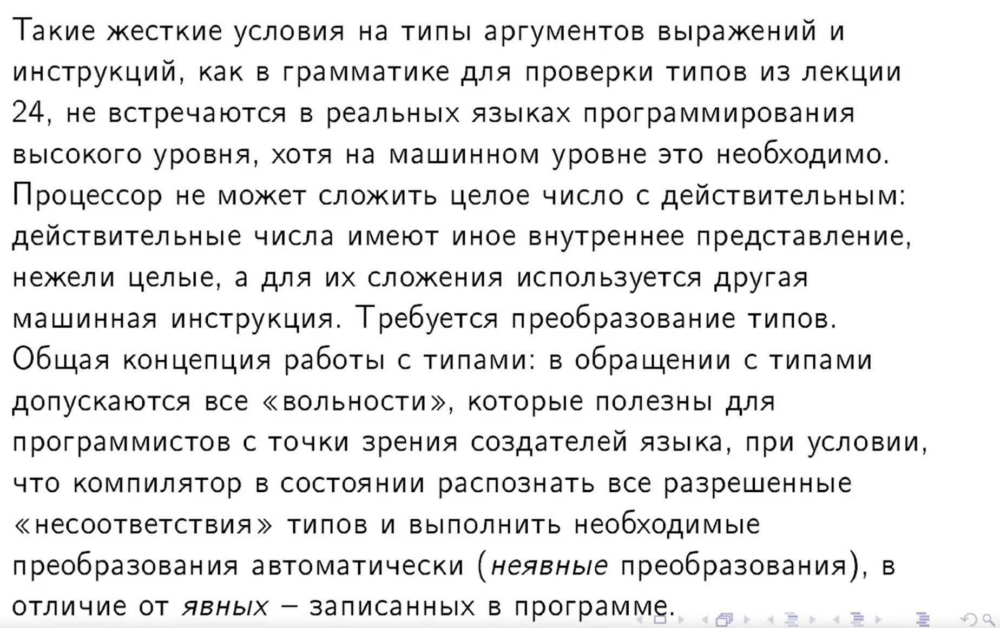
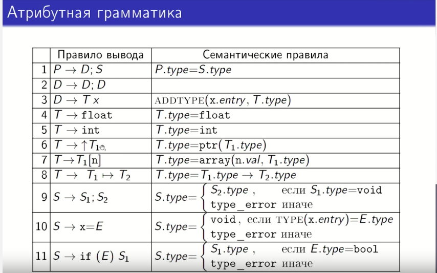
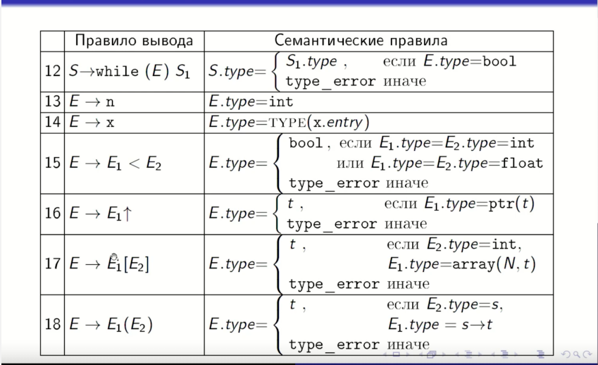
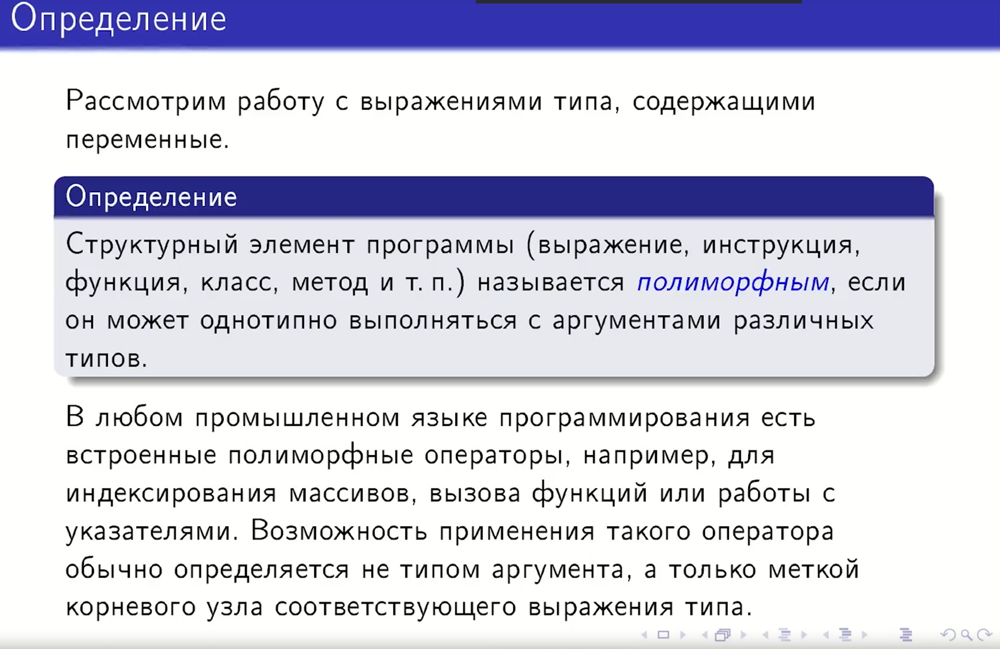
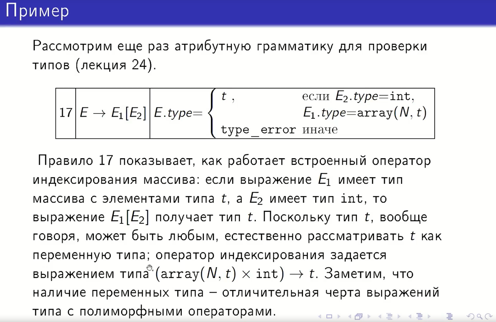
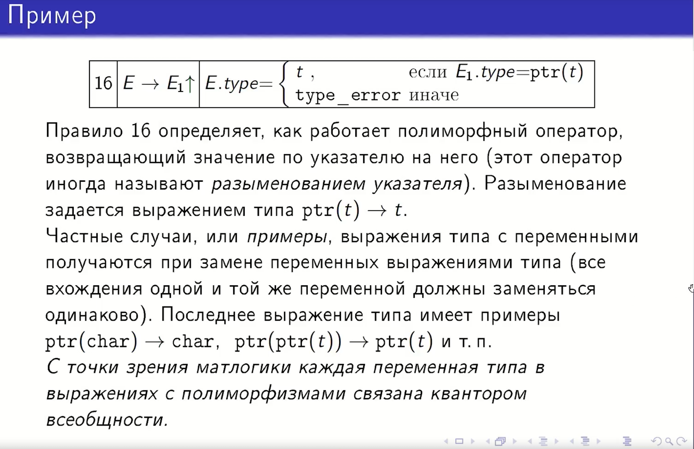
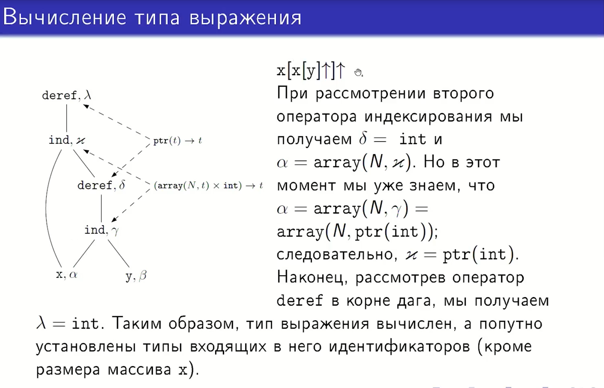
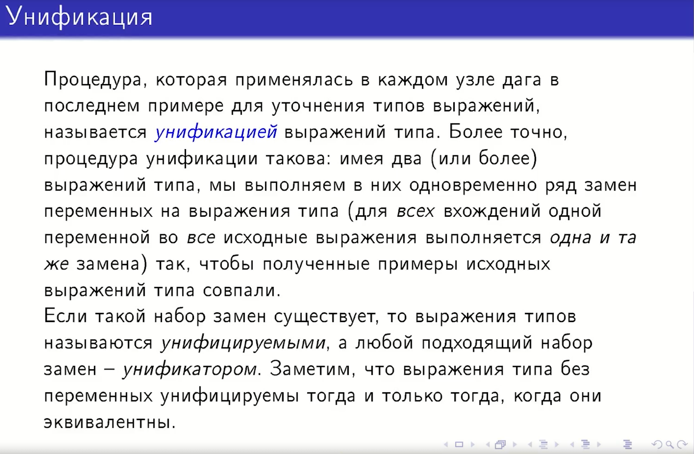
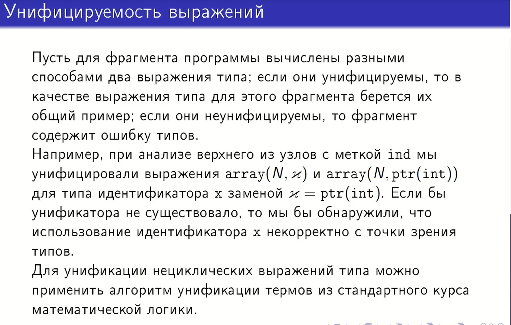

## 33. Полиморфизмы. Вычисление типов унификацией выражений типа.

## 1. Понятие полиморфизма

**Определение:** Структурный элемент программы (выражение, инструкция, функция, класс и т. д.) называется
**полиморфным**, если он может однотипно выполняться с аргументами различных типов.

* **Встроенные полиморфные операторы:** В промышленных языках это операторы индексирования массивов, вызова функций или
  работы с указателями.
* **Особенности реализации:** Возможность применения такого оператора обычно определяется не конкретным типом аргумента,
  а только «меткой» корневого узла соответствующего выражения типа.

---

## 2. Примеры полиморфных операторов

### Разыменование указателя (Правило 16)

Оператор, возвращающий значение по указателю на него (разыменование), задается выражением типа $ptr(t) \to t$.

* Если выражение $E_1$ имеет тип $ptr(t)$, то тип результата $E.type = t$.
* В противном случае возникает ошибка `type_error`.
* **Квантор всеобщности:** С точки зрения матлогики, каждая переменная типа ($t$) в таких выражениях связана квантором
  всеобщности ($\forall t$).

### Индексирование массива (Правило 17)

Оператор индексирования задается выражением типа $(array(N, t) \times int) \to t$.

* Если выражение $E_1$ имеет тип массива с элементами типа $t$, а индекс $E_2$ имеет тип $int$, то результат $E_1[E_2]$
  получает тип $t$.
* Переменная $t$ может быть любым типом, что и делает оператор полиморфным.

---

## 3. Унификация выражений типа

**Унификация** — это процедура уточнения типов путем выполнения замен переменных типа на конкретные выражения типа.

* **Процесс:** Имея два (или более) выражения типа, мы выполняем в них одновременно ряд замен для **всех вхождений**
  одной переменной во все исходные выражения.
* **Цель:** Сделать так, чтобы полученные примеры исходных выражений совпали.
* **Результат:** * Если набор замен существует, типы называются **унифицируемыми**, а набор замен — **унификатором**.
    * Если унификатора не существует, в программе содержится **ошибка типов**.
    * В качестве итогового типа берется их **общий пример** (наиболее общий унификатор).

---

## 4. Разбор сложного примера: Вычисление типа $x[x[y]\uparrow]\uparrow$

На примере выражения $x[x[y]\uparrow]\uparrow$ показано, как работает алгоритм на ориентированном ациклическом графе (
DAG):

### Шаги вычисления:

1. **Начальные данные:**
    * $x$ имеет тип $\alpha$.
    * $y$ имеет тип $\beta$.
2. **Анализ внутреннего выражения $x[y]$:**
    * Чтобы применить оператор индексирования к $x$, его тип $\alpha$ должен быть унифицирован с
      типом $array(N, \gamma)$.
    * Тип $y$ ($\beta$) должен быть унифицирован с $int$. Значит, $\beta = int$.
3. **Анализ разыменования $\uparrow$:**
    * К результату $x[y]$ (тип $\gamma$) применяется оператор `deref`. Значит, $\gamma$ должен иметь вид $ptr(t)$.
    * Таким образом, уточняется тип $x$: теперь $\alpha = array(N, ptr(t))$.
4. **Анализ внешнего индексирования:**
    * Внешний оператор индексирования снова работает с $x$ (тип $\alpha$) и индексом (результат $x[y]\uparrow$ имеет
      тип $t$).
    * Для успешной унификации индекс должен быть $int$. Следовательно, $t = int$.
5. **Итоговый вывод:**
    * Тип переменной $x$ уточнен как $array(N, ptr(int))$.
    * Итоговый тип всего выражения ($\lambda$) вычисляется как $int$.

---

## 5. Дополнительные сведения

* **Неявные преобразования:** В реальных процессорах нельзя просто сложить целое и действительное число, так как у них
  разное машинное представление. Компиляторы высокого уровня берут на себя задачу автоматического (неявного)
  преобразования типов для удобства программиста.
* **Алгоритм:** Для унификации нециклических выражений используется стандартный алгоритм унификации термов из
  математической логики.

### Расшифровка символов и обозначений типов

| Символ / Запись                   | Что означает               | Пояснение                                                                                                                  |
|:----------------------------------|:---------------------------|:---------------------------------------------------------------------------------------------------------------------------|
| **$t, s, \alpha, \beta, \gamma$** | **Переменные типа**        | Обозначают неизвестный тип, который нужно вычислить. Например, $t$ может оказаться `int` или `char` в процессе унификации. |
| **$ptr(t)$**                      | **Pointer (Указатель)**    | Обозначает тип «указатель на тип $t$». Используется для операций разыменования.                                            |
| **$array(N, t)$**                 | **Массив**                 | Обозначает массив из $N$ элементов типа $t$.                                                                               |
| **$\uparrow$ (стрелка вверх)**    | **Разыменование**          | Оператор получения значения, на которое указывает указатель. В коде это часто `*p` или `p^`.                               |
| **$[ \ ]$**                       | **Индексирование**         | Оператор доступа к элементу массива по индексу.                                                                            |
| **$\to$ (стрелка вправо)**        | **Отображение (Функция)**  | Описывает сигнатуру оператора. Запись $A \to B$ значит: «принимает тип $A$, возвращает тип $B$».                           |
| **$\times$**                      | **Декартово произведение** | Обозначает, что оператор принимает несколько аргументов. Например, $(Тип1 \times Тип2)$.                                   |
| **`int`**                         | **Целое число**            | Базовый атомарный тип данных.                                                                                              |
| **`type_error`**                  | **Ошибка типа**            | Специальное значение, которое возвращается, если типы несовместимы (унификация невозможна).                                |

---

### Подробный разбор концепций

#### 1. Что такое `ptr(t)`?

Это описание типа данных в памяти. Если мы говорим, что переменная имеет тип `ptr(int)`, значит, в ней лежит адрес, по
которому находится целое число. Полиморфный оператор разыменования ($\uparrow$) работает так: он «снимает» оболочку
`ptr`. Если на вход подан `ptr(t)`, на выходе мы получаем чистый `t`.

#### 2. Зачем нужны греческие буквы ($\alpha, \beta, \gamma, \delta$)?

В примере с графом (DAG) они используются как временные «имена-заглушки» для узлов:

* **$\alpha$** — это тип идентификатора $x$.
* **$\beta$** — это тип идентификатора $y$.
* Когда анализатор видит $x[y]$, он понимает, что $\alpha$ обязан быть массивом, а $\beta$ — целым числом. Так
  происходит «уточнение» через унификацию.

#### 3. Как читать запись $(array(N, t) \times int) \to t$?

Это математическое описание правила индексации массива:

1. Берем массив элементов типа $t$ (`array(N, t)`).
2. Берем целое число (`int`).
3. Применяем оператор `[]`.
4. **Результат:** получаем один элемент того самого типа $t$.

#### 4. Что такое Унификация (простыми словами)?

Это процесс решения уравнения.

* У нас есть шаблон: `Указатель на что-то` ($ptr(t)$).
* У нас есть факт: `Указатель на целое` ($ptr(int)$).
* **Унификация:** мы сравниваем их и делаем вывод, что «что-то» ($t$) — это точно `int`. Если бы мы пытались сравнить
  `ptr(int)` и `array(10, char)`, компилятор выдал бы `type_error`, так как они не «унифицируются» (не похожи друг на
  друга по структуре).

Для проверки типов(*из лекции 24*) используется атрибутная грамматика, а именно **S-атрибутная**.

Вот основные характеристики этой грамматики:

* **Тип грамматики:** Это **S-атрибутная грамматика**, так как она использует только синтезируемые атрибуты (значения
  передаются
  от листьев к корню).

* **Синтезируемый атрибут:** Основным атрибутом является ptr (или type), который хранит указатель на узел
  синтаксического
  дерева или само выражение типа.

* **База грамматики:** В качестве основы используется **КС-грамматика (контекстно-свободная)** для арифметических
  выражений.

* **Полиморфные операторы:** Грамматика включает правила для обработки полиморфных операций, таких как разыменование
  указателя ($\uparrow$) и индексирование массива ($[ \ ]$).

* **Формализм выражений типа:** Грамматика оперирует конструкторами типов, такими как $ptr(t)$ для
  указателей и $array(N, t)$ для массивов.

Вид грамматики:

| №      | Правило вывода                | Семантическое правило                                                                                       | Описание (что происходит)                                                               |
|:-------|:------------------------------|:------------------------------------------------------------------------------------------------------------|:----------------------------------------------------------------------------------------|
| **1**  | $P \to D; S$                  | $P.type = S.type$                                                                                           | Тип всей программы ($P$) определяется типом блока операторов ($S$).                     |
| **2**  | $D \to D; D$                  | —                                                                                                           | Определение списка объявлений (деклараций). Семантическое правило пустое (группировка). |
| **3**  | $D \to T \ x$                 | $ADDTYPE(x.entry, T.type)$                                                                                  | Регистрация переменной: в таблицу символов для $x$ записывается тип $T$.                |
| **4**  | $T \to \text{float}$          | $T.type = \text{float}$                                                                                     | Базовый тип: вещественное число.                                                        |
| **5**  | $T \to \text{int}$            | $T.type = \text{int}$                                                                                       | Базовый тип: целое число.                                                               |
| **6**  | $T \to \uparrow T_1$          | $T.type = ptr(T_1.type)$                                                                                    | Конструктор указателя: тип $T$ становится указателем на тип $T_1$.                      |
| **7**  | $T \to T_1[n]$                | $T.type = array(n.val, T_1.type)$                                                                           | Конструктор массива: создается массив из $n$ элементов типа $T_1$.                      |
| **8**  | $T \to T_1 \to T_2$           | $T.type = T_1.type \to T_2.type$                                                                            | Тип функции: отображение аргумента типа $T_1$ в результат типа $T_2$.                   |
| **9**  | $S \to S_1; S_2$              | $S.type = (S_1.type == \text{void} \text{ ? } S_2.type : \text{type\_error})$                               | Последовательность: если $S_1$ корректен, берется тип $S_2$, иначе — ошибка.            |
| **10** | $S \to x = E$                 | $S.type = (TYPE(x.entry) == E.type \text{ ? } \text{void} : \text{type\_error})$                            | Присваивание: типы $x$ и $E$ должны совпадать. Результат — `void`.                      |
| **11** | $S \to \text{if } (E) S_1$    | $S.type = (E.type == \text{bool} \text{ ? } S_1.type : \text{type\_error})$                                 | Условие: $E$ должно быть `bool`. Результат совпадает с типом ветки $S_1$.               |
| **12** | $S \to \text{while } (E) S_1$ | $S.type = (E.type == \text{bool} \text{ ? } S_1.type : \text{type\_error})$                                 | Цикл: условие $E$ должно быть `bool`. Результат — тип тела цикла.                       |
| **13** | $E \to n$                     | $E.type = \text{int}$                                                                                       | Литерал: целое число $n$ всегда имеет тип `int`.                                        |
| **14** | $E \to x$                     | $E.type = TYPE(x.entry)$                                                                                    | Переменная: тип выражения берется из таблицы символов по имени $x$.                     |
| **15** | $E \to E_1 < E_2$             | $E.type = (\text{тип } E_1, E_2 \in \{\text{int, float}\} \text{ ? } \text{bool} : \text{type\_error})$     | Сравнение: если операнды числа, то результат — `bool`.                                  |
| **16** | $E \to E_1\uparrow$           | $E.type = (E_1.type == ptr(t) \text{ ? } t : \text{type\_error})$                                           | Разыменование: если $E_1$ — указатель на $t$, результат имеет тип $t$.                  |
| **17** | $E \to E_1[E_2]$              | $E.type = (E_1.type == array(N, t) \text{ \&\& } E_2.type == \text{int} \text{ ? } t : \text{type\_error})$ | Индексация: $E_1$ — массив, индекс $E_2$ — целое число.                                 |
| **18** | $E \to E_1(E_2)$              | $E.type = (E_1.type == s \to t \text{ \&\& } E_2.type == s \text{ ? } t : \text{type\_error})$              | Вызов функции: аргумент $E_2$ должен соответствовать входному типу $s$.                 |

