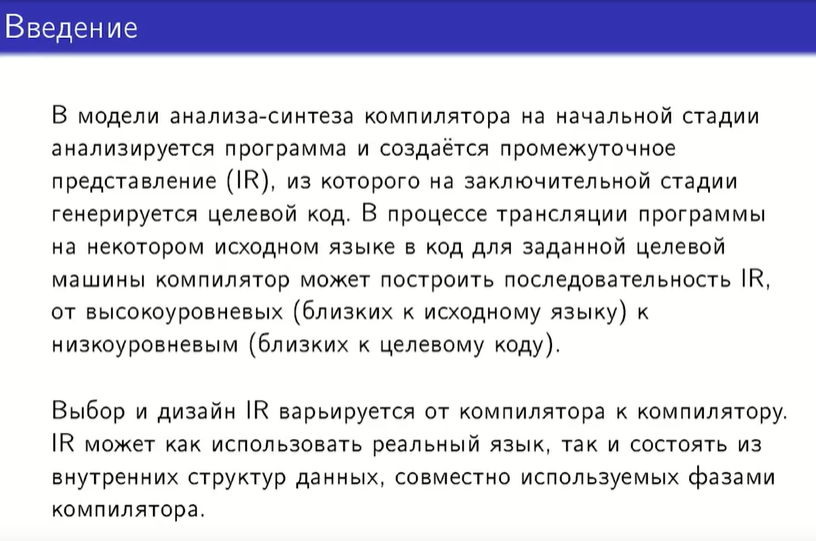
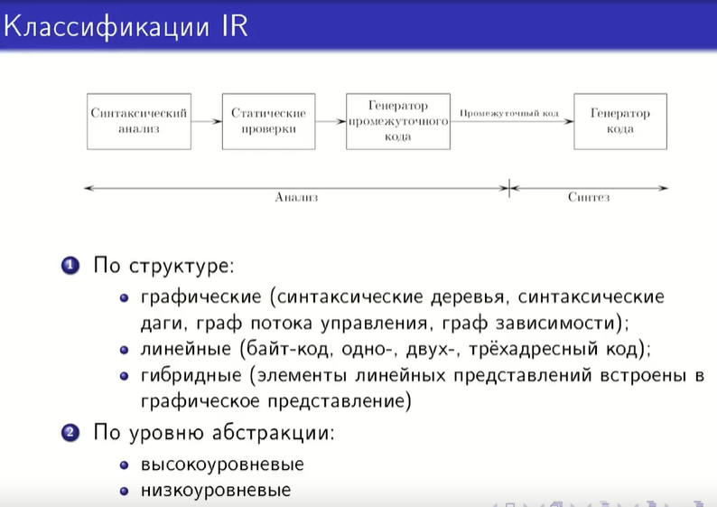

## 34. Промежуточное представление программы (IR). Назначение IR. Виды IR.

Для перехода к генерации и оптимизации кода для целевой машины или целевого языка необходимо сформировать промежуточное представление (IR) - это исходный код, преобразованный в такой вид, из которого уже можно генерировать целевой код. Это промежуточная стадия между фронтендом и бэкендом.

Язык С часто используется в качестве языка IR.

Идея: если у нас есть некоторое кол-во возможных исходных языков и некоторое кол-во возможных целевых языков, то нам не нужно строить компиляторы для каждой из этих возможных пар по отдельности, достаточно построить IR для всех исходных языков, такие, что ими смогут пользоваться все блоки синтеза для целевых языков.

Все 3 стадии анализа в зависимости от компилятора могут как-то совмещаться друг с другом.

По уровню абстракции: высокоуровневые - близко к исходному языку, низкоуровневые - близко к целевому коду.
