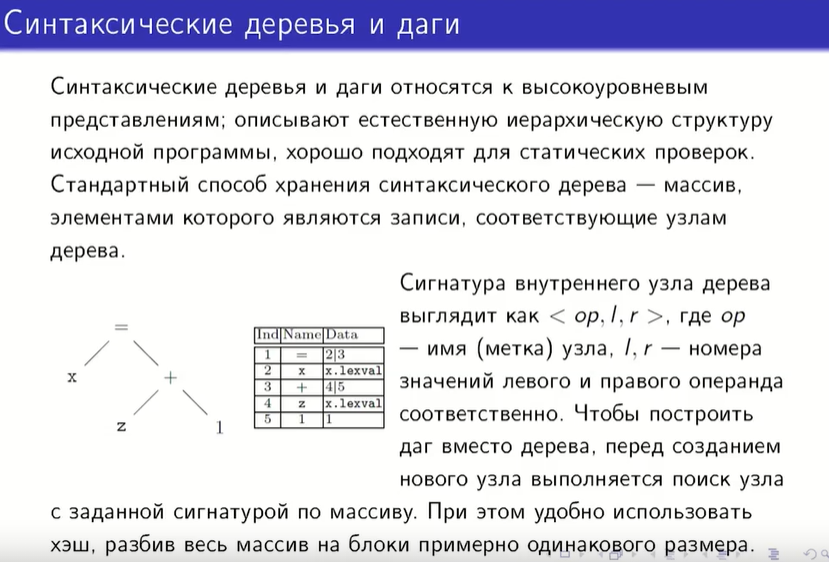
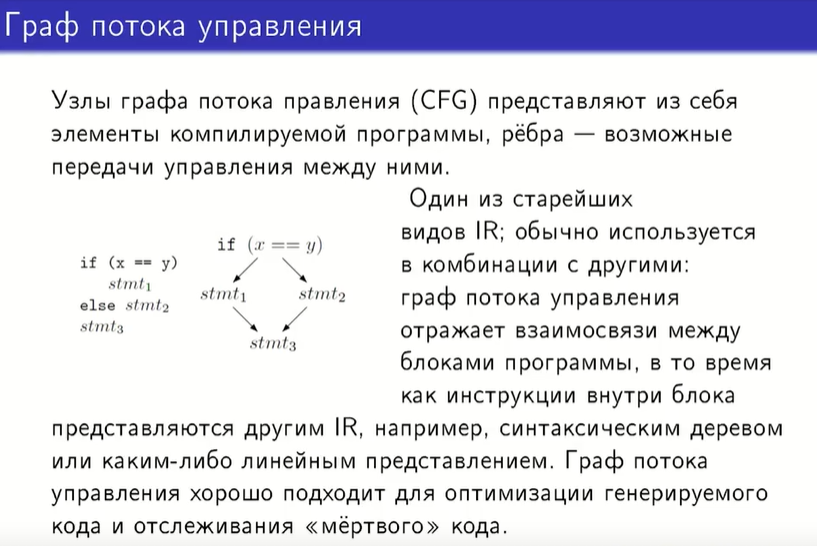
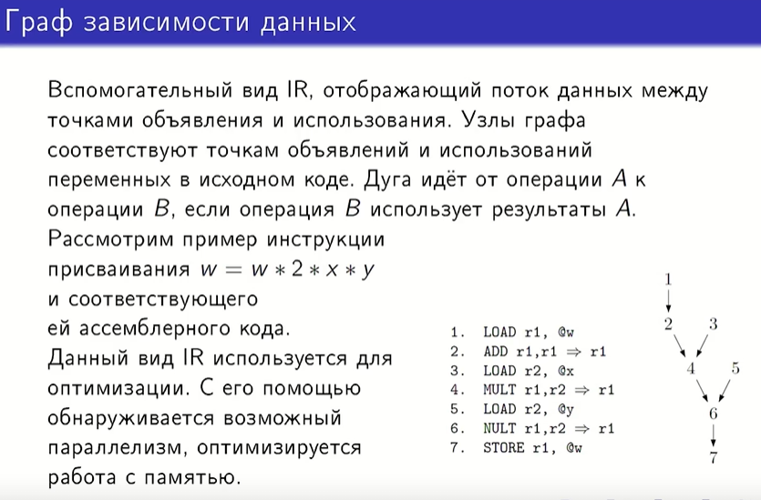
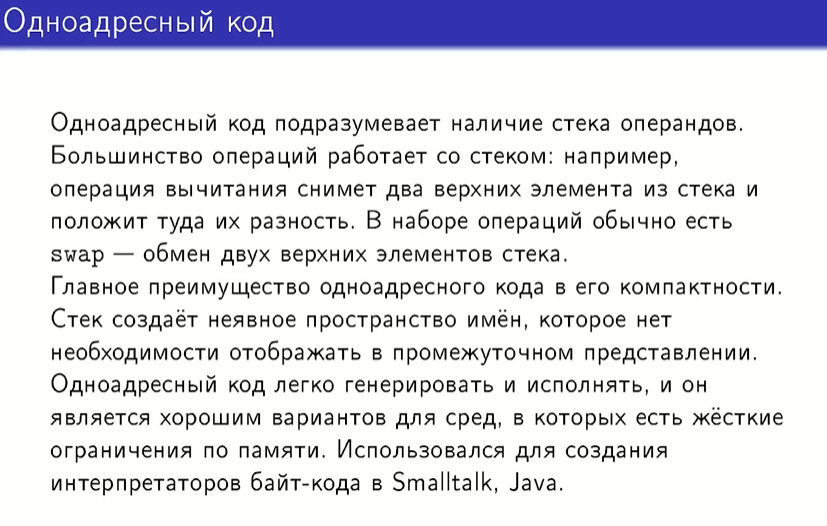
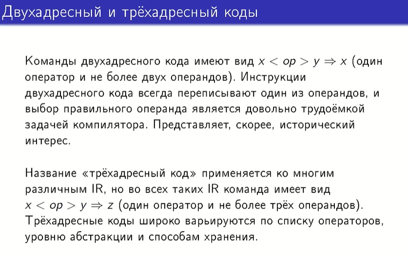
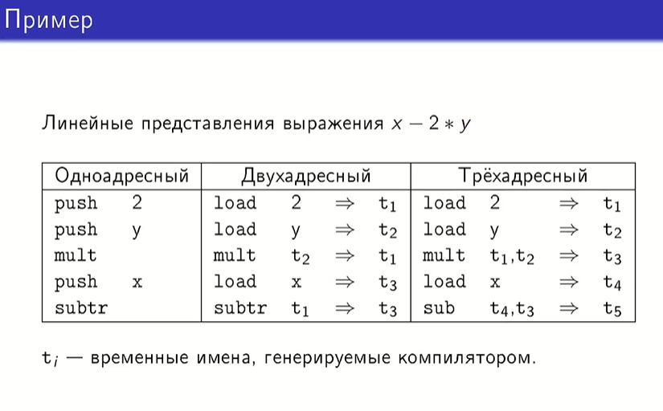
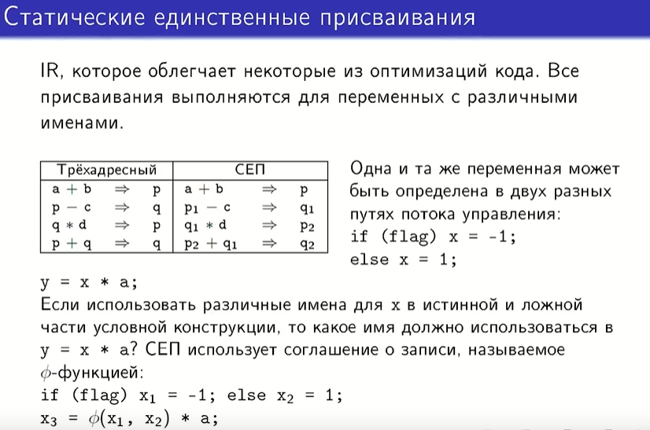

## 35. Графические и линейные IR, виды и применение.

В проверке типов как раз мы строили синтаксические деревья и даги.

То, как организован массив, определяет, насколько быстро можно будет осуществлять операции на синтаксическом дереве, поиск узлов с заданными параметрами и непосредственнл семантические проверки, для которых это IR (промежуточное представление) и предназначено.

Для построения синтаксического дага необходимо перед созданием нового узла проверить, не существует ли уже узел с заданной сигнатурой. Для этого все узлы разбиваются на группы с примерно равным кол-вом элементов и с помощью хэш-функции осуществляется доступ уже к конкретной группе узлов и среди них ищется заданный узел. 

Если узлом является какой-то блок, то внутри него не должно никуда передаваться управление.

Отображает поток данных между всеми операциями, которые как-либо обращаются к переменным (объявление, использование, загрузка).

STORE - содержимое регистра, которое сейчас представляет из себя значение этого выражения, надо сохранить обратно в то место памяти, где хранится значение переменной w.

Все операции используют только один операнд, поэтому нужен стек.

Swap нужен для того, чтобы осуществлять некоммутативные операции.

В двухадресном коде результат сохраняется в один из операндов - сложно выбрать именно тот, значение которого можно стереть (которое не понадобится в дальнейшем).

Трехадресный код может быть ближе как к исходному коду, так и к целевому.

Во всех этих кодах сам адрес означает имя переменной, константа или временные имена, которые генерируются компилятором.

1. Операции над двумя верхними элементами стека (вытащили их, результат положили).
2. Временные имена это могут быть названия регистров, например. Переменная в правой части выступает в роли и операнда, и указания на место сохранения результата.
3. Для проверок может иметь одну структуру: более компактная, но в ней сложнее осуществлять перестановки. Для оптимизации кода: требуется больше памяти, но быстрее осуществляются перестановки.

Другая стратегия именования (по сравнению с трехадресным кодом).

В СЕП нет переиспользования имен: с одной и той же переменной может что-то происходить в разных путях потока управления в программе, СЕП в каждом из этих путей присвоит переменной различные имена, а дальше с помощью соглашения о записи вернется то значение, которое реально сработало, и запишется снова в новую переменную.

