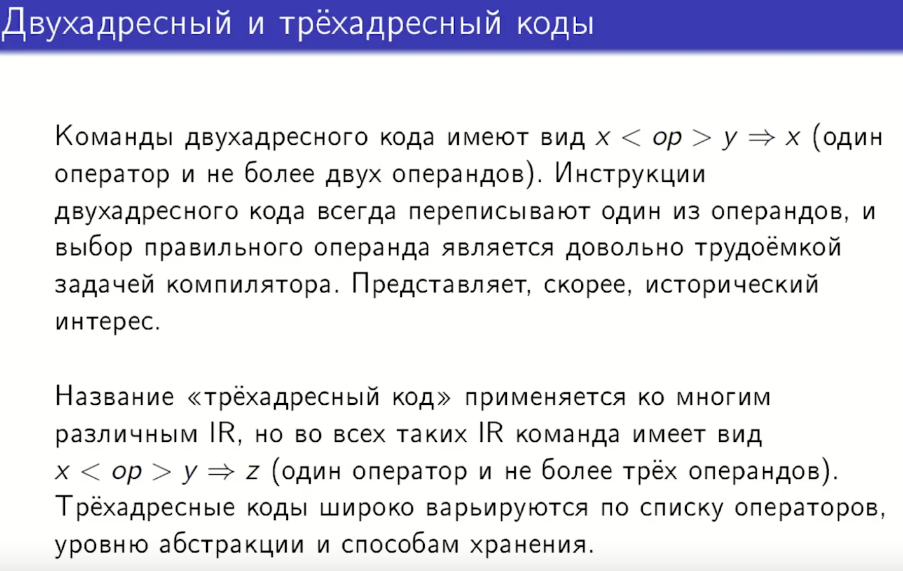
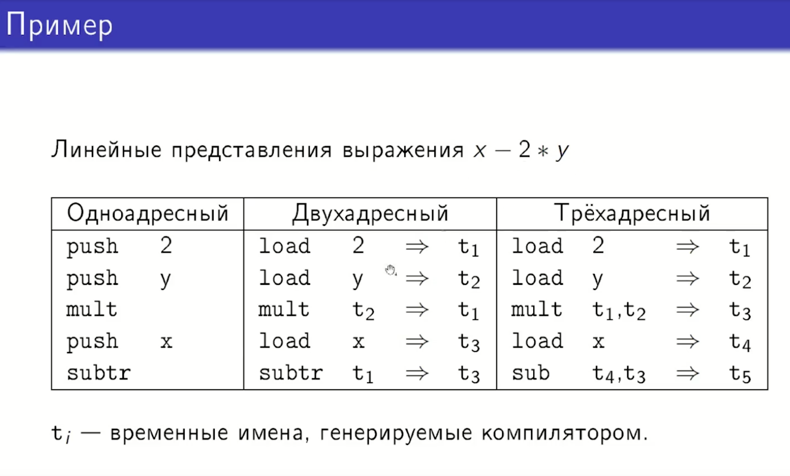
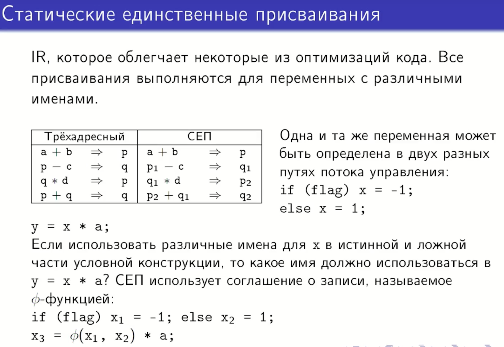

## 36. Трансляция выражений и инструкций изменения потока управления в трёхадресный код. Сокращённые вычисления. Использование меток fall.


### пример




### От ИИ, не все есть в лекции (надо смотреть тетрадь)

## 1. Трёхадресный код как промежуточное представление

**Трёхадресный код** — это промежуточное представление (IR), в котором каждая команда имеет форму:
```
x = y <операция> z
```
где:
- `x`, `y`, `z` — операнды (переменные, константы или временные значения)
- `<операция>` — оператор (арифметический, логический и т.д.)

**Ключевые характеристики:**
- Максимум **три адреса** (операнда) на команду
- Один оператор на команду
- Позволяет выразить сложные выражения через последовательность простых операций

### Сравнение с другими формами представления

| Тип кода | Формат команды | Пример для `x - 2 * y` |
|----------|----------------|------------------------|
| **Одноадресный** (стековый) | `push/pop <операнд>` | `push 2`<br>`push y`<br>`mult`<br>`push x`<br>`subtr` |
| **Двухадресный** | `x <оп> y ⇒ x` | `load 2 ⇒ t1`<br>`load y ⇒ t2`<br>`mult t2 ⇒ t1`<br>`load x ⇒ t3`<br>`subtr t1 ⇒ t3` |
| **Трёхадресный** | `x <оп> y ⇒ z` | `load 2 ⇒ t1`<br>`load y ⇒ t2`<br>`mult t1, t2 ⇒ t3`<br>`load x ⇒ t4`<br>`subtr t4, t3 ⇒ t5` |

## 2. Трансляция выражений в трёхадресный код

### Алгоритм трансляции
1. **Разбиение сложных выражений** на последовательность простых операций
2. **Генерация временных переменных** для хранения промежуточных результатов
3. **Создание команд трёхадресного кода**

### Пример трансляции
**Исходное выражение:** `a + b * c - d / e`

**Трёхадресный код:**
```
t1 = b * c      # умножение
t2 = a + t1     # сложение
t3 = d / e      # деление
t4 = t2 - t3    # вычитание
```

## 3. Трансляция инструкций изменения потока управления

### Условные переходы
**Исходный код:**
```c
if (x > y) {
    z = x;
} else {
    z = y;
}
```

**Трёхадресный код с метками:**
```
L1: if x <= y goto L3    # условие на переход в else
L2: z = x                # тело if
    goto L4              # переход после if
L3: z = y                # тело else
L4: ...                  # продолжение программы
```

### Циклы
**Исходный код:**
```c
while (i < 10) {
    sum = sum + i;
    i = i + 1;
}
```

**Трёхадресный код:**
```
L1: if i >= 10 goto L3   # проверка условия выхода
L2: t1 = sum + i         # тело цикла
    sum = t1
    t2 = i + 1
    i = t2
    goto L1              # переход к проверке условия
L3: ...                  # после цикла
```

## 4. Сокращённые вычисления (Short-circuit Evaluation)

### Принцип работы
В логических выражениях с операторами `&&` (И) и `||` (ИЛИ) второй операнд вычисляется только при необходимости:
- Для `expr1 && expr2`: если `expr1` ложно, `expr2` не вычисляется
- Для `expr1 || expr2`: если `expr1` истинно, `expr2` не вычисляется

### Пример трансляции
**Исходный код:**
```c
if (x != 0 && y / x > 2) {
    z = 1;
}
```

**Трёхадресный код со сокращёнными вычислениями:**
```
    if x == 0 goto L2     # проверка первого условия
    t1 = y / x            # вычисление y/x (безопасно, так как x ≠ 0)
    if t1 <= 2 goto L2    # проверка второго условия
    z = 1                 # тело if
L2: ...                   # продолжение
```

## 5. Использование меток fall

### Концепция меток fall
**Метка fall** (падение) используется в конструкциях, где управление должно перейти к следующей инструкции без явного перехода (например, в `switch-case` без `break`).

### Пример с switch-case
**Исходный код:**
```c
switch (x) {
    case 1: y = 10;
    case 2: y = 20; break;
    default: y = 30;
}
```

**Трёхадресный код:**
```
    goto L_test           # переход к проверке
L1: y = 10                # case 1 (без break - fall through)
L2: y = 20                # case 2
    goto L_end            # break
L3: y = 30                # default
    goto L_end
L_test:
    if x == 1 goto L1
    if x == 2 goto L2
    goto L3               # default
L_end: ...
```


## 6. Практические аспекты реализации

### Генерация временных имён
Компилятор генерирует уникальные временные имена (`t1`, `t2`, ...) для:
1. Промежуточных результатов вычислений
2. Хранения значений при трансляции сложных выражений
3. Реализации SSA-формы (добавление индексов к именам переменных)

### Управление метками
1. **Генерация уникальных меток** (`L1`, `L2`, ...) для точек перехода
2. **Размещение меток** перед инструкциями, на которые возможен переход
3. **Обработка forward- и backward-переходов**

### Оптимизации при трансляции
1. **Удаление избыточных переходов** — устранение `goto L`, где L — следующая инструкция
2. **Слияние меток** — если на метку нет переходов, её можно удалить
3. **Упрощение условий** — преобразование сложных условий в последовательность простых проверок

## Заключение

Трансляция в трёхадресный код — ключевой этап работы компилятора, который:
- Абстрагируется от конкретного машинного кода
- Позволяет выполнять оптимизации на уровне промежуточного представления
- Обеспечивает переносимость компилятора на разные архитектуры
- Поддерживает сложные конструкции управления потоком через метки и условные переходы
- Реализует важные семантические особенности языка (сокращённые вычисления, fall-through)