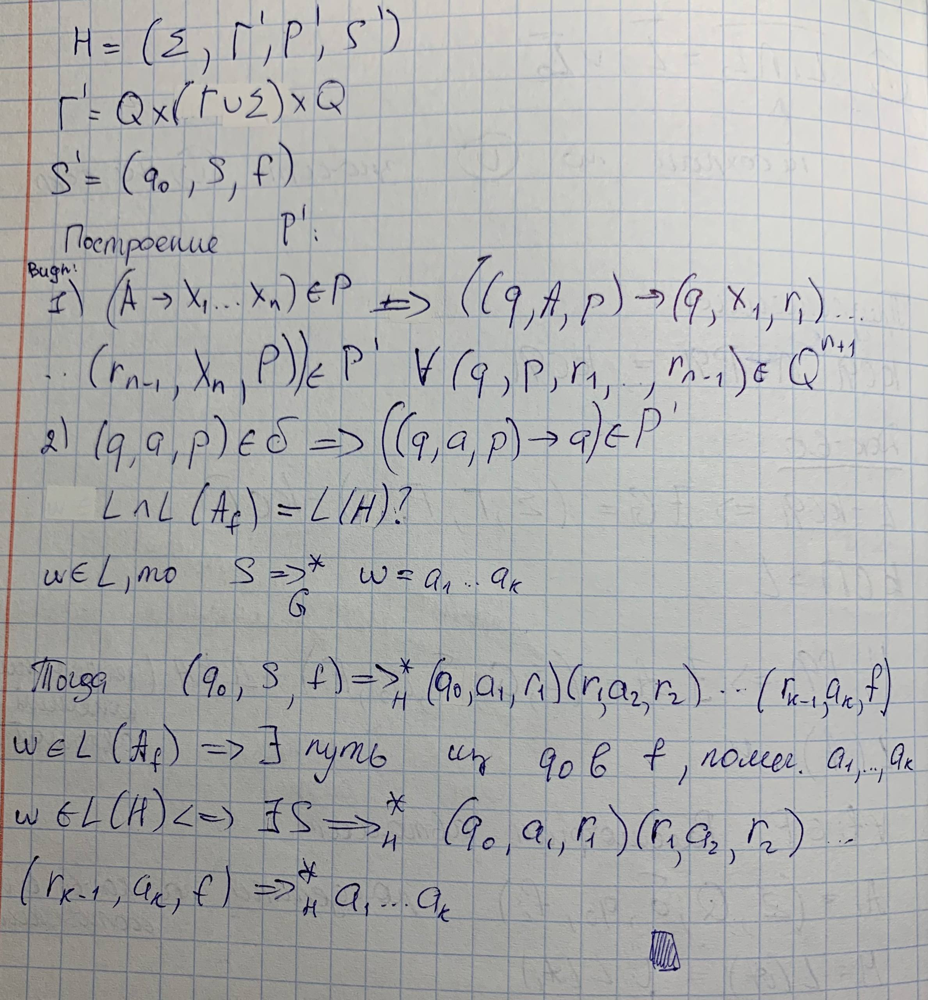

## 4. Теорема о пересечении КС-языка с регулярным языком.

### Теорема

**Пересечение контекстно-свободного языка (КСЯ) с регулярным языком (РЯ) является контекстно-свободным языком (КСЯ)**.

Или в простой форме: КСЯ $\cap$ РЯ = КСЯ.

### Док-во:

### Суть доказательства и конструкция

Доказательство строится конструктивно: по КС-грамматике $G$, порождающей язык $K$, и детерминированному конечному автомату (ДКА) $A$, распознающему регулярный язык $M$, строится новая КС-грамматика $H$, порождающая их пересечение.

1. **Нетерминалы новой грамматики**: Представляют собой тройки вида **$(q, X, r)$**, где $q$ и $r$ — состояния автомата, а $X$ — символ исходной грамматики (терминал или нетерминал).
2. **Аксиома**: Новой аксиомой становится тройка $(q_0, S, f)$, где $q_0$ — начальное состояние автомата, $S$ — аксиома исходной грамматики, а $f$ — заключительное состояние автомата.
3. **Правила вывода**:
   * Если в исходной грамматике есть правило $A \to X_1 X_2 \dots X_k$, то в новую грамматику добавляются правила, моделирующие все возможные переходы автомата через эти символы: $(q, A, r) \to (q, X_1, p_1)(p_1, X_2, p_2)\dots(p_{k-1}, X_k, r)$ для всех комбинаций состояний.
   * Для терминалов добавляются правила вида $(q, a, r) \to a$, если в автомате существует переход из состояния $q$ в $r$ по символу $a$.

Таким образом, вывод в грамматике $H$ возможен тогда и только тогда, когда цепочка одновременно выводима в исходной КС-грамматике и «прочитывается» автоматом, переходя из начального состояния в конечное.

### Контекст и значение

Важно понимать, что в общем случае класс КС-языков **не замкнут** относительно пересечения. Например, если взять два КС-языка $L_1 = {a^n b^n a^m}$ и $L_2 = {a^m b^n a^n}$, то их пересечением будет язык ${a^n b^n a^n}$, который, согласно теореме о накачке, не является контекстно-свободным. Однако пересечение с регулярным языком всегда сохраняет свойство контекстной свободности.

### Практическое применение

Эта теорема часто используется для доказательства того, что какой-либо язык **не является контекстно-свободным**. Если при пересечении исследуемого языка с заведомо регулярным языком получается язык, не являющийся КС-языком (что можно проверить по лемме о накачке), то и исходный язык не был контекстно-свободным.
