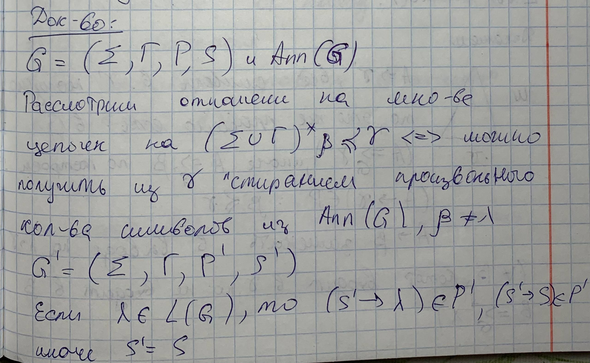
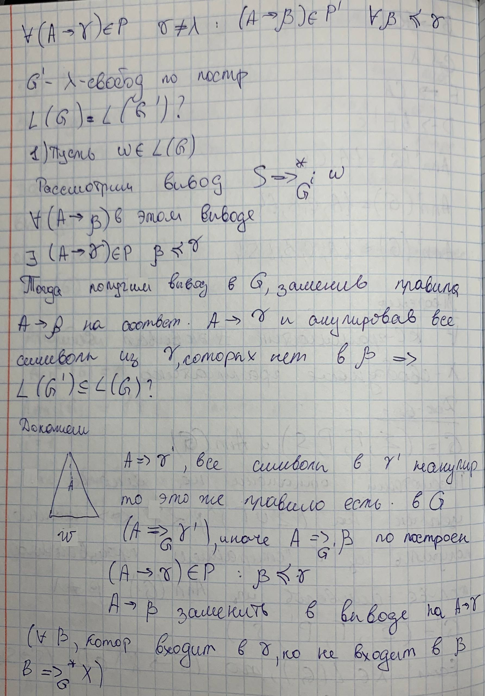

## 5. Теорема о λ-свободной грамматике.

### Основные определения
*   **Аннулирующее правило ($\lambda$-правило):** это правило вывода вида $A \to \lambda$, где из нетерминала выводится пустая строка.
*   **Аннулирующий символ:** нетерминал $B$, из которого за один или несколько шагов можно вывести пустую цепочку ($B \Rightarrow^* \lambda$).
*   **$\lambda$-свободная грамматика:** контекстно-свободная грамматика (КС-грамматика), которая либо вообще не содержит аннулирующих правил, либо содержит единственное правило $S \to \lambda$ для аксиомы, при условии, что аксиома не встречается в правых частях других правил.

### Формулировка теоремы 
**Для любой КС-грамматики $G$ существует эквивалентная ей $\lambda$-свободная (или $\lambda$-свободная) КС-грамматика $G'$**. 

Это означает, что из любой грамматики можно исключить правила, порождающие пустые строки «в середине» вывода, не изменив при этом язык, который она порождает.

### Док-во:

### Алгоритм построения
Процесс преобразования грамматики в $\lambda$-свободную включает следующие шаги:
1.  **Поиск всех аннулирующих символов:** Сначала вычисляется множество $Ann(G)$ всех нетерминалов, способных породить пустую строку.
2.  **Формирование новых правил:** Для каждого исходного правила $A \to \gamma$ создаются все возможные новые правила $A \to \beta$, где $\beta$ — это любая непустая подпоследовательность цепочки $\gamma$, полученная путем удаления одного или нескольких аннулирующих символов.
3.  **Обработка аксиомы:** Если пустая строка принадлежит языку (аксиома $S$ была аннулирующей), вводится новая аксиома $S'$ и правила $S' \to S$ и $S' \to \lambda$, чтобы сохранить возможность порождения пустой цепочки в самом начале вывода.