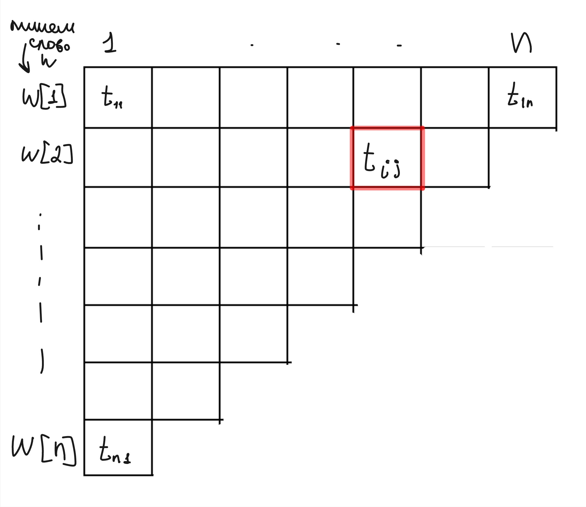
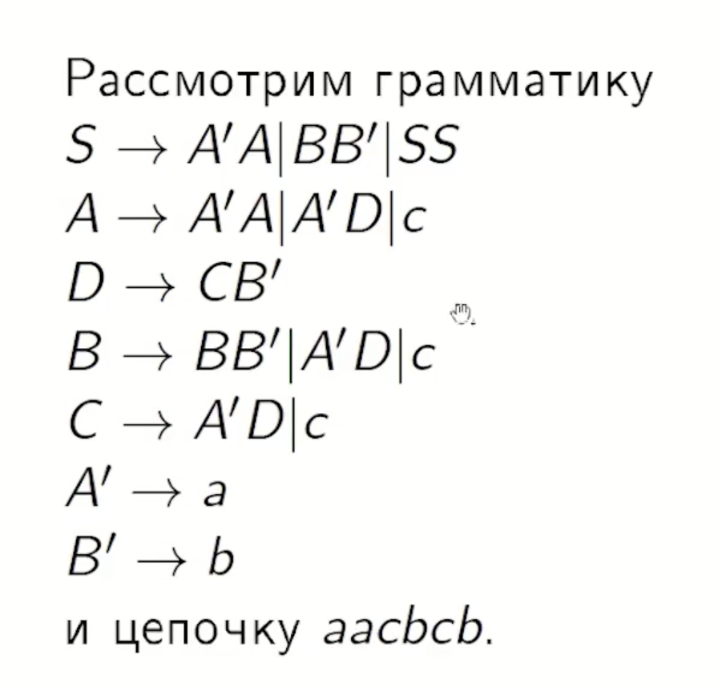
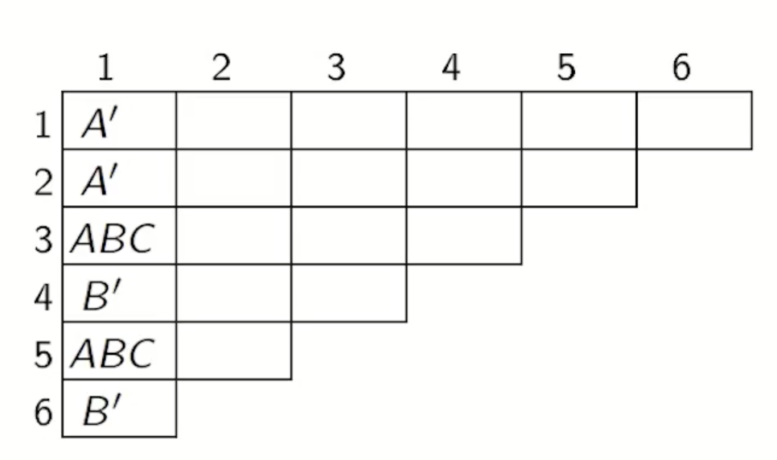
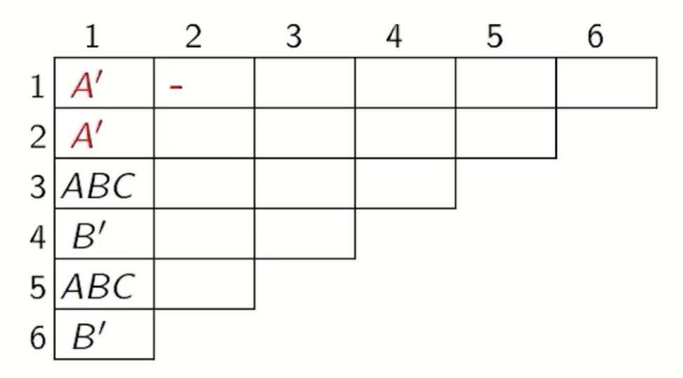
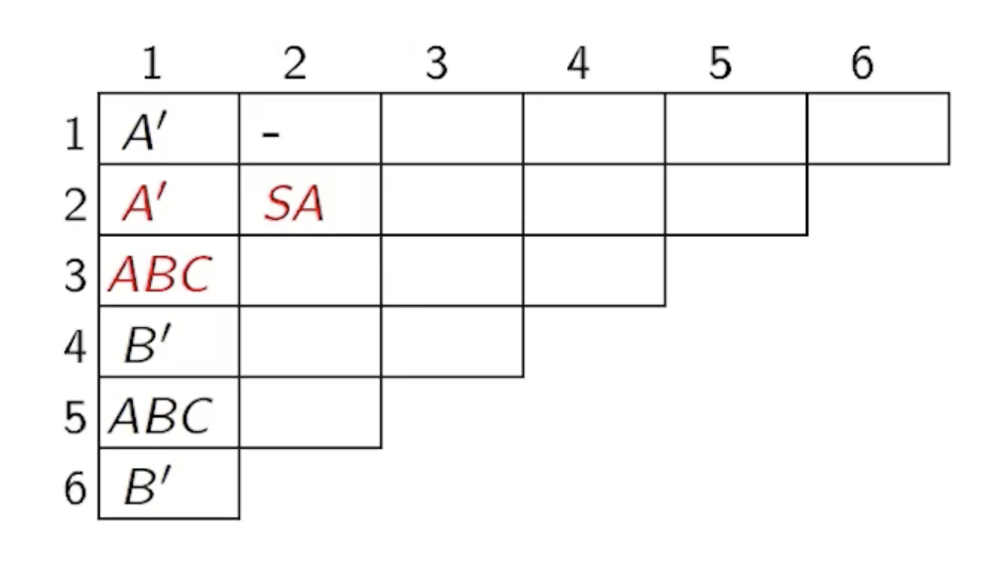
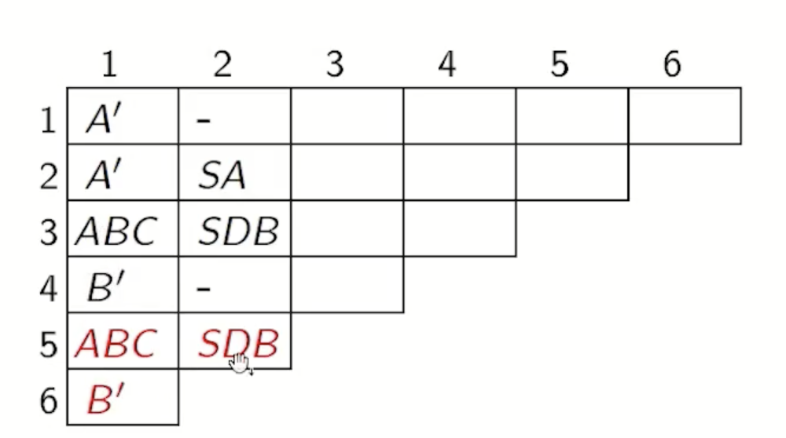
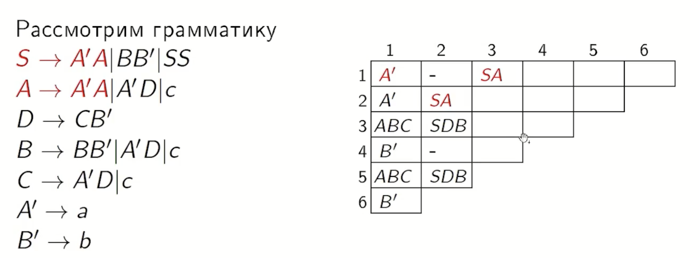
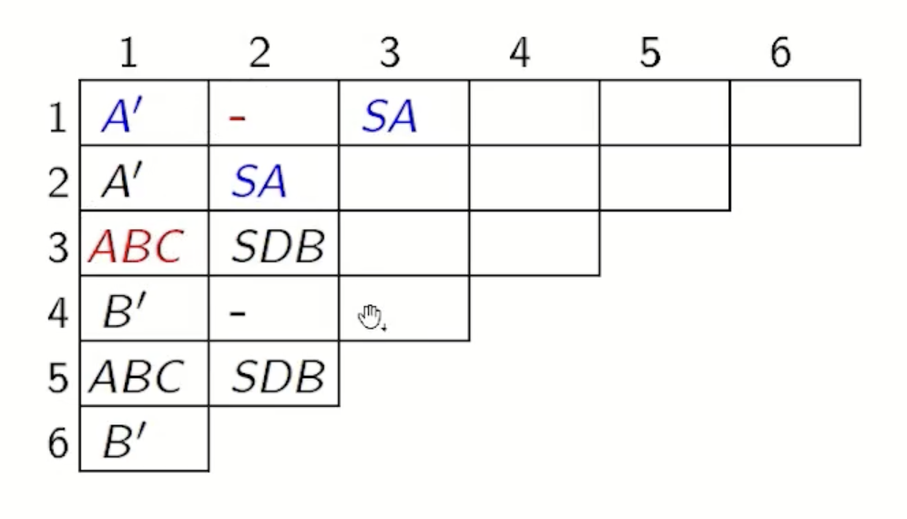
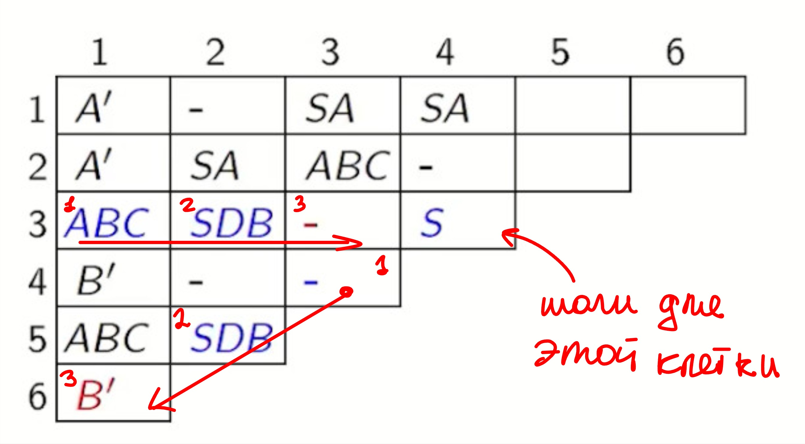
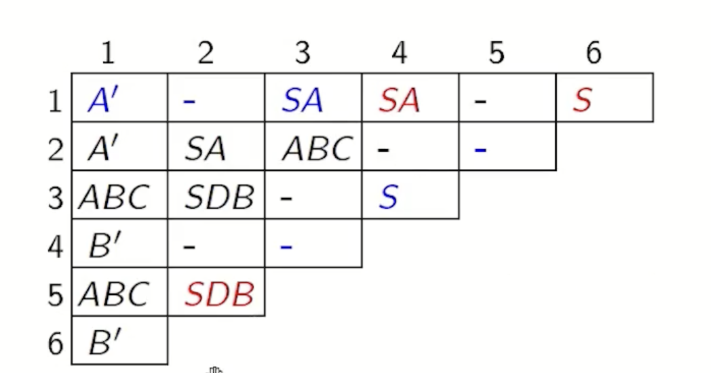

## 6. Распознавание КС-языков методом динамического программирования, нормальная форма Хомского.

### Нормальная форма Хомского (ХНФ)

**Нормальная форма Хомского** — это канонический вид контекстно-свободной грамматики, в котором правила вывода максимально стандартизированы.

*   **Определение:** КС-грамматика считается находящейся в нормальной форме Хомского, если она является **$\lambda$-свободной** (не содержит аннулирующих правил, кроме, возможно, правила для аксиомы), а все её неаннулирующие правила вывода имеют строго один из двух видов:
    1.  **$A \to BC$** — нетерминал порождает ровно два нетерминала;
    2.  **$A \to a$** — нетерминал порождает ровно один терминал.
*   **Эквивалентность:** любая КС-грамматика может быть преобразована в эквивалентную ей грамматику в нормальной форме Хомского.

### Алгоритм Кока-Янгера-Касами

**Вход:** $L-$КСЯ, $G-$ в ХНФ, $L(G)=L$ и самое главное $w\ -$ строка длины $n$.

**Выход:** $w \in L?$

_(Можно ли данной грамматике получить слово $w$?)_

### Алгоритм

Строим верхнетреугольную матрицу размера $n$ x $n$

Клетка $t_{ij} - $ это множество нетерминалов из которых выводится $w[i, i+j-1] - $ подслово начиная с i позиции длинны j.

Если $t_{1n}$ (правая верхняя) содержит аксиому граммматики, то $w \in L$

В ХНФ правила имею вид:
1) A -> BC
2) A -> a

Значит $t_{11},. t_{i1}..,t_{n1}$ заполняется непосредственно по правилам типа (2).  То есть в клетку записываем нетерменилы из которого сразу выводится терминал w[i].

Для заполнения  $t_{ij}$ нужно размотреть все возможные разбиения $w[i, i+j-1]$ на два не пустых подслова.

Если в $t_{ik}$ есть нетерминал $B$ в $t_{i+k,j-k}$ есть нетериминал $C$ $(A\rightarrow BC) \in P$, то в $t_{ij}$ поместить $A$ $k \in \{1,..,j-1\}$

### Если сложно то, вот ответ от нейронки

**2. Алгоритм Кока-Янгера-Касами**
*   **Предпосылка:** Грамматика `G` дана в НФХ. Строка `w = a₁a₂...aₙ` длины `n`.
*   **Идея:** Построить таблицу `D` размером `n x n`, где элемент `D[i][j]` — **множество нетерминалов**, из которых выводится подстрока `w` длиной `j`, начинающаяся с позиции `i` (индексация может немного варьироваться).
*   **Алгоритм (по шагам):**
    1.  **Инициализация (база ДП, подстроки длины 1):**
        Для каждой позиции `i` от 1 до `n`:
        `D[i][1] = { A | (A → aᵢ) ∈ P }` (все нетерминалы, порождающие терминал `aᵢ`).
    2.  **Заполнение таблицы (переход ДП, подстроки длины L > 1):**
        Для длины `L` от 2 до `n`:
        Для начала `i` от 1 до `n - L + 1`:
        *   `j = i + L - 1` (конец подстроки).
        *   Множество `D[i][L]` изначально пусто.
        *   Для всех точек разбиения `k` от `i` до `j-1`:
            *   Рассматриваем разбиение подстроки на две части: `(i..k)` и `(k+1..j)`.
            *   Пусть `X ∈ D[i][k-i+1]`, `Y ∈ D[k+1][j-k]`.
            *   Для **всех** правил `A → XY` в грамматике добавляем `A` в `D[i][L]`.
    3.  **Завершение:** Строка `w` принадлежит `L(G)` **тогда и только тогда, когда** аксиома `S` содержится в множестве `D[1][n]`.
*   **Сложность:** `O(n³ * |G|)`, где `|G|` — размер грамматики. Это полиномиально, в отличие от экспоненциального перебора.

### Пример(с пары)

Слово w = aacbcb

x - это пустая клетка/пустое мно-во.

#### Разбор(шаги):

1) Заполняем первый столбец по грамматике (если символ выводится сразу за 1 шаг, добавляем левую часть правила в ячейку)
    
2) Смотрим есть ли рядом стоящие A'A' в правых частях? Нет -> пустое мно-во.
    
3) Смотрим есть ли A'A или A'B или A'C в правых частях? Да, значит левые части (нетерминалы) правил вывода добавлем в ячейку.
    
4) И так далее до конца второго столбца.
    
5) 3-ий столбец, заполняем по похожему правилу (Обрати внимание какие ячейки мы сейчас берём)
    
    Если в паре нетерминалов при переборе, встретилось `-` значит можно скипнуть и перебирать дальше
    
6) Шагаем вот так (цифры это какие ячейки будут участвовать на текущей итерации):
    
7) Итог аксиома выводится из w.
    
