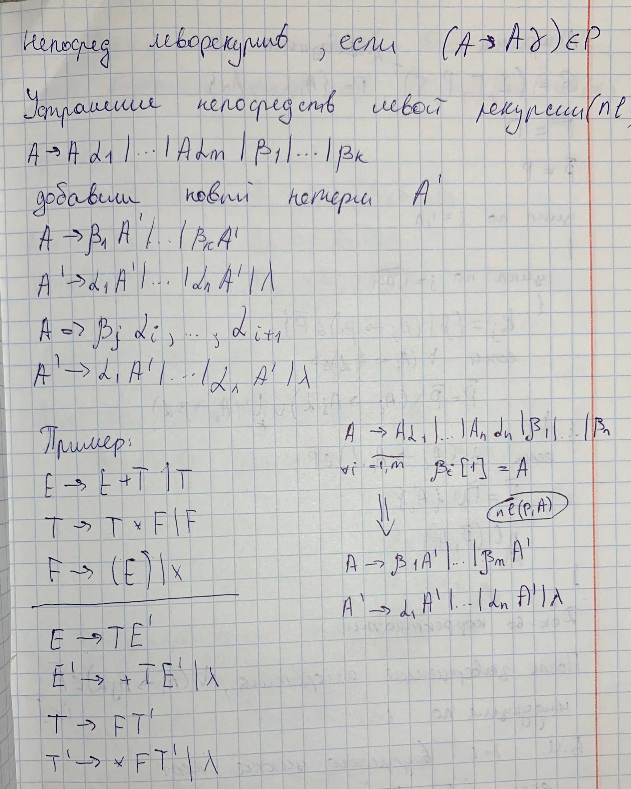
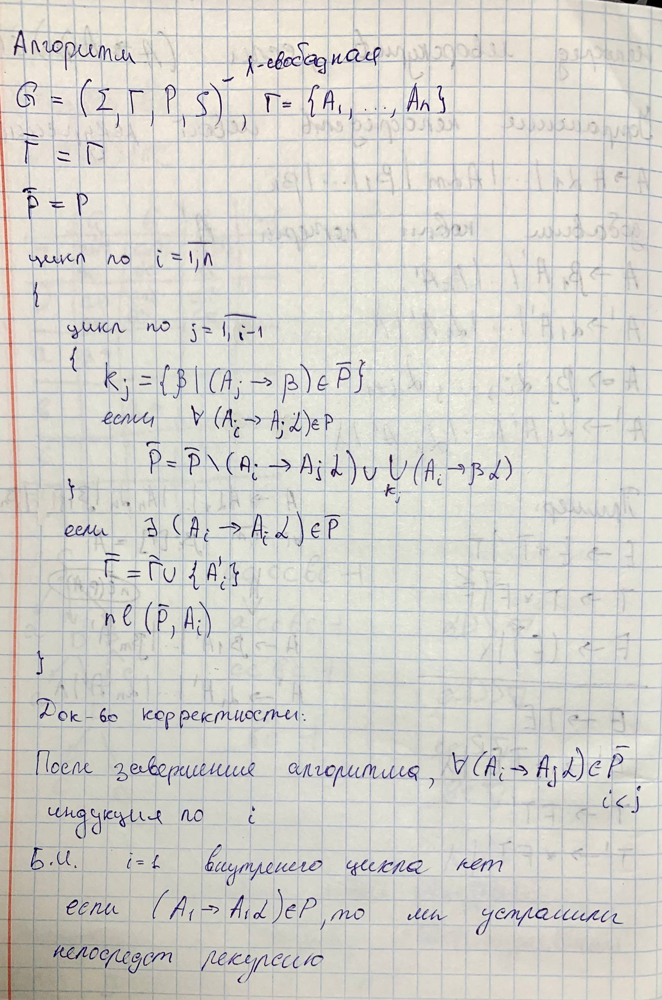
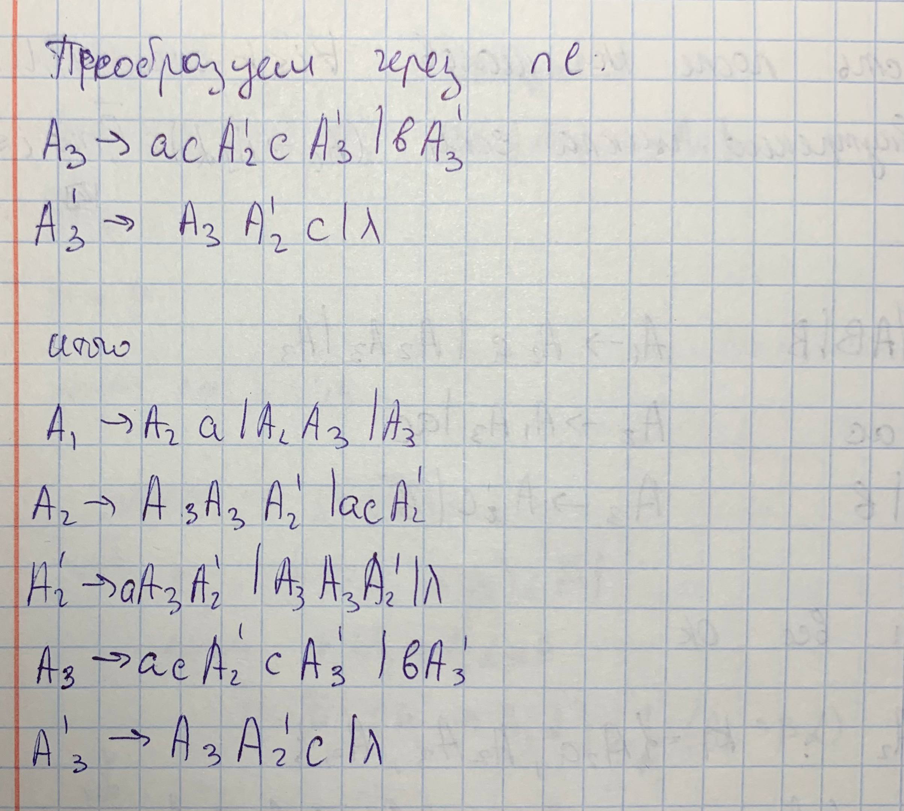
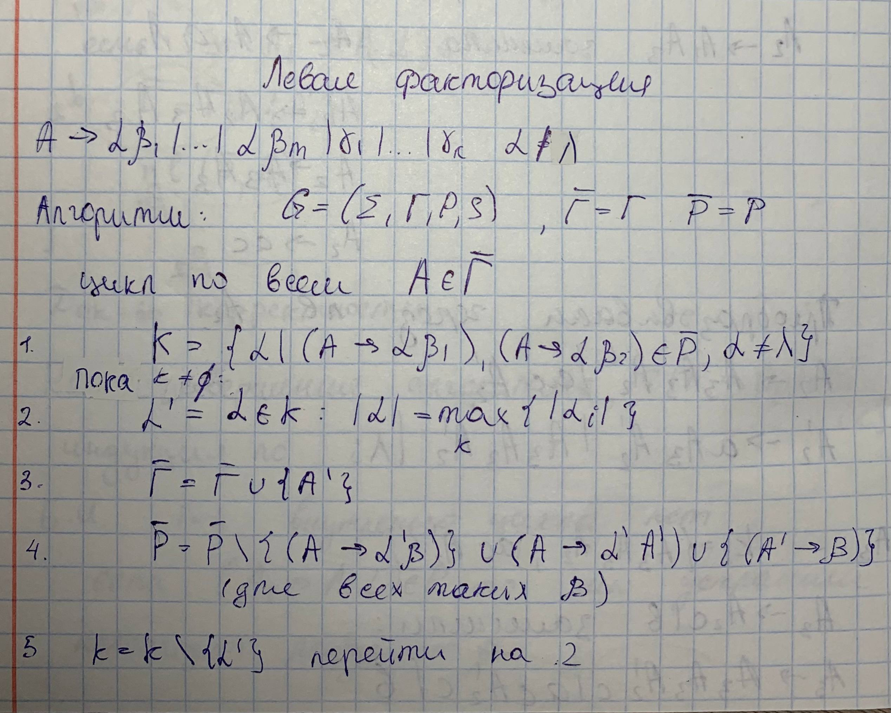
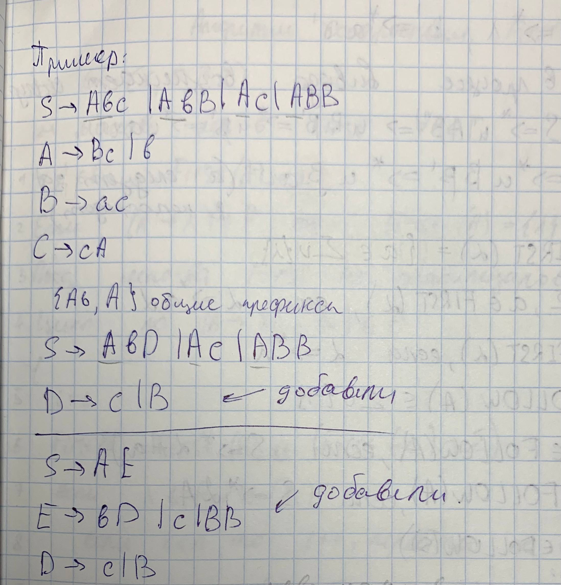

## 7. Преобразования КС-грамматик: устранение левой рекурсии, левая факторизация.

### Устранение левой рекурсии

**опр.** Нетерминал $А$ называют леворекурсивный, если допустим $A \rightarrow^* A \gamma$

**опр.** Непосредственной левой рекурсией назвыаются правила вида $A\rightarrow A\gamma$

Наличие левой рекурсии делает невозможным применение некоторых методов нисходящего анализа (например, метода рекурсивного спуска), так как они могут войти в бесконечный цикл.

### Алгоритм устранения непосредственной левой рекурсии (nl)

Для устранения рекурсии используется метод динамического программирования, который последовательно переупорядочивает нетерминалы и заменяет правила таким образом, чтобы индекс левого нетерминала в правой части был строго больше индекса нетерминала в левой части.

Любая КС-грамматика имеет эквивалентную ей грамматику без левой рекурсии.

### Левая факторизация
Левая факторизация — это преобразование грамматики, целью которого является устранение у нетерминалов альтернатив, имеющих общий непустой префикс.

Это необходимо для детерминированного выбора правила в процессе нисходящего анализа: когда несколько правил начинаются одинаково, анализатор не может решить, какое из них применить, не заглядывая далеко вперед во входную цепочку.

