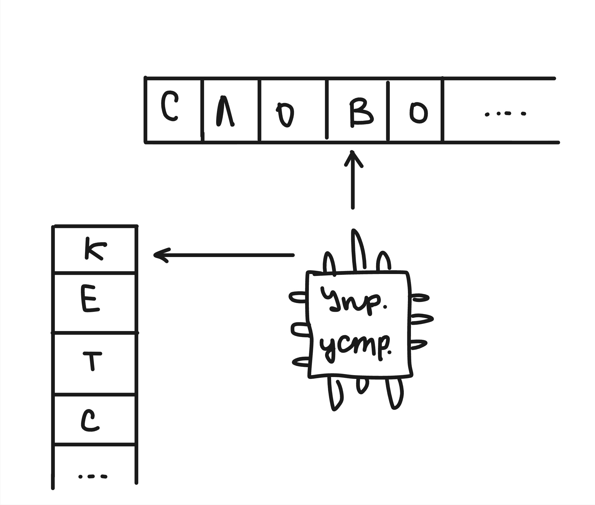
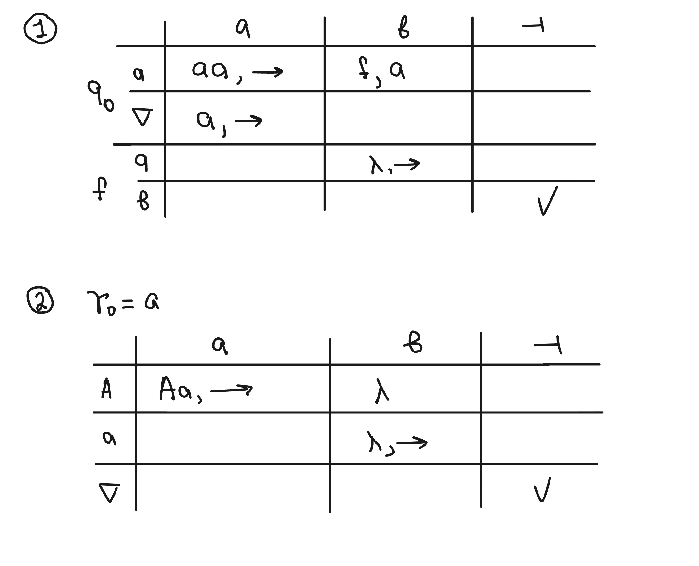
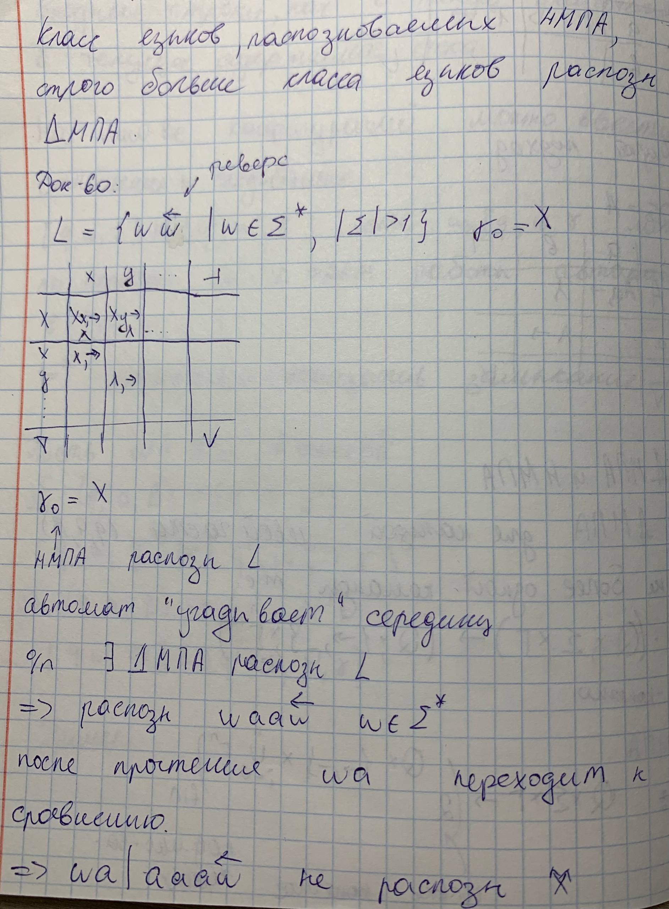

## 8. МП-автоматы. Варианты распознавания. ДМПА и НМПА, их неэквивалентность.

Автомат с магазинной памятью (МПА) представляет собой более мощную модель распознавателя, чем конечный автомат, за счет добавления бесконечной памяти, организованной по принципу стека («последний вошел — первый вышел»).

Стек позволяет автомату «запоминать» информацию о прочитанных символах и использовать её при обработке последующих частей цепочки.

**Команда выглядит так:** $(q, a, B) \rightarrow (q', \{\text{что то из: }\rightarrow\ или\ \_\}, \gamma)$
* $q$ — состояние
* $a$ — символ с ленты
* $B$ — вершина стека (берем и смотрим на самую верхнюю ячейку стека)
* $q'$ — новое состояние
* $\rightarrow или\ \_$ — двигаем указатель в слове вправо или стоим на месте
* $\gamma$ — что кладем в стек

Вершину всегда снимаем, когда заходим в новое состояние.

Доп символы $\nabla$ — дно стека и $\dashv$ — конец строки в ленте слова.

**опр.** МП-автомат(МПА) $\mathcal{M}$ — это 7-ка = $(\Sigma, \Gamma, Q, \delta, q_0, F, \gamma_0)$

* $\Sigma$ — **основной (терминальный) алфавит**
* $\Gamma$ — **вспомогательный (нетерминальный) алфавит**
* $Q$ — множество состояний
* $\delta$ — множество команд(выше есть разбор)
* $q_0$ — начальное состояние
* $F$ — множество конечных состояний (терминальных)
* $\gamma_0$ — начальное содержимое стека

**опр.** Конфигурация автомата — 3-ка $[q, w, \gamma]$
* $q$ — текущее состояние
* $w$ — остаток слова(прям до $\dashv$ ) в ленте 
* $\gamma$ — текущее содержимое стека

### Виды распознания 
* По заключительным состояниям: если после прочтения всей входной цепочки автомат оказался в одном из состояний множества $F$.
* С использованием специальной команды допуска: часто в МП-автоматах используется дополнительная команда вида $(q,a,B)→\checkmark$, где $q\in F$ и $\checkmark$ означает немедленное «допущение» цепочки.

### ДМПА

ДМПА - детерминированный МПА

Для каждой левой части команды существует не более одной правой части команды т.е.:

$\delta:(Q\times \Sigma \times \Gamma) \rightarrow (Q\times \{\rightarrow, \_\} \times \bigcup_{i=0}^{n} \Gamma^i)$ где n - конечно

### НМПА

НМПА - недетерминированный МПА

Для каждой левой части команды существует более одной правой части команды т.е.:

$\delta:(Q\times \Sigma \times \Gamma) \rightarrow 2^{(Q\times \{\rightarrow, \_\} \times \bigcup_{i=0}^{n} \Gamma^i)}$ где n - конечно

### Теорема(неэквивалентность)

Класс языков распознаваемых НМПА, строго больше класса языков распознаваемых ДМПА.

### Док-во:

